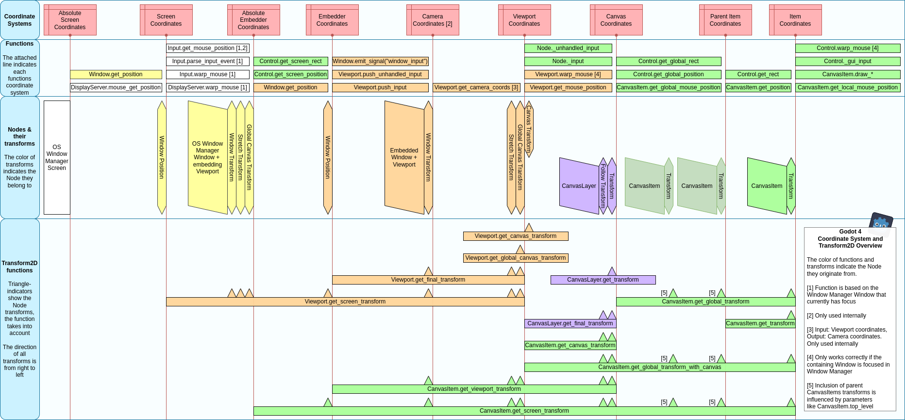

# 2D coordinate systems and 2D transforms

## Introduction

This is a detailed overview of the available 2D coordinate systems and
2D transforms that are built in. The basic concepts are covered in
`doc_viewport_and_canvas_transforms`.

`Transform2D <class_Transform2D>` are matrices that convert coordinates
from one coordinate system to an other. In order to use them, it is
beneficial to know which coordinate systems are available in Godot. For
a deeper understanding, the `doc_matrices_and_transforms` tutorial
offers insights to the underlying functionality.

## Godot 2D coordinate systems

The following graphic gives an overview of Godot 2D coordinate systems
and the available node-transforms, transform-functions and
coordinate-system related functions. At the left is the OS Window
Manager screen, at the right are the `CanvasItems <class_CanvasItem>`.
For simplicity reasons this graphic doesn't include
`SubViewport <class_SubViewport>`,
`SubViewportContainer <class_SubViewportContainer>`,
`ParallaxLayer<class_ParallaxLayer>` and
`ParallaxBackground<class_ParallaxBackground>` all of which also
influence transforms.

The graphic is based on a node tree of the following form:
`Root Window (embed Windows)` ⇒ `Window (don't embed Windows)` ⇒
`CanvasLayer` ⇒ `CanvasItem` ⇒ `CanvasItem` ⇒ `CanvasItem`. There are
more complex combinations possible, like deeply nested Window and
SubViewports, however this example intends to provide an overview of the
methodology in general.

Click graphic to enlarge.

-   **Item Coordinates**  
    This is the local coordinate system of a
    `CanvasItem <class_CanvasItem>`.

-   **Parent Item Coordinates**  
    This is the local coordinate system of the parent's *CanvasItem*.
    When positioning *CanvasItems* in the *Canvas*, they usually inherit
    the transformations of their parent *CanvasItems*. An exceptions is
    `CanvasItems.top_level <class_CanvasItem_property_top_level>`.

-   **Canvas Coordinates**  
    As mentioned in the previous tutorial `doc_canvas_layers`, there are
    two types of canvases (*Viewport* canvas and *CanvasLayer* canvas)
    and both have a canvas coordinate system. These are also called
    world coordinates. A *Viewport* can contain multiple *Canvases* with
    different coordinate systems.

-   **Viewport Coordinates**  
    This is the coordinate system of the `Viewport <class_Viewport>`.

-   **Camera Coordinates**  
    This is only used internally for functionality like 3D-camera ray
    projections.

-   **Embedder Coordinates / Screen Coordinates**  
    Every *Viewport* (*Window* or *SubViewport*) in the scene tree is
    embedded either in a different node or in the OS Window Manager.
    This coordinate system's origin is identical to the top-left corner
    of the *Window* or *SubViewport* and its scale is the one of the
    embedder or the OS Window Manager.

    If the embedder is the OS Window Manager, then they are also called
    Screen Coordinates.

-   **Absolute Embedder Coordinates / Absolute Screen Coordinates**  
    The origin of this coordinate system is the top-left corner of the
    embedding node or the OS Window Manager screen. Its scale is the one
    of the embedder or the OS Window Manager.

    If the embedder is the OS Window Manager, then they are also called
    Absolute Screen Coordinates.

## Node transforms

Each of the mentioned nodes have one or more transforms associated with
them and the combination of these nodes infer the transforms between the
different coordinate systems. With a few exceptions, the transforms are
`Transform2D <class_Transform2D>` and the following list shows details
and effects of each of them.

-   **CanvasItem transform**  
    *CanvasItems* are either *Control*-nodes or *Node2D*-nodes.

    For *Control* nodes this transform consists of a
    `position <class_Control_property_position>` relative to the
    parent's origin and a `scale <class_Control_property_scale>` and
    `rotation <class_Control_property_rotation>` around a
    `pivot point <class_Control_property_pivot_offset>`.

    For *Node2D* nodes `transform <class_Node2D_property_transform>`
    consists of `position <class_Node2D_property_position>`,
    `rotation <class_Node2D_property_rotation>`,
    `scale <class_Node2D_property_scale>` and
    `skew <class_Node2D_property_skew>`.

    The transform affects the item itself and usually also
    child-*CanvasItems* and in the case of a *SubViewportContainer* it
    affects the contained *SubViewport*.

-   **CanvasLayer transform**  
    The *CanvasLayer's*
    `transform <class_CanvasLayer_property_transform>` affects all
    *CanvasItems* within the *CanvasLayer*. It doesn't affect other
    *CanvasLayers* or *Windows* in its *Viewport*.

-   **CanvasLayer follow viewport transform**  
    The *follow viewport transform* is an automatically calculated
    transform, that is based on the *Viewport's*
    `canvas transform <class_Viewport_property_canvas_transform>` and
    the *CanvasLayer's*
    `follow viewport scale <class_CanvasLayer_property_follow_viewport_scale>`
    and can be used, if
    `enabled <class_CanvasLayer_property_follow_viewport_enabled>`, to
    achieve a pseudo 3D effect. It affects the same child nodes as the
    *CanvasLayer transform*.

-   **Viewport canvas transform**  
    The `canvas transform <class_Viewport_property_canvas_transform>`
    affects all *CanvasItems* in the *Viewport's* default canvas. It
    also affects *CanvasLayers*, that have follow viewport transform
    enabled. The *Viewport's* active `Camera2D <class_Camera2D>` works
    by changing this transform. It doesn't affect this *Viewport's*
    embedded *Windows*.

-   **Viewport global canvas transform**  
    *Viewports* also have a
    `global canvas transform <class_Viewport_property_global_canvas_transform>`.
    This is the master transform and affects all individual *Canvas
    Layer* and embedded *Window* transforms. This is primarily used in
    Godot's CanvasItem Editor.

-   **Viewport stretch transform**  
    Finally, *Viewports* have a *stretch transform*, which is used when
    resizing or stretching the viewport. This transform is used for
    `Windows <class_Window>` as described in `doc_multiple_resolutions`,
    but can also be manually set on *SubViewports* by means of
    `size <class_SubViewport_property_size>` and
    `size_2d_override <class_SubViewport_property_size_2d_override>`.
    It's `translation <class_Transform2D_method_get_origin>`,
    `rotation <class_Transform2D_method_get_rotation>` and
    `skew <class_Transform2D_method_get_skew>` are the default values
    and it can only have non-default
    `scale <class_Transform2D_method_get_scale>`.

-   **Window transform**  
    In order to scale and position the *Window's* content as described
    in `doc_multiple_resolutions`, each `Window <class_Window>` contains
    a *window transform*. It is for example responsible for the black
    bars at the *Window's* sides so that the *Viewport* is displayed
    with a fixed aspect ratio.

-   **Window position**  
    Every *Window* also has a
    `position <class_Window_property_position>` to describe its position
    within its embedder. The embedder can be another *Viewport* or the
    OS Window Manager.

-   **SubViewportContainer shrink transform**  
    `stretch <class_SubViewportContainer_property_stretch>` together
    with
    `stretch_shrink <class_SubViewportContainer_property_stretch_shrink>`
    declare for a *SubViewportContainer* if and by what integer factor
    the contained *SubViewport* should be scaled in comparison to the
    container's size.
