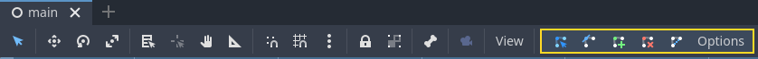
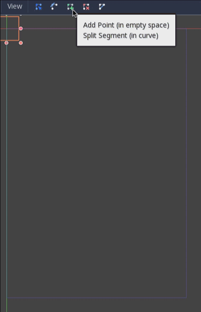

# The main game scene

Now it's time to bring everything we did together into a playable game
scene.

Create a new scene and add a `Node <class_Node>` named `Main`. (The
reason we are using Node instead of Node2D is because this node will be
a container for handling game logic. It does not require 2D
functionality itself.)

Click the **Instance** button (represented by a chain link icon) and
select your saved `player.tscn`.

Now, add the following nodes as children of `Main`, and name them as
shown:

-   `Timer <class_Timer>` (named `MobTimer`) - to control how often mobs
    spawn
-   `Timer <class_Timer>` (named `ScoreTimer`) - to increment the score
    every second
-   `Timer <class_Timer>` (named `StartTimer`) - to give a delay before
    starting
-   `Marker2D <class_Marker2D>` (named `StartPosition`) - to indicate
    the player's start position

Set the `Wait Time` property of each of the `Timer` nodes as follows
(values are in seconds):

-   `MobTimer`: `0.5`
-   `ScoreTimer`: `1`
-   `StartTimer`: `2`

In addition, set the `One Shot` property of `StartTimer` to "On" and set
`Position` of the `StartPosition` node to `(240, 450)`.

## Spawning mobs

The Main node will be spawning new mobs, and we want them to appear at a
random location on the edge of the screen. Add a `Path2D <class_Path2D>`
node named `MobPath` as a child of `Main`. When you select `Path2D`, you
will see some new buttons at the top of the editor:

Select the middle one ("Add Point") and draw the path by clicking to add
the points at the corners shown. To have the points snap to the grid,
make sure "Use Grid Snap" and "Use Smart Snap" are both selected. These
options can be found to the left of the "Lock" button, appearing as a
magnet next to some dots and intersecting lines, respectively.

Important

Draw the path in *clockwise* order, or your mobs will spawn pointing
*outwards* instead of *inwards*!

After placing point `4` in the image, click the "Close Curve" button and
your curve will be complete.

Now that the path is defined, add a `PathFollow2D <class_PathFollow2D>`
node as a child of `MobPath` and name it `MobSpawnLocation`. This node
will automatically rotate and follow the path as it moves, so we can use
it to select a random position and direction along the path.

Your scene should look like this:

## Main script

Add a script to `Main`. At the top of the script, we use
`@export var mob_scene: PackedScene` to allow us to choose the Mob scene
we want to instance.

.. code-tab:: gdscript GDScript

extends Node

@export var mob\_scene: PackedScene var score

csharp

using Godot;

public partial class Main : Node { // Don't forget to rebuild the
project so the editor knows about the new export variable.

> \[Export\] public PackedScene MobScene { get; set; }
>
> private int \_score;

}

Click the `Main` node and you will see the `Mob Scene` property in the
Inspector under "Main.gd".

You can assign this property's value in two ways:

-   Drag `mob.tscn` from the "FileSystem" dock and drop it in the **Mob
    Scene** property.
-   Click the down arrow next to "\[empty\]" and choose "Load". Select
    `mob.tscn`.

Next, select the instance of the `Player` scene under `Main` node in the
Scene dock, and access the Node dock on the sidebar. Make sure to have
the Signals tab selected in the Node dock.

You should see a list of the signals for the `Player` node. Find and
double-click the `hit` signal in the list (or right-click it and select
"Connect..."). This will open the signal connection dialog. We want to
make a new function named `game_over`, which will handle what needs to
happen when a game ends. Type "game\_over" in the "Receiver Method" box
at the bottom of the signal connection dialog and click "Connect". You
are aiming to have the `hit` signal emitted from `Player` and handled in
the `Main` script. Add the following code to the new function, as well
as a `new_game` function that will set everything up for a new game:

.. code-tab:: gdscript GDScript

func game\_over():  
$ScoreTimer.stop() $MobTimer.stop()

func new\_game():  
score = 0 $Player.start($StartPosition.position) $StartTimer.start()

csharp

public void GameOver() { GetNode&lt;Timer&gt;("MobTimer").Stop();
GetNode&lt;Timer&gt;("ScoreTimer").Stop(); }

public void NewGame() { \_score = 0;

> var player = GetNode&lt;Player&gt;("Player"); var startPosition =
> GetNode&lt;Marker2D&gt;("StartPosition");
> player.Start(startPosition.Position);
>
> GetNode&lt;Timer&gt;("StartTimer").Start();

}

Now connect the `timeout()` signal of each of the Timer nodes
(`StartTimer`, `ScoreTimer`, and `MobTimer`) to the main script.
`StartTimer` will start the other two timers. `ScoreTimer` will
increment the score by 1.

.. code-tab:: gdscript GDScript

func \_on\_score\_timer\_timeout():  
score += 1

func \_on\_start\_timer\_timeout():  
$MobTimer.start() $ScoreTimer.start()

csharp

// We also specified this function name in PascalCase in the editor's
connection window. private void OnScoreTimerTimeout() { \_score++; }

// We also specified this function name in PascalCase in the editor's
connection window. private void OnStartTimerTimeout() {
GetNode&lt;Timer&gt;("MobTimer").Start();
GetNode&lt;Timer&gt;("ScoreTimer").Start(); }

In `_on_mob_timer_timeout()`, we will create a mob instance, pick a
random starting location along the `Path2D`, and set the mob in motion.
The `PathFollow2D` node will automatically rotate as it follows the
path, so we will use that to select the mob's direction as well as its
position. When we spawn a mob, we'll pick a random value between `150.0`
and `250.0` for how fast each mob will move (it would be boring if they
were all moving at the same speed).

Note that a new instance must be added to the scene using `add_child()`.

.. code-tab:: gdscript GDScript

func \_on\_mob\_timer\_timeout():  
\# Create a new instance of the Mob scene. var mob =
mob\_scene.instantiate()

\# Choose a random location on Path2D. var mob\_spawn\_location =
$MobPath/MobSpawnLocation mob\_spawn\_location.progress\_ratio = randf()

\# Set the mob's direction perpendicular to the path direction. var
direction = mob\_spawn\_location.rotation + PI / 2

\# Set the mob's position to a random location. mob.position =
mob\_spawn\_location.position

\# Add some randomness to the direction. direction += randf\_range(-PI /
4, PI / 4) mob.rotation = direction

\# Choose the velocity for the mob. var velocity =
Vector2(randf\_range(150.0, 250.0), 0.0) mob.linear\_velocity =
velocity.rotated(direction)

\# Spawn the mob by adding it to the Main scene. add\_child(mob)

csharp

// We also specified this function name in PascalCase in the editor's
connection window. private void OnMobTimerTimeout() { // Note: Normally
it is best to use explicit types rather than the
var // keyword. However, var is
acceptable to use here because the types are // obviously Mob and
PathFollow2D, since they appear later on the line.

> // Create a new instance of the Mob scene. Mob mob =
> MobScene.Instantiate&lt;Mob&gt;();
>
> // Choose a random location on Path2D. var mobSpawnLocation =
> GetNode&lt;PathFollow2D&gt;("MobPath/MobSpawnLocation");
> mobSpawnLocation.ProgressRatio = GD.Randf();
>
> // Set the mob's direction perpendicular to the path direction. float
> direction = mobSpawnLocation.Rotation + Mathf.Pi / 2;
>
> // Set the mob's position to a random location. mob.Position =
> mobSpawnLocation.Position;
>
> // Add some randomness to the direction. direction +=
> (float)GD.RandRange(-Mathf.Pi / 4, Mathf.Pi / 4); mob.Rotation =
> direction;
>
> // Choose the velocity. var velocity = new
> Vector2((float)GD.RandRange(150.0, 250.0), 0); mob.LinearVelocity =
> velocity.Rotated(direction);
>
> // Spawn the mob by adding it to the Main scene. AddChild(mob);

}

Important

Why `PI`? In functions requiring angles, Godot uses *radians*, not
degrees. Pi represents a half turn in radians, about `3.1415` (there is
also `TAU` which is equal to `2 * PI`). If you're more comfortable
working with degrees, you'll need to use the `deg_to_rad()` and
`rad_to_deg()` functions to convert between the two.

## Testing the scene

Let's test the scene to make sure everything is working. Add this
`new_game` call to `_ready()`:

.. code-tab:: gdscript GDScript

func \_ready():  
new\_game()

csharp

public override void \_Ready() { NewGame(); }

Let's also assign `Main` as our "Main Scene" - the one that runs
automatically when the game launches. Press the "Play" button and select
`main.tscn` when prompted.

Tip

If you had already set another scene as the "Main Scene", you can right
click `main.tscn` in the FileSystem dock and select "Set As Main Scene".

You should be able to move the player around, see mobs spawning, and see
the player disappear when hit by a mob.

When you're sure everything is working, remove the call to `new_game()`
from `_ready()` and replace it with `pass`.

What's our game lacking? Some user interface. In the next lesson, we'll
add a title screen and display the player's score.
