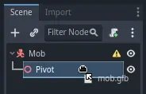
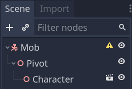
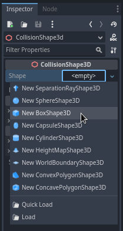
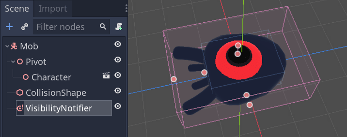
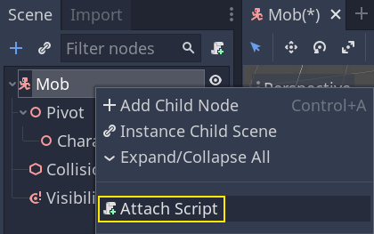

# Designing the mob scene

In this part, you're going to code the monsters, which we'll call mobs.
In the next lesson, we'll spawn them randomly around the playable area.

Let's design the monsters themselves in a new scene. The node structure
is going to be similar to the `player.tscn` scene.

Create a scene with, once again, a
`CharacterBody3D <class_CharacterBody3D>` node as its root. Name it
`Mob`. Add a child node `Node3D <class_Node3D>`, name it `Pivot`. And
drag and drop the file `mob.glb` from the *FileSystem* dock onto the
`Pivot` to add the monster's 3D model to the scene.

You can rename the newly created `mob` node into `Character`.

We need a collision shape for our body to work. Right-click on the `Mob`
node, the scene's root, and click *Add Child Node*.

Add a `CollisionShape3D <class_CollisionShape3D>`.

In the *Inspector*, assign a *BoxShape3D* to the *Shape* property.

We should change its size to fit the 3D model better. You can do so
interactively by clicking and dragging on the orange dots.

The box should touch the floor and be a little thinner than the model.
Physics engines work in such a way that if the player's sphere touches
even the box's corner, a collision will occur. If the box is a little
too big compared to the 3D model, you may die at a distance from the
monster, and the game will feel unfair to the players.

Notice that my box is taller than the monster. It is okay in this game
because we're looking at the scene from above and using a fixed
perspective. Collision shapes don't have to match the model exactly.
It's the way the game feels when you test it that should dictate their
form and size.

## Removing monsters off-screen

We're going to spawn monsters at regular time intervals in the game
level. If we're not careful, their count could increase to infinity, and
we don't want that. Each mob instance has both a memory and a processing
cost, and we don't want to pay for it when the mob is outside the
screen.

Once a monster leaves the screen, we don't need it anymore, so we should
delete it. Godot has a node that detects when objects leave the screen,
`VisibleOnScreenNotifier3D <class_VisibleOnScreenNotifier3D>`, and we're
going to use it to destroy our mobs.

Note

When you keep instancing an object, there's a technique you can use to
avoid the cost of creating and destroying instances all the time called
pooling. It consists of pre-creating an array of objects and reusing
them over and over.

When working with GDScript, you don't need to worry about this. The main
reason to use pools is to avoid freezes with garbage-collected languages
like C# or Lua. GDScript uses a different technique to manage memory,
reference counting, which doesn't have that caveat. You can learn more
about that here: `doc_gdscript_basics_memory_management`.

Select the `Mob` node and add a child node
`VisibleOnScreenNotifier3D <class_VisibleOnScreenNotifier3D>`. Another
box, pink this time, appears. When this box completely leaves the
screen, the node will emit a signal.

Resize it using the orange dots until it covers the entire 3D model.

### Coding the mob's movement

Let's implement the monster's motion. We're going to do this in two
steps. First, we'll write a script on the `Mob` that defines a function
to initialize the monster. We'll then code the randomized spawn
mechanism in the `main.tscn` scene and call the function from there.

Attach a script to the `Mob`.

Here's the movement code to start with. We define two properties,
`min_speed` and `max_speed`, to define a random speed range, which we
will later use to define `CharacterBody3D.velocity`.

.. code-tab:: gdscript GDScript

extends CharacterBody3D

\# Minimum speed of the mob in meters per second. @export var min\_speed
= 10 \# Maximum speed of the mob in meters per second. @export var
max\_speed = 18

func \_physics\_process(\_delta):  
move\_and\_slide()

csharp

using Godot;

public partial class Mob : CharacterBody3D { // Don't forget to rebuild
the project so the editor knows about the new export variable.

> // Minimum speed of the mob in meters per second \[Export\] public int
> MinSpeed { get; set; } = 10; // Maximum speed of the mob in meters per
> second \[Export\] public int MaxSpeed { get; set; } = 18;
>
> public override void \_PhysicsProcess(double delta) { MoveAndSlide();
> }

}

Similarly to the player, we move the mob every frame by calling the
function `CharacterBody3D.move_and_slide()`. This time, we don't update
the `velocity` every frame; we want the monster to move at a constant
speed and leave the screen, even if it were to hit an obstacle.

We need to define another function to calculate the
`CharacterBody3D.velocity`. This function will turn the monster towards
the player and randomize both its angle of motion and its velocity.

The function will take a `start_position`,the mob's spawn position, and
the `player_position` as its arguments.

We position the mob at `start_position` and turn it towards the player
using the `look_at_from_position()` method, and randomize the angle by
rotating a random amount around the Y axis. Below, `randf_range()`
outputs a random value between `-PI / 4` radians and `PI / 4` radians.

.. code-tab:: gdscript GDScript

\# This function will be called from the Main scene. func
initialize(start\_position, player\_position): \# We position the mob by
placing it at start\_position \# and rotate it towards player\_position,
so it looks at the player. look\_at\_from\_position(start\_position,
player\_position, Vector3.UP) \# Rotate this mob randomly within range
of -45 and +45 degrees, \# so that it doesn't move directly towards the
player. rotate\_y(randf\_range(-PI / 4, PI / 4))

csharp

// This function will be called from the Main scene. public void
Initialize(Vector3 startPosition, Vector3 playerPosition) { // We
position the mob by placing it at startPosition // and rotate it towards
playerPosition, so it looks at the player.
LookAtFromPosition(startPosition, playerPosition, Vector3.Up); // Rotate
this mob randomly within range of -45 and +45 degrees, // so that it
doesn't move directly towards the player.
RotateY((float)GD.RandRange(-Mathf.Pi / 4.0, Mathf.Pi / 4.0)); }

We got a random position, now we need a `random_speed`. `randi_range()`
will be useful as it gives random int values, and we will use
`min_speed` and `max_speed`. `random_speed` is just an integer, and we
just use it to multiply our `CharacterBody3D.velocity`. After
`random_speed` is applied, we rotate `CharacterBody3D.velocity` Vector3
towards the player.

.. code-tab:: gdscript GDScript

func initialize(start\_position, player\_position):  
\# ...

\# We calculate a random speed (integer) var random\_speed =
randi\_range(min\_speed, max\_speed) \# We calculate a forward velocity
that represents the speed. velocity = Vector3.FORWARD \* random\_speed
\# We then rotate the velocity vector based on the mob's Y rotation \#
in order to move in the direction the mob is looking. velocity =
velocity.rotated(Vector3.UP, rotation.y)

csharp

public void Initialize(Vector3 startPosition, Vector3 playerPosition) {
// ...

> // We calculate a random speed (integer). int randomSpeed =
> GD.RandRange(MinSpeed, MaxSpeed); // We calculate a forward velocity
> that represents the speed. Velocity = Vector3.Forward \* randomSpeed;
> // We then rotate the velocity vector based on the mob's Y rotation //
> in order to move in the direction the mob is looking. Velocity =
> Velocity.Rotated(Vector3.Up, Rotation.Y);

}

### Leaving the screen

We still have to destroy the mobs when they leave the screen. To do so,
we'll connect our
`VisibleOnScreenNotifier3D <class_VisibleOnScreenNotifier3D>` node's
`screen_exited` signal to the `Mob`.

Head back to the 3D viewport by clicking on the *3D* label at the top of
the editor. You can also press `Ctrl + F2` (`Opt + 2` on macOS).

Select the `VisibleOnScreenNotifier3D <class_VisibleOnScreenNotifier3D>`
node and on the right side of the interface, navigate to the *Node*
dock. Double-click the `screen_exited()` signal.

Connect the signal to the `Mob`

This will add a new function for you in your mob script,
`_on_visible_on_screen_notifier_3d_screen_exited()`. From it, call the
`queue_free()` method. This function destroys the instance it's called
on.

.. code-tab:: gdscript GDScript

func \_on\_visible\_on\_screen\_notifier\_3d\_screen\_exited():  
queue\_free()

csharp

// We also specified this function name in PascalCase in the editor's
connection window. private void OnVisibilityNotifierScreenExited() {
QueueFree(); }

Our monster is ready to enter the game! In the next part, you will spawn
monsters in the game level.

Here is the complete `mob.gd` script for reference.

.. code-tab:: gdscript GDScript

extends CharacterBody3D

\# Minimum speed of the mob in meters per second. @export var min\_speed
= 10 \# Maximum speed of the mob in meters per second. @export var
max\_speed = 18

func \_physics\_process(\_delta):  
move\_and\_slide()

\# This function will be called from the Main scene. func
initialize(start\_position, player\_position): \# We position the mob by
placing it at start\_position \# and rotate it towards player\_position,
so it looks at the player. look\_at\_from\_position(start\_position,
player\_position, Vector3.UP) \# Rotate this mob randomly within range
of -45 and +45 degrees, \# so that it doesn't move directly towards the
player. rotate\_y(randf\_range(-PI / 4, PI / 4))

> \# We calculate a random speed (integer) var random\_speed =
> randi\_range(min\_speed, max\_speed) \# We calculate a forward
> velocity that represents the speed. velocity = Vector3.FORWARD \*
> random\_speed \# We then rotate the velocity vector based on the mob's
> Y rotation \# in order to move in the direction the mob is looking.
> velocity = velocity.rotated(Vector3.UP, rotation.y)

func \_on\_visible\_on\_screen\_notifier\_3d\_screen\_exited():  
queue\_free()

csharp

using Godot;

public partial class Mob : CharacterBody3D { // Minimum speed of the mob
in meters per second. \[Export\] public int MinSpeed { get; set; } = 10;
// Maximum speed of the mob in meters per second. \[Export\] public int
MaxSpeed { get; set; } = 18;

> public override void \_PhysicsProcess(double delta) { MoveAndSlide();
> }
>
> // This function will be called from the Main scene. public void
> Initialize(Vector3 startPosition, Vector3 playerPosition) { // We
> position the mob by placing it at startPosition // and rotate it
> towards playerPosition, so it looks at the player.
> LookAtFromPosition(startPosition, playerPosition, Vector3.Up); //
> Rotate this mob randomly within range of -45 and +45 degrees, // so
> that it doesn't move directly towards the player.
> RotateY((float)GD.RandRange(-Mathf.Pi / 4.0, Mathf.Pi / 4.0));
>
> > // We calculate a random speed (integer). int randomSpeed =
> > GD.RandRange(MinSpeed, MaxSpeed); // We calculate a forward velocity
> > that represents the speed. Velocity = Vector3.Forward \*
> > randomSpeed; // We then rotate the velocity vector based on the
> > mob's Y rotation // in order to move in the direction the mob is
> > looking. Velocity = Velocity.Rotated(Vector3.Up, Rotation.Y);
>
> }
>
> // We also specified this function name in PascalCase in the editor's
> connection window. private void OnVisibilityNotifierScreenExited() {
> QueueFree(); }

}
