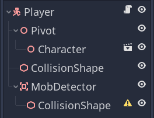
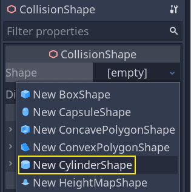
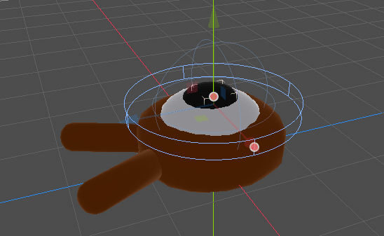
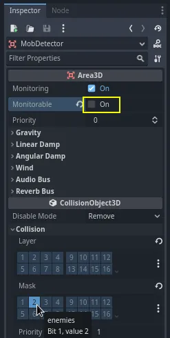
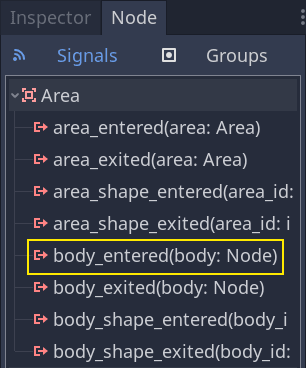
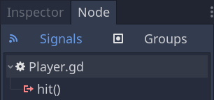

# Killing the player

We can kill enemies by jumping on them, but the player still can't die.
Let's fix this.

We want to detect being hit by an enemy differently from squashing them.
We want the player to die when they're moving on the floor, but not if
they're in the air. We could use vector math to distinguish the two
kinds of collisions. Instead, though, we will use an
`Area3D <class_Area3D>` node, which works well for hitboxes.

## Hitbox with the Area node

Head back to the `player.tscn` scene and add a new child node
`Area3D <class_Area3D>`. Name it `MobDetector` Add a
`CollisionShape3D <class_CollisionShape3D>` node as a child of it.

In the *Inspector*, assign a cylinder shape to it.

Here is a trick you can use to make the collisions only happen when the
player is on the ground or close to it. You can reduce the cylinder's
height and move it up to the top of the character. This way, when the
player jumps, the shape will be too high up for the enemies to collide
with it.

You also want the cylinder to be wider than the sphere. This way, the
player gets hit before colliding and being pushed on top of the
monster's collision box.

The wider the cylinder, the more easily the player will get killed.

Next, select the `MobDetector` node again, and in the *Inspector*, turn
**off** its *Monitorable* property. This makes it so other physics nodes
cannot detect the area. The complementary *Monitoring* property allows
it to detect collisions. Then, remove the *Collision -&gt; Layer* and
set the mask to the "enemies" layer.

When areas detect a collision, they emit signals. We're going to connect
one to the `Player` node. Select `MobDetector` and go to *Inspector*'s
*Node* tab, double-click the `body_entered` signal and connect it to the
`Player`

The *MobDetector* will emit `body_entered` when a
`CharacterBody3D <class_CharacterBody3D>` or a
`RigidBody3D <class_RigidBody3D>` node enters it. As it only masks the
"enemies" physics layers, it will only detect the `Mob` nodes.

Code-wise, we're going to do two things: emit a signal we'll later use
to end the game and destroy the player. We can wrap these operations in
a `die()` function that helps us put a descriptive label on the code.

.. code-tab:: gdscript GDScript

\# Emitted when the player was hit by a mob. \# Put this at the top of
the script. signal hit

\# And this function at the bottom. func die(): hit.emit() queue\_free()

func \_on\_mob\_detector\_body\_entered(body):  
die()

csharp

// Don't forget to rebuild the project so the editor knows about the new
signal.

// Emitted when the player was hit by a mob. \[Signal\] public delegate
void HitEventHandler();

// ...

private void Die() { EmitSignal(SignalName.Hit); QueueFree(); }

// We also specified this function name in PascalCase in the editor's
connection window. private void OnMobDetectorBodyEntered(Node3D body) {
Die(); }

## Ending the game

We can use the `Player`'s `hit` signal to end the game. All we need to
do is connect it to the `Main` node and stop the `MobTimer` in reaction.

Open `main.tscn`, select the `Player` node, and in the *Node* dock,
connect its `hit` signal to the `Main` node.

Get the timer, and stop it, in the `_on_player_hit()` function.

.. code-tab:: gdscript GDScript

func \_on\_player\_hit():  
$MobTimer.stop()

csharp

// We also specified this function name in PascalCase in the editor's
connection window. private void OnPlayerHit() {
GetNode&lt;Timer&gt;("MobTimer").Stop(); }

If you try the game now, the monsters will stop spawning when you die,
and the remaining ones will leave the screen.

Notice also that the game no longer crashes or displays an error when
the player dies. Because we are stopping the MobTimer, it no longer
triggers the `_on_mob_timer_timeout()` function.

Also note that the enemy colliding with the player and dying depends on
the size and position of the `Player` and the `Mob`'s collision shapes.
You may need to move them and resize them to achieve a tight game feel.

You can pat yourself on the back: you prototyped a complete 3D game,
even if it's still a bit rough.

From there, we'll add a score, the option to retry the game, and you'll
see how you can make the game feel much more alive with minimalistic
animations.

## Code checkpoint

Here are the complete scripts for the `Main`, `Mob`, and `Player` nodes,
for reference. You can use them to compare and check your code.

Starting with `main.gd`.

.. code-tab:: gdscript GDScript

extends Node

@export var mob\_scene: PackedScene

func \_on\_mob\_timer\_timeout():  
\# Create a new instance of the Mob scene. var mob =
mob\_scene.instantiate()

\# Choose a random location on the SpawnPath. \# We store the reference
to the SpawnLocation node. var mob\_spawn\_location =
get\_node("SpawnPath/SpawnLocation") \# And give it a random offset.
mob\_spawn\_location.progress\_ratio = randf()

var player\_position = $Player.position
mob.initialize(mob\_spawn\_location.position, player\_position)

\# Spawn the mob by adding it to the Main scene. add\_child(mob)

func \_on\_player\_hit():  
$MobTimer.stop()

csharp

using Godot;

public partial class Main : Node { \[Export\] public PackedScene
MobScene { get; set; }

> private void OnMobTimerTimeout() { // Create a new instance of the Mob
> scene. Mob mob = MobScene.Instantiate&lt;Mob&gt;();
>
> > // Choose a random location on the SpawnPath. // We store the
> > reference to the SpawnLocation node. var mobSpawnLocation =
> > GetNode&lt;PathFollow3D&gt;("SpawnPath/SpawnLocation"); // And give
> > it a random offset. mobSpawnLocation.ProgressRatio = GD.Randf();
> >
> > Vector3 playerPosition = GetNode&lt;Player&gt;("Player").Position;
> > mob.Initialize(mobSpawnLocation.Position, playerPosition);
> >
> > // Spawn the mob by adding it to the Main scene. AddChild(mob);
>
> }
>
> private void OnPlayerHit() { GetNode&lt;Timer&gt;("MobTimer").Stop();
> }

}

Next is `mob.gd`.

.. code-tab:: gdscript GDScript

extends CharacterBody3D

\# Minimum speed of the mob in meters per second. @export var min\_speed
= 10 \# Maximum speed of the mob in meters per second. @export var
max\_speed = 18

\# Emitted when the player jumped on the mob signal squashed

func \_physics\_process(\_delta):  
move\_and\_slide()

\# This function will be called from the Main scene. func
initialize(start\_position, player\_position): \# We position the mob by
placing it at start\_position \# and rotate it towards player\_position,
so it looks at the player. look\_at\_from\_position(start\_position,
player\_position, Vector3.UP) \# Rotate this mob randomly within range
of -45 and +45 degrees, \# so that it doesn't move directly towards the
player. rotate\_y(randf\_range(-PI / 4, PI / 4))

> \# We calculate a random speed (integer) var random\_speed =
> randi\_range(min\_speed, max\_speed) \# We calculate a forward
> velocity that represents the speed. velocity = Vector3.FORWARD \*
> random\_speed \# We then rotate the velocity vector based on the mob's
> Y rotation \# in order to move in the direction the mob is looking.
> velocity = velocity.rotated(Vector3.UP, rotation.y)

func \_on\_visible\_on\_screen\_notifier\_3d\_screen\_exited():  
queue\_free()

func squash():  
squashed.emit() queue\_free() \# Destroy this node

csharp

using Godot;

public partial class Mob : CharacterBody3D { // Emitted when the played
jumped on the mob. \[Signal\] public delegate void
SquashedEventHandler();

> // Minimum speed of the mob in meters per second \[Export\] public int
> MinSpeed { get; set; } = 10; // Maximum speed of the mob in meters per
> second \[Export\] public int MaxSpeed { get; set; } = 18;
>
> public override void \_PhysicsProcess(double delta) { MoveAndSlide();
> }
>
> // This function will be called from the Main scene. public void
> Initialize(Vector3 startPosition, Vector3 playerPosition) { // We
> position the mob by placing it at startPosition // and rotate it
> towards playerPosition, so it looks at the player.
> LookAtFromPosition(startPosition, playerPosition, Vector3.Up); //
> Rotate this mob randomly within range of -45 and +45 degrees, // so
> that it doesn't move directly towards the player.
> RotateY((float)GD.RandRange(-Mathf.Pi / 4.0, Mathf.Pi / 4.0));
>
> > // We calculate a random speed (integer) int randomSpeed =
> > GD.RandRange(MinSpeed, MaxSpeed); // We calculate a forward velocity
> > that represents the speed. Velocity = Vector3.Forward \*
> > randomSpeed; // We then rotate the velocity vector based on the
> > mob's Y rotation // in order to move in the direction the mob is
> > looking. Velocity = Velocity.Rotated(Vector3.Up, Rotation.Y);
>
> }
>
> public void Squash() { EmitSignal(SignalName.Squashed); QueueFree();
> // Destroy this node }
>
> private void OnVisibilityNotifierScreenExited() { QueueFree(); }

}

Finally, the longest script, `player.gd`:

.. code-tab:: gdscript GDScript

extends CharacterBody3D

signal hit

\# How fast the player moves in meters per second @export var speed = 14
\# The downward acceleration while in the air, in meters per second
squared. @export var fall\_acceleration = 75 \# Vertical impulse applied
to the character upon jumping in meters per second. @export var
jump\_impulse = 20 \# Vertical impulse applied to the character upon
bouncing over a mob \# in meters per second. @export var bounce\_impulse
= 16

var target\_velocity = Vector3.ZERO

func \_physics\_process(delta):  
\# We create a local variable to store the input direction var direction
= Vector3.ZERO

\# We check for each move input and update the direction accordingly if
Input.is\_action\_pressed("move\_right"): direction.x = direction.x + 1
if Input.is\_action\_pressed("move\_left"): direction.x = direction.x -
1 if Input.is\_action\_pressed("move\_back"): \# Notice how we are
working with the vector's x and z axes. \# In 3D, the XZ plane is the
ground plane. direction.z = direction.z + 1 if
Input.is\_action\_pressed("move\_forward"): direction.z = direction.z -
1

\# Prevent diagonal moving fast af if direction != Vector3.ZERO:
direction = direction.normalized() $Pivot.look\_at(position + direction,
Vector3.UP)

\# Ground Velocity target\_velocity.x = direction.x \* speed
target\_velocity.z = direction.z \* speed

\# Vertical Velocity if not is\_on\_floor(): \# If in the air, fall
towards the floor. Literally gravity target\_velocity.y =
target\_velocity.y - (fall\_acceleration \* delta)

\# Jumping. if is\_on\_floor() and
Input.is\_action\_just\_pressed("jump"): target\_velocity.y =
jump\_impulse

\# Iterate through all collisions that occurred this frame \# in C this
would be for(int i = 0; i &lt; collisions.Count; i++) for index in
range(get\_slide\_collision\_count()): \# We get one of the collisions
with the player var collision = get\_slide\_collision(index)

> \# If the collision is with ground if collision.get\_collider() ==
> null: continue
>
> \# If the collider is with a mob if
> collision.get\_collider().is\_in\_group("mob"): var mob =
> collision.get\_collider() \# we check that we are hitting it from
> above. if Vector3.UP.dot(collision.get\_normal()) &gt; 0.1: \# If so,
> we squash it and bounce. mob.squash() target\_velocity.y =
> bounce\_impulse \# Prevent further duplicate calls. break

\# Moving the Character velocity = target\_velocity move\_and\_slide()

\# And this function at the bottom. func die(): hit.emit() queue\_free()

func \_on\_mob\_detector\_body\_entered(body):  
die()

csharp

using Godot;

public partial class Player : CharacterBody3D { // Emitted when the
player was hit by a mob. \[Signal\] public delegate void
HitEventHandler();

> // How fast the player moves in meters per second. \[Export\] public
> int Speed { get; set; } = 14; // The downward acceleration when in the
> air, in meters per second squared. \[Export\] public int
> FallAcceleration { get; set; } = 75; // Vertical impulse applied to
> the character upon jumping in meters per second. \[Export\] public int
> JumpImpulse { get; set; } = 20; // Vertical impulse applied to the
> character upon bouncing over a mob in meters per second. \[Export\]
> public int BounceImpulse { get; set; } = 16;
>
> private Vector3 \_targetVelocity = Vector3.Zero;
>
> public override void \_PhysicsProcess(double delta) { // We create a
> local variable to store the input direction. var direction =
> Vector3.Zero;
>
> > // We check for each move input and update the direction
> > accordingly. if (Input.IsActionPressed("move\_right")) { direction.X
> > += 1.0f; } if (Input.IsActionPressed("move\_left")) { direction.X -=
> > 1.0f; } if (Input.IsActionPressed("move\_back")) { // Notice how we
> > are working with the vector's X and Z axes. // In 3D, the XZ plane
> > is the ground plane. direction.Z += 1.0f; } if
> > (Input.IsActionPressed("move\_forward")) { direction.Z -= 1.0f; }
> >
> > // Prevent diagonal moving fast af if (direction != Vector3.Zero) {
> > direction = direction.Normalized();
> > GetNode&lt;Node3D&gt;("Pivot").LookAt(Position + direction,
> > Vector3.Up); }
> >
> > // Ground Velocity \_targetVelocity.X = direction.X \* Speed;
> > \_targetVelocity.Z = direction.Z \* Speed;
> >
> > // Vertical Velocity if (!IsOnFloor()) // If in the air, fall
> > towards the floor. Literally gravity { \_targetVelocity.Y -=
> > FallAcceleration \* (float)delta; }
> >
> > // Jumping. if (IsOnFloor() && Input.IsActionJustPressed("jump")) {
> > \_targetVelocity.Y = JumpImpulse; }
> >
> > // Iterate through all collisions that occurred this frame. for (int
> > index = 0; index &lt; GetSlideCollisionCount(); index++) { // We get
> > one of the collisions with the player. KinematicCollision3D
> > collision = GetSlideCollision(index);
> >
> > > // If the collision is with a mob. if (collision.GetCollider() is
> > > Mob mob) { // We check that we are hitting it from above. if
> > > (Vector3.Up.Dot(collision.GetNormal()) &gt; 0.1f) { // If so, we
> > > squash it and bounce. mob.Squash(); \_targetVelocity.Y =
> > > BounceImpulse; // Prevent further duplicate calls. break; } }
> >
> > }
> >
> > // Moving the Character Velocity = \_targetVelocity; MoveAndSlide();
>
> }
>
> private void Die() { EmitSignal(SignalName.Hit); QueueFree(); }
>
> private void OnMobDetectorBodyEntered(Node3D body) { Die(); }

}

See you in the next lesson to add the score and the retry option.
