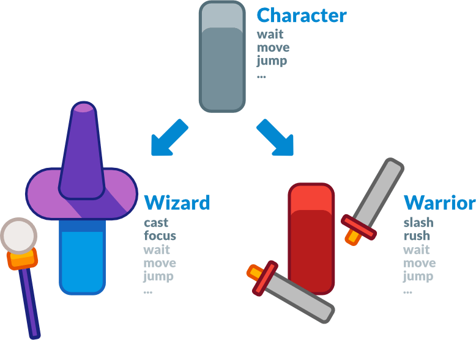
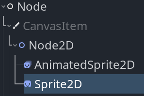
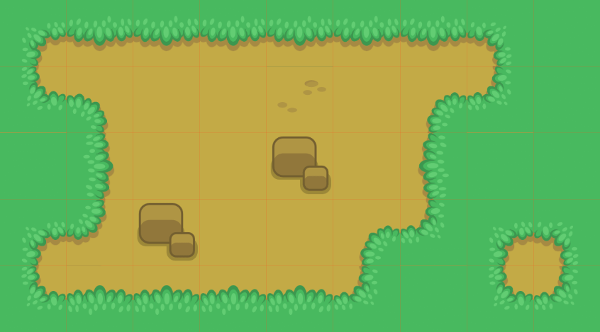
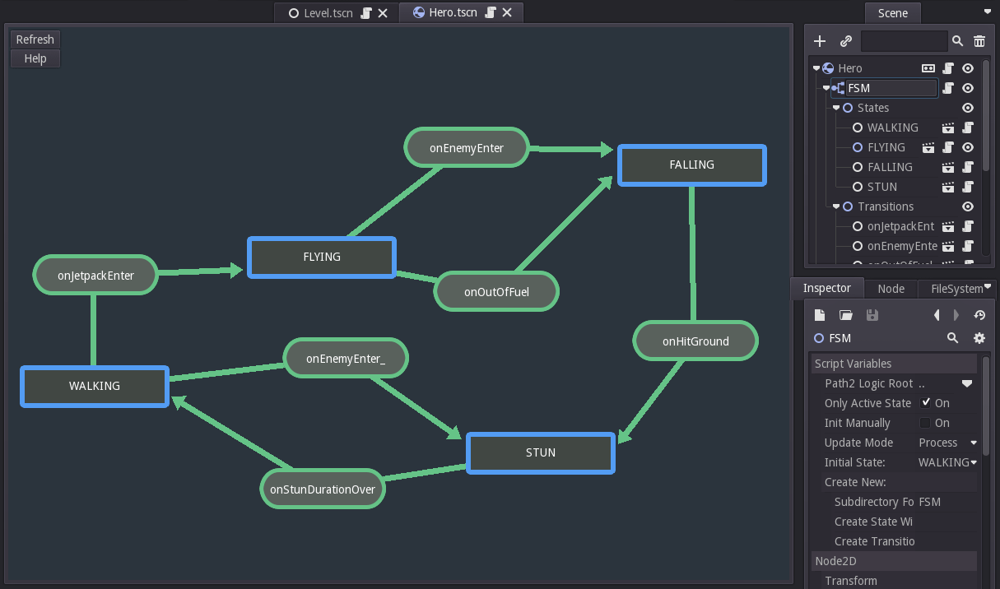

# Godot's design philosophy

Now that you've gotten your feet wet, let's talk about Godot's design.

**Every game engine is different and fits different needs.** Not only do
they offer a range of features, but the design of each engine is unique.
This leads to different workflows and different ways to form your games'
structures. This all stems from their respective design philosophies.

This page is here to help you understand how Godot works, starting with
some of its core pillars. It is not a list of available features, nor is
it an engine comparison. To know if any engine can be a good fit for
your project, you need to try it out for yourself and understand its
design and limitations.

Please watch [Godot explained in 7
minutes](https://www.youtube.com/watch?v=yS9cuu5o5Ug) if you're looking
for an overview of the engine's features.

## Object-oriented design and composition

Godot embraces object-oriented design at its core with its flexible
scene system and Node hierarchy. It tries to stay away from strict
programming patterns to offer an intuitive way to structure your game.

For one, Godot lets you **compose or aggregate** scenes. It's like
nested prefabs: you can create a BlinkingLight scene and a BrokenLantern
scene that uses the BlinkingLight. Then, create a city filled with
BrokenLanterns. Change the BlinkingLight's color, save, and all the
BrokenLanterns in the city will update instantly.

On top of that, you can **inherit** from any scene.

A Godot scene could be a Weapon, a Character, an Item, a Door, a Level,
part of a level… anything you'd like. It works like a class in pure
code, except you're free to design it by using the editor, using only
the code, or mixing and matching the two.

It's different from prefabs you find in several 3D engines, as you can
then inherit from and extend those scenes. You may create a Magician
that extends your Character. Modify the Character in the editor and the
Magician will update as well. It helps you build your projects so that
their structure matches the game's design.

Also note that Godot offers many different types of objects called
nodes, each with a specific purpose. Nodes are part of a tree and always
inherit from their parents up to the Node class. Although the engine
does feature some nodes like collision shapes that a parent physics body
will use, most nodes work independently from one another.

In other words, Godot's nodes do not work like components in some other
game engines.

Sprite2D is a Node2D, a CanvasItem and a Node. It has all the properties
and features of its three parent classes, like transforms or the ability
to draw custom shapes and render with a custom shader.

## All-inclusive package

Godot tries to provide its own tools to answer most common needs. It has
a dedicated scripting workspace, an animation editor, a tilemap editor,
a shader editor, a debugger, a profiler, the ability to hot-reload
locally and on remote devices, etc.

The goal is to offer a full package to create games and a continuous
user experience. You can still work with external programs as long as
there is an import plugin available in Godot for it. Or you can create
one, like the [Tiled Map
Importer](https://github.com/vnen/godot-tiled-importer).

That is also partly why Godot offers its own programming language
GDScript along with C#. GDScript is designed for the needs of game
developers and game designers, and is tightly integrated in the engine
and the editor.

GDScript lets you write code using an indentation-based syntax, yet it
detects types and offers a static language's quality of auto-completion.
It is also optimized for gameplay code with built-in types like Vectors
and Colors.

Note that with GDExtension, you can write high-performance code using
compiled languages like C, C++, Rust, D, Haxe, or Swift without
recompiling the engine.

Note that the 3D workspace doesn't feature as many tools as the 2D
workspace. You'll need external programs or add-ons to edit terrains,
animate complex characters, and so on. Godot provides a complete API to
extend the editor's functionality using game code. See [The Godot editor
is a Godot game](#the-godot-editor-is-a-godot-game) below.

*A State Machine editor plugin in Godot 2 by kubecz3k. It lets you
manage states and transitions visually.*

## Open source

Godot offers a fully open source codebase under the **MIT license**.
This means all the technologies that ship with it have to be Free (as in
freedom) as well. For the most part, they're developed from the ground
up by contributors.

Anyone can plug in proprietary tools for the needs of their projects —
they just won't ship with the engine. This may include Google AdMob, or
FMOD. Any of these can come as third-party plugins instead.

On the other hand, an open codebase means you can **learn from and
extend the engine** to your heart's content. You can also debug games
easily, as Godot will print errors with a stack trace, even if they come
from the engine itself.

Note

This **does not affect the work you do with Godot** in any way: there's
no strings attached to the engine or anything you make with it.

## Community-driven

**Godot is made by its community, for the community, and for all game
creators out there.** It's the needs of the users and open discussions
that drive the core updates. New features from the core developers often
focus on what will benefit the most users first.

That said, although a handful of core developers work on it full-time,
the project has thousands of contributors at the time of writing.
Benevolent programmers work on features they may need themselves, so
you'll see improvements in all corners of the engine at the same time in
every major release.

## The Godot editor is a Godot game

The Godot editor runs on the game engine. It uses the engine's own UI
system, it can hot-reload code and scenes when you test your projects,
or run game code in the editor. This means you can **use the same code**
and scenes for your games, or **build plugins and extend the editor.**

This leads to a reliable and flexible UI system, as it powers the editor
itself. With the `@tool` annotation, you can run any game code in the
editor.

*RPG in a Box is a voxel RPG editor made with Godot 2. It uses Godot's
UI tools for its node-based programming system and for the rest of the
interface.*

Put the `@tool` annotation at the top of any GDScript file and it will
run in the editor. This lets you import and export plugins, create
plugins like custom level editors, or create scripts with the same nodes
and API you use in your projects.

Note

The editor is fully written in C++ and is statically compiled into the
binary. This means you can't import it as a typical project that would
have a `project.godot` file.

## Separate 2D and 3D engines

Godot offers dedicated 2D and 3D rendering engines. As a result, **the
base unit for 2D scenes is pixels.** Even though the engines are
separate, you can render 2D in 3D, 3D in 2D, and overlay 2D sprites and
interfaces over your 3D world.
