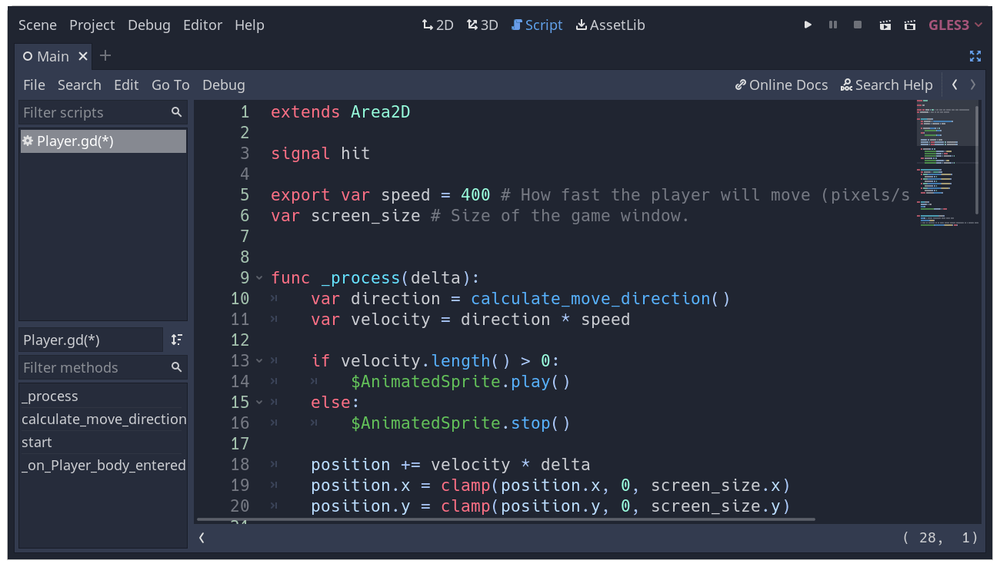
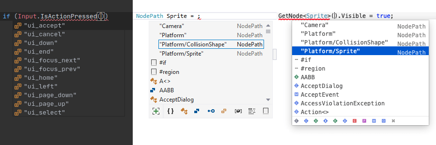

article\_outdated  
True

# Scripting languages

This lesson will give you an overview of the available scripting
languages in Godot. You will learn the pros and cons of each option. In
the next part, you will write your first script using GDScript.

**Scripts attach to a node and extend its behavior**. This means that
scripts inherit all functions and properties of the node they attach to.

For example, take a game where a Camera2D node follows a ship. The
Camera2D node follows its parent by default. Imagine you want the camera
to shake when the player takes damage. As this feature is not built into
Godot, you would attach a script to the Camera2D node and code the
shake.

## Available scripting languages

Godot offers **four gameplay programming languages**: GDScript, C#, and,
via its GDExtension technology, C and C++. There are more
community-supported languages, but these are the official ones.

You can use multiple languages in a single project. For instance, in a
team, you could code gameplay logic in GDScript as it's fast to write,
and use C# or C++ to implement complex algorithms and maximize their
performance. Or you can write everything in GDScript or C#. It's your
call.

We provide this flexibility to answer the needs of different game
projects and developers.

## Which language should I use?

If you're a beginner, we recommend to **start with GDScript**. We made
this language specifically for Godot and the needs of game developers.
It has a lightweight and straightforward syntax and provides the
tightest integration with Godot.

For C#, you will need an external code editor like
[VSCode](https://code.visualstudio.com/) or Visual Studio. While C#
support is now mature, you will find fewer learning resources for it
compared to GDScript. That's why we recommend C# mainly to users who
already have experience with the language.

Let's look at each language's features, as well as its pros and cons.

### GDScript

`GDScript<doc_gdscript>` is an
[object-oriented](https://en.wikipedia.org/wiki/Object-oriented_programming)
and [imperative](https://en.wikipedia.org/wiki/Imperative_programming)
programming language built for Godot. It's made by and for game
developers to save you time coding games. Its features include:

-   A simple syntax that leads to short files.
-   Blazing fast compilation and loading times.
-   Tight editor integration, with code completion for nodes, signals,
    and more information from the scene it's attached to.
-   Built-in vector and transform types, making it efficient for heavy
    use of linear algebra, a must for games.
-   Supports multiple threads as efficiently as statically typed
    languages.
-   No [garbage
    collection](https://en.wikipedia.org/wiki/Garbage_collection_(computer_science)),
    as this feature eventually gets in the way when creating games. The
    engine counts references and manages the memory for you in most
    cases by default, but you can also control memory if you need to.
-   [Gradual typing](https://en.wikipedia.org/wiki/Gradual_typing).
    Variables have dynamic types by default, but you also can use type
    hints for strong type checks.

GDScript looks like Python as you structure your code blocks using
indentations, but it doesn't work the same way in practice. It's
inspired by multiple languages, including Squirrel, Lua, and Python.

Note

Why don't we use Python or Lua directly?

Years ago, Godot used Python, then Lua. Both languages' integration took
a lot of work and had severe limitations. For example, threading support
was a big challenge with Python.

Developing a dedicated language doesn't take us more work and we can
tailor it to game developers' needs. We're now working on performance
optimizations and features that would've been difficult to offer with
third-party languages.

### .NET / C#

As Microsoft's
[C#](https://en.wikipedia.org/wiki/C_Sharp_(programming_language)) is a
favorite amongst game developers, we officially support it. C# is a
mature and flexible language with tons of libraries written for it. We
were able to add support for it thanks to a generous donation from
Microsoft.

C# offers a good tradeoff between performance and ease of use, although
you should be aware of its garbage collector.

Note

You must use the .NET edition of the Godot editor to script in C#. You
can download it on the Godot website's
[download](https://godotengine.org/download/) page.

Since Godot uses .NET 6, in theory, you can use any third-party .NET
library or framework in Godot, as well as any Common Language
Infrastructure-compliant programming language, such as F#, Boo, or
ClojureCLR. However, C# is the only officially supported .NET option.

Note

GDScript code itself doesn't execute as fast as compiled C# or C++.
However, most script code calls functions written with fast algorithms
in C++ code inside the engine. In many cases, writing gameplay logic in
GDScript, C#, or C++ won't have a significant impact on performance.

Attention

Projects written in C# using Godot 4 currently cannot be exported to the
web platform. To use C# on that platform, consider Godot 3 instead.
Android and iOS platform support is available as of Godot 4.2, but is
experimental and `some limitations apply <doc_c_sharp_platforms>`.

To learn more about C#, head to the `C# basics <doc_c_sharp>` page.

### C++ via GDExtension

GDExtension allows you to write game code in C++ without needing to
recompile Godot.

You can use any version of the language or mix compiler brands and
versions for the generated shared libraries, thanks to our use of an
internal C API Bridge.

GDExtension is the best choice for performance. You don't need to use it
throughout an entire game, as you can write other parts in GDScript or
C#.

When working with GDExtension, the available types, functions, and
properties closely resemble Godot's actual C++ API.

## Summary

Scripts are files containing code that you attach to a node to extend
its functionality.

Godot supports four official scripting languages, offering you
flexibility between performance and ease of use.

You can mix languages, for instance, to implement demanding algorithms
with C or C++ and write most of the game logic with GDScript or C#.
