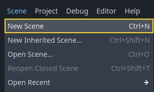
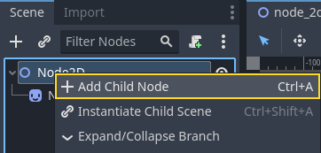
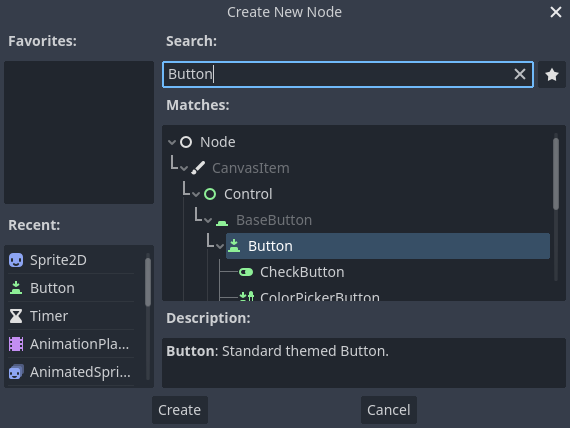
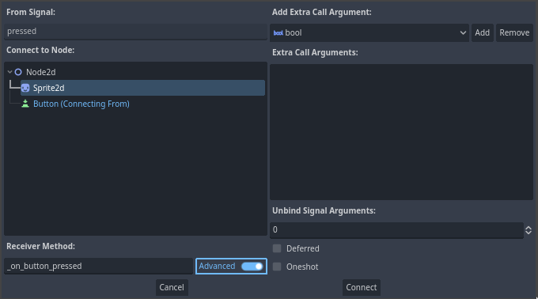
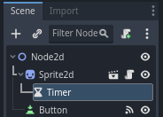
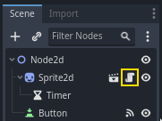

# Using signals

In this lesson, we will look at signals. They are messages that nodes
emit when something specific happens to them, like a button being
pressed. Other nodes can connect to that signal and call a function when
the event occurs.

Signals are a delegation mechanism built into Godot that allows one game
object to react to a change in another without them referencing one
another. Using signals limits
[coupling](https://en.wikipedia.org/wiki/Coupling_(computer_programming))
and keeps your code flexible.

For example, you might have a life bar on the screen that represents the
player's health. When the player takes damage or uses a healing potion,
you want the bar to reflect the change. To do so, in Godot, you would
use signals.

Like methods (`class_callable`), signals are a first-class type since
Godot 4.0. This means you can pass them around as method arguments
directly without having to pass them as strings, which allows for better
autocompletion and is less error-prone. See the `class_signal` class
reference for a list of what you can do with the Signal type directly.

As mentioned in the introduction, signals are Godot's version of the
observer pattern. You can learn more about it in [Game Programming
Patterns](https://gameprogrammingpatterns.com/observer.html).

We will now use a signal to make our Godot icon from the previous lesson
(`doc_scripting_player_input`) move and stop by pressing a button.

Note

For this project, we will be following the Godot naming conventions.

-   **GDScript**: Classes (nodes) use PascalCase, variables and
    functions use snake\_case, and constants use ALL\_CAPS (See
    `doc_gdscript_styleguide`).
-   **C#**: Classes, export variables and methods use PascalCase,
    private fields use \_camelCase, local variables and parameters use
    camelCase (See `doc_c_sharp_styleguide`). Be careful to type the
    method names precisely when connecting signals.

## Scene setup

To add a button to our game, we will create a new scene which will
include both a `Button <class_button>` and the `sprite_2d.tscn` scene we
created in the `doc_scripting_first_script` lesson.

Create a new scene by going to the menu Scene -&gt; New Scene.

In the Scene dock, click the 2D Scene button. This will add a
`Node2D <class_Node2D>` as our root.

In the FileSystem dock, click and drag the `sprite_2d.tscn` file you
saved previously onto the Node2D to instantiate it.

We want to add another node as a sibling of the Sprite2D. To do so,
right-click on Node2D and select Add Child Node.

Search for the `Button <class_button>` node and add it.

The node is small by default. Click and drag on the bottom-right handle
of the Button in the viewport to resize it.

If you don't see the handles, ensure the select tool is active in the
toolbar.

Click and drag on the button itself to move it closer to the sprite.

You can also write a label on the Button by editing its Text property in
the Inspector. Enter `Toggle motion`.

Your scene tree and viewport should look like this.

Save your newly created scene as `node_2d.tscn`, if you haven't already.
You can then run it with `F6` (`Cmd + R` on macOS). At the moment, the
button will be visible, but nothing will happen if you press it.

## Connecting a signal in the editor

Here, we want to connect the Button's "pressed" signal to our Sprite2D,
and we want to call a new function that will toggle its motion on and
off. We need to have a script attached to the Sprite2D node, which we do
from the previous lesson.

You can connect signals in the Node dock. Select the Button node and, on
the right side of the editor, click on the tab named "Node" next to the
Inspector.

The dock displays a list of signals available on the selected node.

Double-click the "pressed" signal to open the node connection window.

There, you can connect the signal to the Sprite2D node. The node needs a
receiver method, a function that Godot will call when the Button emits
the signal. The editor generates one for you. By convention, we name
these callback methods "\_on\_node\_name\_signal\_name". Here, it'll be
"\_on\_button\_pressed".

Note

When connecting signals via the editor's Node dock, you can use two
modes. The simple one only allows you to connect to nodes that have a
script attached to them and creates a new callback function on them.

The advanced view lets you connect to any node and any built-in
function, add arguments to the callback, and set options. You can toggle
the mode in the window's bottom-right by clicking the Advanced button.

Note

If you are using an external editor (such as VS Code) this automatic
code generation might not work. In this case you need to to connect the
signal via code as explained in the next section.

Click the Connect button to complete the signal connection and jump to
the Script workspace. You should see the new method with a connection
icon in the left margin.

If you click the icon, a window pops up and displays information about
the connection. This feature is only available when connecting nodes in
the editor.

Let's replace the line with the `pass` keyword with code that'll toggle
the node's motion.

Our Sprite2D moves thanks to code in the `_process()` function. Godot
provides a method to toggle processing on and off: `Node.set_process()
<class_Node_method_set_process>`. Another method of the Node class,
`is_processing()`, returns `true` if idle processing is active. We can
use the `not` keyword to invert the value.

.. code-tab:: gdscript GDScript

func \_on\_button\_pressed():  
set\_process(not is\_processing())

csharp C#

// We also specified this function name in PascalCase in the editor's
connection window. private void OnButtonPressed() {
SetProcess(!IsProcessing()); }

This function will toggle processing and, in turn, the icon's motion on
and off upon pressing the button.

Before trying the game, we need to simplify our `_process()` function to
move the node automatically and not wait for user input. Replace it with
the following code, which we saw two lessons ago:

.. code-tab:: gdscript GDScript

func \_process(delta):  
rotation += angular\_speed \* delta var velocity =
Vector2.UP.rotated(rotation) \* speed position += velocity \* delta

csharp C#

public override void \_Process(double delta) { Rotation +=
\_angularSpeed \* (float)delta; var velocity =
Vector2.Up.Rotated(Rotation) \* \_speed; Position += velocity \*
(float)delta; }

Your complete `sprite_2d.gd` code should look like the following.

.. code-tab:: gdscript GDScript

extends Sprite2D

var speed = 400 var angular\_speed = PI

func \_process(delta):  
rotation += angular\_speed \* delta var velocity =
Vector2.UP.rotated(rotation) \* speed position += velocity \* delta

func \_on\_button\_pressed():  
set\_process(not is\_processing())

csharp C#

using Godot;

public partial class MySprite2D : Sprite2D { private float \_speed =
400; private float \_angularSpeed = Mathf.Pi;

> public override void \_Process(double delta) { Rotation +=
> \_angularSpeed \* (float)delta; var velocity =
> Vector2.Up.Rotated(Rotation) \* \_speed; Position += velocity \*
> (float)delta; }
>
> // We also specified this function name in PascalCase in the editor's
> connection window. private void OnButtonPressed() {
> SetProcess(!IsProcessing()); }

}

Run the scene now and click the button to see the sprite start and stop.

## Connecting a signal via code

You can connect signals via code instead of using the editor. This is
necessary when you create nodes or instantiate scenes inside of a
script.

Let's use a different node here. Godot has a `Timer <class_Timer>` node
that's useful to implement skill cooldown times, weapon reloading, and
more.

Head back to the 2D workspace. You can either click the "2D" text at the
top of the window or press `Ctrl + F1` (`Ctrl + Cmd + 1` on macOS).

In the Scene dock, right-click on the Sprite2D node and add a new child
node. Search for Timer and add the corresponding node. Your scene should
now look like this.

With the Timer node selected, go to the Inspector and enable the
**Autostart** property.

Click the script icon next to Sprite2D to jump back to the scripting
workspace.

We need to do two operations to connect the nodes via code:

1.  Get a reference to the Timer from the Sprite2D.
2.  Call the `connect()` method on the Timer's "timeout" signal.

Note

To connect to a signal via code, you need to call the `connect()` method
of the signal you want to listen to. In this case, we want to listen to
the Timer's "timeout" signal.

We want to connect the signal when the scene is instantiated, and we can
do that using the `Node._ready() <class_Node_private_method__ready>`
built-in function, which is called automatically by the engine when a
node is fully instantiated.

To get a reference to a node relative to the current one, we use the
method `Node.get_node() <class_Node_method_get_node>`. We can store the
reference in a variable.

.. code-tab:: gdscript GDScript

func \_ready():  
var timer = get\_node("Timer")

csharp C#

public override void \_Ready() { var timer =
GetNode&lt;Timer&gt;("Timer"); }

The function `get_node()` looks at the Sprite2D's children and gets
nodes by their name. For example, if you renamed the Timer node to
"BlinkingTimer" in the editor, you would have to change the call to
`get_node("BlinkingTimer")`.

We can now connect the Timer to the Sprite2D in the `_ready()` function.

.. code-tab:: gdscript GDScript

func \_ready():  
var timer = get\_node("Timer")
timer.timeout.connect(\_on\_timer\_timeout)

csharp C#

public override void \_Ready() { var timer =
GetNode&lt;Timer&gt;("Timer"); timer.Timeout += OnTimerTimeout; }

The line reads like so: we connect the Timer's "timeout" signal to the
node to which the script is attached. When the Timer emits `timeout`, we
want to call the function `_on_timer_timeout()`, that we need to define.
Let's add it at the bottom of our script and use it to toggle our
sprite's visibility.

Note

By convention, we name these callback methods in GDScript as
"\_on\_node\_name\_signal\_name" and in C# as "OnNodeNameSignalName".
Here, it'll be "\_on\_timer\_timeout" for GDScript and OnTimerTimeout()
for C#.

.. code-tab:: gdscript GDScript

func \_on\_timer\_timeout():  
visible = not visible

csharp C#

private void OnTimerTimeout() { Visible = !Visible; }

The `visible` property is a boolean that controls the visibility of our
node. The line `visible = not visible` toggles the value. If `visible`
is `true`, it becomes `false`, and vice-versa.

If you run the Node2D scene now, you will see that the sprite blinks on
and off, at one second intervals.

## Complete script

That's it for our little moving and blinking Godot icon demo! Here is
the complete `sprite_2d.gd` file for reference.

.. code-tab:: gdscript GDScript

extends Sprite2D

var speed = 400 var angular\_speed = PI

func \_ready():  
var timer = get\_node("Timer")
timer.timeout.connect(\_on\_timer\_timeout)

func \_process(delta):  
rotation += angular\_speed \* delta var velocity =
Vector2.UP.rotated(rotation) \* speed position += velocity \* delta

func \_on\_button\_pressed():  
set\_process(not is\_processing())

func \_on\_timer\_timeout():  
visible = not visible

csharp C#

using Godot;

public partial class MySprite2D : Sprite2D { private float \_speed =
400; private float \_angularSpeed = Mathf.Pi;

> public override void \_Ready() { var timer =
> GetNode&lt;Timer&gt;("Timer"); timer.Timeout += OnTimerTimeout; }
>
> public override void \_Process(double delta) { Rotation +=
> \_angularSpeed \* (float)delta; var velocity =
> Vector2.Up.Rotated(Rotation) \* \_speed; Position += velocity \*
> (float)delta; }
>
> // We also specified this function name in PascalCase in the editor's
> connection window. private void OnButtonPressed() {
> SetProcess(!IsProcessing()); }
>
> private void OnTimerTimeout() { Visible = !Visible; }

}

## Custom signals

Note

This section is a reference on how to define and use your own signals,
and does not build upon the project created in previous lessons.

You can define custom signals in a script. Say, for example, that you
want to show a game over screen when the player's health reaches zero.
To do so, you could define a signal named "died" or "health\_depleted"
when their health reaches 0.

.. code-tab:: gdscript GDScript

extends Node2D

signal health\_depleted

var health = 10

csharp C#

using Godot;

public partial class MyNode2D : Node2D { \[Signal\] public delegate void
HealthDepletedEventHandler();

> private int \_health = 10;

}

Note

As signals represent events that just occurred, we generally use an
action verb in the past tense in their names.

Your signals work the same way as built-in ones: they appear in the Node
tab and you can connect to them like any other.

To emit a signal in your scripts, call `emit()` on the signal.

.. code-tab:: gdscript GDScript

func take\_damage(amount):  
health -= amount if health &lt;= 0: health\_depleted.emit()

csharp C#

public void TakeDamage(int amount) { \_health -= amount;

> if (\_health &lt;= 0) { EmitSignal(SignalName.HealthDepleted); }

}

A signal can optionally declare one or more arguments. Specify the
argument names between parentheses:

.. code-tab:: gdscript GDScript

extends Node2D

signal health\_changed(old\_value, new\_value)

var health = 10

csharp C#

using Godot;

public partial class MyNode : Node { \[Signal\] public delegate void
HealthChangedEventHandler(int oldValue, int newValue);

> private int \_health = 10;

}

Note

The signal arguments show up in the editor's node dock, and Godot can
use them to generate callback functions for you. However, you can still
emit any number of arguments when you emit signals. So it's up to you to
emit the correct values.

To emit values along with the signal, add them as extra arguments to the
`emit()` function:

.. code-tab:: gdscript GDScript

func take\_damage(amount):  
var old\_health = health health -= amount
health\_changed.emit(old\_health, health)

csharp C#

public void TakeDamage(int amount) { int oldHealth = \_health; \_health
-= amount; EmitSignal(SignalName.HealthChanged, oldHealth, \_health); }

## Summary

Any node in Godot emits signals when something specific happens to them,
like a button being pressed. Other nodes can connect to individual
signals and react to selected events.

Signals have many uses. With them, you can react to a node entering or
exiting the game world, to a collision, to a character entering or
leaving an area, to an element of the interface changing size, and much
more.

For example, an `Area2D <class_Area2D>` representing a coin emits a
`body_entered` signal whenever the player's physics body enters its
collision shape, allowing you to know when the player collected it.

In the next section, `doc_your_first_2d_game`, you'll create a complete
2D game and put everything you learned so far into practice.
