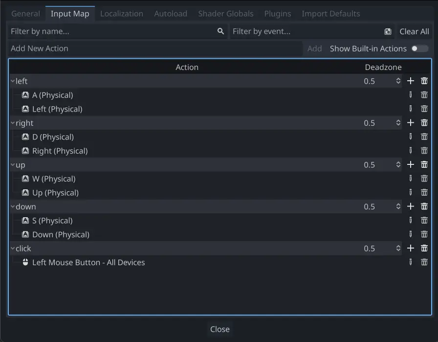
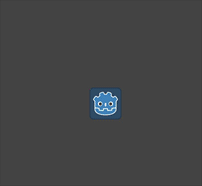

# 2D movement overview

## Introduction

Every beginner has been there: "How do I move my character?" Depending
on the style of game you're making, you may have special requirements,
but in general the movement in most 2D games is based on a small number
of designs.

We'll use `CharacterBody2D <class_CharacterBody2D>` for these examples,
but the principles will apply to other node types (Area2D, RigidBody2D)
as well.

## Setup

Each example below uses the same scene setup. Start with a
`CharacterBody2D` with two children: `Sprite2D` and `CollisionShape2D`.
You can use the Godot icon ("icon.png") for the Sprite2D's texture or
use any other 2D image you have.

Open `Project -> Project Settings` and select the "Input Map" tab. Add
the following input actions (see `InputEvent <doc_inputevent>` for
details):

## 8-way movement

In this scenario, you want the user to press the four directional keys
(up/left/down/right or W/A/S/D) and move in the selected direction. The
name "8-way movement" comes from the fact that the player can move
diagonally by pressing two keys at the same time.

Add a script to the character body and add the following code:

.. code-tab:: gdscript GDScript

extends CharacterBody2D

@export var speed = 400

func get\_input():  
var input\_direction = Input.get\_vector("left", "right", "up", "down")
velocity = input\_direction \* speed

func \_physics\_process(delta):  
get\_input() move\_and\_slide()

csharp

using Godot;

public partial class Movement : CharacterBody2D { \[Export\] public int
Speed { get; set; } = 400;

> public void GetInput() {
>
> > Vector2 inputDirection = Input.GetVector("left", "right", "up",
> > "down"); Velocity = inputDirection \* Speed;
>
> }
>
> public override void \_PhysicsProcess(double delta) { GetInput();
> MoveAndSlide(); }

}

In the `get_input()` function, we use `Input <class_Input>`
`get_vector()` to check for the four key events and sum return a
direction vector.

We can then set our velocity by multiplying this direction vector, which
has a length of `1`, by our desired speed.

Tip

If you've never used vector math before, or need a refresher, you can
see an explanation of vector usage in Godot at `doc_vector_math`.

Note

If the code above does nothing when you press the keys, double-check
that you've set up input actions correctly as described in the
`doc_2d_movement_setup` part of this tutorial.

## Rotation + movement

This type of movement is sometimes called "Asteroids-style" because it
resembles how that classic arcade game worked. Pressing left/right
rotates the character, while up/down moves it forward or backward in
whatever direction it's facing.

.. code-tab:: gdscript GDScript

extends CharacterBody2D

@export var speed = 400 @export var rotation\_speed = 1.5

var rotation\_direction = 0

func get\_input():  
rotation\_direction = Input.get\_axis("left", "right") velocity =
transform.x \* Input.get\_axis("down", "up") \* speed

func \_physics\_process(delta):  
get\_input() rotation += rotation\_direction \* rotation\_speed \* delta
move\_and\_slide()

csharp

using Godot;

public partial class Movement : CharacterBody2D { \[Export\] public int
Speed { get; set; } = 400;

> \[Export\] public float RotationSpeed { get; set; } = 1.5f;
>
> private float \_rotationDirection;
>
> public void GetInput() { \_rotationDirection = Input.GetAxis("left",
> "right"); Velocity = Transform.X \* Input.GetAxis("down", "up") \*
> Speed; }
>
> public override void \_PhysicsProcess(double delta) { GetInput();
> Rotation += \_rotationDirection \* RotationSpeed \* (float)delta;
> MoveAndSlide(); }

}

Here we've added two variables to track our rotation direction and
speed. The rotation is applied directly to the body's `rotation`
property.

To set the velocity, we use the body's `transform.x` which is a vector
pointing in the body's "forward" direction, and multiply that by the
speed.

## Rotation + movement (mouse)

This style of movement is a variation of the previous one. This time,
the direction is set by the mouse position instead of the keyboard. The
character will always "look at" the mouse pointer. The forward/back
inputs remain the same, however.

.. code-tab:: gdscript GDScript

extends CharacterBody2D

@export var speed = 400

func get\_input():  
look\_at(get\_global\_mouse\_position()) velocity = transform.x \*
Input.get\_axis("down", "up") \* speed

func \_physics\_process(delta):  
get\_input() move\_and\_slide()

csharp

using Godot;

public partial class Movement : CharacterBody2D { \[Export\] public int
Speed { get; set; } = 400;

> public void GetInput() { LookAt(GetGlobalMousePosition()); Velocity =
> Transform.X \* Input.GetAxis("down", "up") \* Speed; }
>
> public override void \_PhysicsProcess(double delta) { GetInput();
> MoveAndSlide(); }

}

Here we're using the `Node2D <class_Node2D>` `look_at()` method to point
the player towards the mouse's position. Without this function, you
could get the same effect by setting the angle like this:

.. code-tab:: gdscript GDScript

rotation = get\_global\_mouse\_position().angle\_to\_point(position)

csharp

var rotation = GetGlobalMousePosition().AngleToPoint(Position);

## Click-and-move

This last example uses only the mouse to control the character. Clicking
on the screen will cause the player to move to the target location.

.. code-tab:: gdscript GDScript

extends CharacterBody2D

@export var speed = 400

var target = position

func \_input(event):  
\# Use is\_action\_pressed to only accept single taps as input instead
of mouse drags. if event.is\_action\_pressed(&"click"): target =
get\_global\_mouse\_position()

func \_physics\_process(delta):  
velocity = position.direction\_to(target) \* speed \# look\_at(target)
if position.distance\_to(target) &gt; 10: move\_and\_slide()

csharp

using Godot;

public partial class Movement : CharacterBody2D { \[Export\] public int
Speed { get; set; } = 400;

> private Vector2 \_target;
>
> public override void \_Input(InputEvent @event) { // Use
> IsActionPressed to only accept single taps as input instead of mouse
> drags. if (@event.IsActionPressed("click")) { \_target =
> GetGlobalMousePosition(); } }
>
> public override void \_PhysicsProcess(double delta) { Velocity =
> Position.DirectionTo(\_target) \* Speed; // LookAt(\_target); if
> (Position.DistanceTo(\_target) &gt; 10) { MoveAndSlide(); } }

}

Note the `distance_to()` check we make prior to movement. Without this
test, the body would "jitter" upon reaching the target position, as it
moves slightly past the position and tries to move back, only to move
too far and repeat.

Uncommenting the `look_at()` line will also turn the body to point in
its direction of motion if you prefer.

Tip

This technique can also be used as the basis of a "following" character.
The `target` position can be that of any object you want to move to.

## Summary

You may find these code samples useful as starting points for your own
projects. Feel free to use them and experiment with them to see what you
can make.

You can download this sample project here:
[2d\_movement\_starter.zip](https://github.com/godotengine/godot-docs-project-starters/releases/download/latest-4.x/2d_movement_starter.zip)
