article\_outdated  
True

# 2D particle systems

## Intro

Particle systems are used to simulate complex physical effects, such as
sparks, fire, magic particles, smoke, mist, etc.

The idea is that a "particle" is emitted at a fixed interval and with a
fixed lifetime. During its lifetime, every particle will have the same
base behavior. What makes each particle different from the rest and
provides a more organic look is the "randomness" associated with each
parameter. In essence, creating a particle system means setting base
physics parameters and then adding randomness to them.

### Particle nodes

Godot provides two different nodes for 2D particles,
`class_GPUParticles2D` and `class_CPUParticles2D`. GPUParticles2D is
more advanced and uses the GPU to process particle effects.
CPUParticles2D is a CPU-driven option with near-feature parity with
GPUParticles2D, but lower performance when using large amounts of
particles. On the other hand, CPUParticles2D may perform better on
low-end systems or in GPU-bottlenecked situations.

While GPUParticles2D is configured via a `class_ParticleProcessMaterial`
(and optionally with a custom shader), the matching options are provided
via node properties in CPUParticles2D (with the exception of the trail
settings).

You can convert a GPUParticles2D node into a CPUParticles2D node by
clicking on the node in the inspector, selecting the 2D viewport, and
selecting **GPUParticles2D &gt; Convert to CPUParticles2D** in the
viewport toolbar.

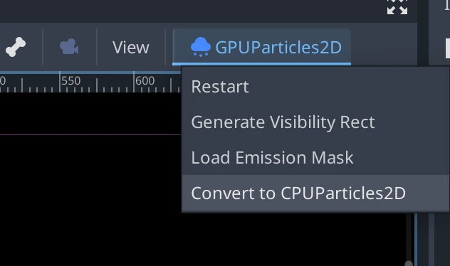

The rest of this tutorial is going to use the GPUParticles2D node.
First, add a GPUParticles2D node to your scene. After creating that node
you will notice that only a white dot was created, and that there is a
warning icon next to your GPUParticles2D node in the scene dock. This is
because the node needs a ParticleProcessMaterial to function.

### ParticleProcessMaterial

To add a process material to your particles node, go to
`Process Material` in your inspector panel. Click on the box next to
`Material`, and from the dropdown menu select
`New ParticleProcessMaterial`.

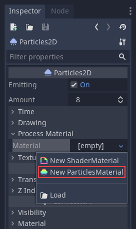

Your GPUParticles2D node should now be emitting white points downward.

### Texture

A particle system can use a single texture or an animation *flipbook*. A
flipbook is a texture that contains several frames of animation that can
be played back, or chosen at random during emission. This is equivalent
to a spritesheet for particles.

The texture is set via the **Texture** property:

#### Using an animation flipbook

Particle flipbooks are suited to reproduce complex effects such as
smoke, fire, explosions. They can also be used to introduce random
texture variation, by making every particle use a different texture. You
can find existing particle flipbook images online, or pre-render them
using external tools such as [Blender](https://www.blender.org/) or
[EmberGen](https://jangafx.com/software/embergen/).

<figure class="align-center">

<figcaption>Example of a particle system that uses a flipbook
texture</figcaption>
</figure>

Using an animation flipbook requires additional configuration compared
to a single texture. For demonstration purposes, we'll use this texture
with 5 columns and 7 rows (right-click and choose **Save as…**):

<figure class="align-center">

<figcaption>Credit: <a
href="https://opengameart.org/content/alot-of-particles-indispersal-special-effect-alotofparticles30">JoesAlotofthings</a>
(CC BY 4.0)</figcaption>
</figure>

To use an animation flipbook, you must create a new CanvasItemMaterial
in the Material section of the GPUParticles2D (or CPUParticles2D) node:

<figure class="align-center">

<figcaption>Creating a CanvasItemMaterial at the bottom of the particles
node inspector</figcaption>
</figure>

In this CanvasItemMaterial, enable **Particle Animation** and set **H
Frames** and **V Frames** to the number of columns and rows present in
your flipbook texture:

<figure class="align-center">

<figcaption>Configuring the CanvasItemMaterial for the example flipbook
texture</figcaption>
</figure>

Once this is done, the
`Animation section <doc_particle_systems_2d_animation>` in
ParticleProcessMaterial (for GPUParticles2D) or in the CPUParticles2D
inspector will be effective.

Tip

If your flipbook texture has a black background instead of a transparent
background, you will also need to set the blend mode to **Add** instead
of **Mix** for correct display. Alternatively, you can modify the
texture to have a transparent background in an image editor. In
[GIMP](https://gimp.org), this can be done using the **Color &gt; Color
to Alpha** menu.

## Time parameters

### Lifetime

The time in seconds that every particle will stay alive. When lifetime
ends, a new particle is created to replace it.

Lifetime: 0.5

Lifetime: 4.0

### One Shot

When enabled, a GPUParticles2D node will emit all of its particles once
and then never again.

### Preprocess

Particle systems begin with zero particles emitted, then start emitting.
This can be an inconvenience when loading a scene and systems like a
torch, mist, etc. begin emitting the moment you enter. Preprocess is
used to let the system process a given number of seconds before it is
actually drawn the first time.

### Speed Scale

The speed scale has a default value of `1` and is used to adjust the
speed of a particle system. Lowering the value will make the particles
slower while increasing the value will make the particles much faster.

### Explosiveness

If lifetime is `1` and there are 10 particles, it means a particle will
be emitted every 0.1 seconds. The explosiveness parameter changes this,
and forces particles to be emitted all together. Ranges are:

-   0: Emit particles at regular intervals (default value).
-   1: Emit all particles simultaneously.

Values in the middle are also allowed. This feature is useful for
creating explosions or sudden bursts of particles:

### Randomness

All physics parameters can be randomized. Random values range from `0`
to `1`. The formula to randomize a parameter is:

    initial_value = param_value + param_value * randomness

### Fixed FPS

This setting can be used to set the particle system to render at a fixed
FPS. For instance, changing the value to `2` will make the particles
render at 2 frames per second. Note this does not slow down the particle
system itself.

Note

Godot 4.3 does not currently support physics interpolation for 2D
particles. As a workaround, disable physics interpolation for the
particles node by setting **Node &gt; Physics Interpolation &gt; Mode**
at the bottom of the inspector.

### Fract Delta

This can be used to turn Fract Delta on or off.

## Drawing parameters

### Visibility Rect

The visibility rectangle controls the visibility of the particles on
screen. If this rectangle is outside of the viewport, the engine will
not render the particles on screen.

The rectangle's `W` and `H` properties respectively control its Width
and its Height. The `X` and `Y` properties control the position of the
upper-left corner of the rectangle, relative to the particle emitter.

You can have Godot generate a Visibility Rect automatically using the
toolbar above the 2d view. To do so, select the GPUParticles2D node and
Click `Particles > Generate Visibility Rect`. Godot will simulate the
Particles2D node emitting particles for a few seconds and set the
rectangle to fit the surface the particles take.

You can control the emit duration with the `Generation Time (sec)`
option. The maximum value is 25 seconds. If you need more time for your
particles to move around, you can temporarily change the `preprocess`
duration on the Particles2D node.

### Local Coords

By default this option is on, and it means that the space that particles
are emitted to is relative to the node. If the node is moved, all
particles are moved with it:

If disabled, particles will emit to global space, meaning that if the
node is moved, already emitted particles are not affected:

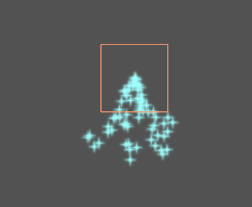

### Draw Order

This controls the order in which individual particles are drawn. `Index`
means particles are drawn according to their emission order (default).
`Lifetime` means they are drawn in order of remaining lifetime.

## ParticleProcessMaterial settings

### Direction

This is the base direction at which particles emit. The default is
`Vector3(1, 0, 0)` which makes particles emit to the right. However,
with the default gravity settings, particles will go straight down.

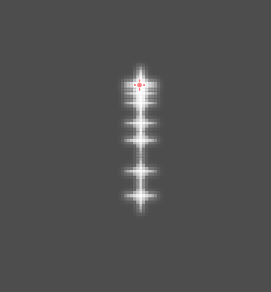

For this property to be noticeable, you need an *initial velocity*
greater than 0. Here, we set the initial velocity to 40. You'll notice
that particles emit toward the right, then go down because of gravity.

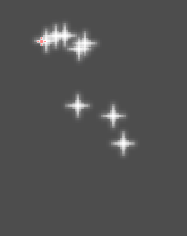

### Spread

This parameter is the angle in degrees which will be randomly added in
either direction to the base `Direction`. A spread of `180` will emit in
all directions (+/- 180). For spread to do anything the "Initial
Velocity" parameter must be greater than 0.

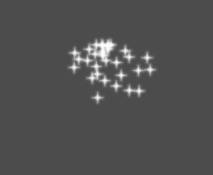

### Flatness

This property is only useful for 3D particles.

### Gravity

The gravity applied to every particle.

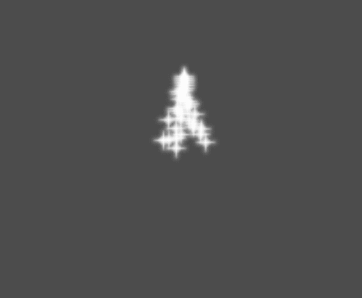

### Initial Velocity

Initial velocity is the speed at which particles will be emitted (in
pixels/sec). Speed might later be modified by gravity or other
accelerations (as described further below).

### Angular Velocity

Angular velocity is the initial angular velocity applied to particles.

### Spin Velocity

Spin velocity is the speed at which particles turn around their center
(in degrees/sec).

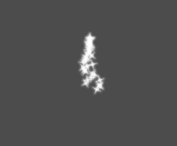

### Orbit Velocity

Orbit velocity is used to make particles turn around their center.

### Linear Acceleration

The linear acceleration applied to each particle.

### Radial Acceleration

If this acceleration is positive, particles are accelerated away from
the center. If negative, they are absorbed towards it.

### Tangential Acceleration

This acceleration will use the tangent vector to the center. Combining
with radial acceleration can do nice effects.

### Damping

Damping applies friction to the particles, forcing them to stop. It is
especially useful for sparks or explosions, which usually begin with a
high linear velocity and then stop as they fade.

### Angle

Determines the initial angle of the particle (in degrees). This
parameter is mostly useful randomized.

### Scale

Determines the initial scale of the particles.

### Color

Used to change the color of the particles being emitted.

### Hue Variation

The `Variation` value sets the initial hue variation applied to each
particle. The `Variation Random` value controls the hue variation
randomness ratio.

### Animation

Note

Particle flipbook animation is only effective if the CanvasItemMaterial
used on the GPUParticles2D or CPUParticles2D node has been
`configured accordingly <doc_particle_systems_2d_using_flipbook>`.

To set up the particle flipbook for linear playback, set the **Speed
Min** and **Speed Max** values to 1:

<figure class="align-center">

<figcaption>Setting up particle animation for playback during the
particle's lifetime</figcaption>
</figure>

By default, looping is disabled. If the particle is done playing before
its lifetime ends, the particle will keep using the flipbook's last
frame (which may be fully transparent depending on how the flipbook
texture is designed). If looping is enabled, the animation will loop
back to the first frame and resume playing.

Depending on how many images your sprite sheet contains and for how long
your particle is alive, the animation might not look smooth. The
relationship between particle lifetime, animation speed, and number of
images in the sprite sheet is this:

Note

At an animation speed of `1.0`, the animation will reach the last image
in the sequence just as the particle's lifetime ends.

$$Animation\\FPS = \frac{Number\\of\\images}{Lifetime}$$

If you wish the particle flipbook to be used as a source of random
particle textures for every particle, keep the speed values at 0 and set
**Offset Max** to 1 instead:

<figure class="align-center">

<figcaption>Setting up particle animation for random offset on
emission</figcaption>
</figure>

Note that the GPUParticles2D node's **Fixed FPS** also affects animation
playback. For smooth animation playback, it's recommended to set it to 0
so that the particle is simulated on every rendered frame. If this is
not an option for your use case, set **Fixed FPS** to be equal to the
effective framerate used by the flipbook animation (see above for the
formula).

## Emission Shapes

ParticleProcessMaterials allow you to set an Emission Mask, which
dictates the area and direction in which particles are emitted. These
can be generated from textures in your project.

Ensure that a ParticleProcessMaterial is set, and the GPUParticles2D
node is selected. A "Particles" menu should appear in the Toolbar:

Open it and select "Load Emission Mask":

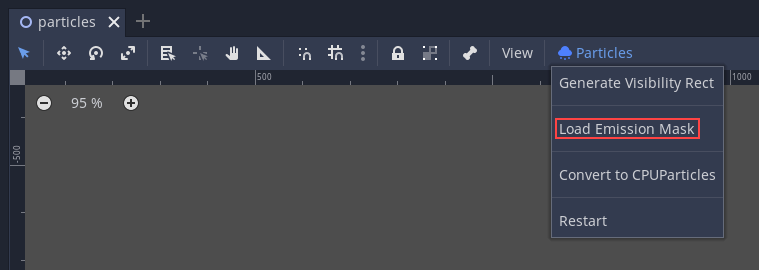

Then select which texture you want to use as your mask:

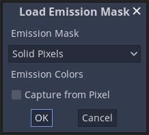

A dialog box with several settings will appear.

### Emission Mask

Three types of emission masks can be generated from a texture:

-   Solid Pixels: Particles will spawn from any area of the texture,
    excluding transparent areas.

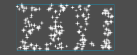

-   Border Pixels: Particles will spawn from the outer edges of the
    texture.

-   Directed Border Pixels: Similar to Border Pixels, but adds extra
    information to the mask to give particles the ability to emit away
    from the borders. Note that an `Initial Velocity` will need to be
    set in order to utilize this.

### Emission Colors

`Capture from Pixel` will cause the particles to inherit the color of
the mask at their spawn points.

Once you click "OK", the mask will be generated and set to the
ParticleProcessMaterial, under the `Emission Shape` section:

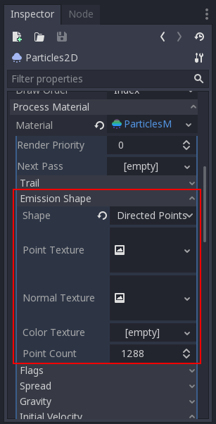

All of the values within this section have been automatically generated
by the "Load Emission Mask" menu, so they should generally be left
alone.

Note

An image should not be added to `Point Texture` or `Color Texture`
directly. The "Load Emission Mask" menu should always be used instead.
