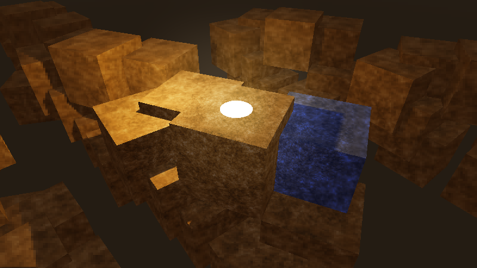
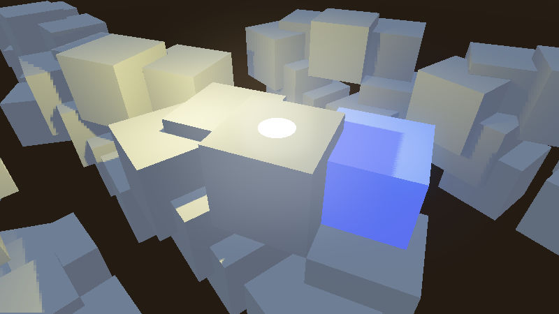

# Variable rate shading

## What is variable rate shading?

In modern 3D rendering engines, shaders are much more complex compared
to before. The advent of physically-based rendering, real-time global
illumination and screen-space effects has increased the number of
*per-pixel* shading that must be performed to render each frame.
Additionally, screen resolutions also have increased a lot, with 1440p
and 4K now being common target resolutions. As a result, the total
shading cost in scene rendering usually represents a significant amount
of the time taken to render each frame.

Variable rate shading (VRS) is a method of decreasing this shading cost
by reducing the resolution of *per-pixel* shading (also called
*fragment* shading), while keeping the original resolution for rendering
geometry. This means geometry edges remain as sharp as they would
without VRS. VRS can be combined with any `doc_3d_antialiasing`
technique (MSAA, FXAA, TAA, SSAA).

VRS allows specifying the shading quality in a local manner, which makes
it possible to have certain parts of the viewport receive more detailed
shading than others. This is particularly useful in virtual reality (VR)
to achieve *foveated rendering*, where the center of the viewport is
more detailed than the edges.

Here's a scene rendered with rate shading disabled then enabled, using
the density map linked at the bottom of this page:

<figure class="align-center">

<figcaption>Variable rate shading disabled in textured
scene</figcaption>
</figure>

<figure class="align-center">

<figcaption>Variable rate shading enabled in textured scene (lower
quality, but higher performance)</figcaption>
</figure>

When used in scenes with low-frequency detail (such as scenes with a
stylized/low-poly aesthetic), it's possible to achieve similar
performance gains, but with less reduction in visual quality:

<figure class="align-center">

<figcaption>Variable rate shading disabled in untextured
scene</figcaption>
</figure>

<figure class="align-center">

<figcaption>Variable rate shading enabled in untextured scene (lower
quality, but higher performance)</figcaption>
</figure>

## Hardware support

Variable rate shading is only supported on specific GPUs:

**Desktop:**

-   NVIDIA Turing and newer (including GTX 1600 series)
-   AMD RDNA2 and newer (both integrated and dedicated GPUs – including
    Steam Deck)
-   Intel Arc Alchemist and newer **(dedicated GPUs only)**
    -   Intel integrated graphics do not support variable rate shading.

**Mobile SoCs:**

-   Snapdragon 888 and newer
-   MediaTek Dimensity 9000 and newer
-   ARM Mali-G615 and newer

As of January 2023, Apple and Raspberry Pi GPUs do not support variable
rate shading.

## Using variable rate shading in Godot

Note

Both Forward Plus and Forward Mobile rendering methods support variable
rate shading. VRS can be used in both pancake (non-XR) and XR display
modes.

The Compatibility rendering method does **not** support variable rate
shading.

In the advanced Project Settings, the **Rendering &gt; VRS** section
offers settings to control variable rate shading on the root viewport:

-   **Mode:** Controls the variable rate shading mode. **Disabled**
    disables variable rate shading. **Texture** uses a manually authored
    texture to set shading density (see the property below). **XR**
    automatically generates a texture suited for foveated rendering in
    virtual/augmented reality.
-   **Texture:** The texture to use to control shading density on the
    root viewport. Only used if **Mode** is **Texture**.

For custom viewports, the VRS mode and texture must be set manually to
the `class_Viewport` node.

Note

On unsupported hardware, there is no visual difference when variable
rate shading is enabled. You can check whether hardware supports
variable rate shading by running the editor or project with the
`--verbose` `command line argument <doc_command_line_tutorial>`.

### Creating a VRS density map

If using the **Texture** VRS mode, you *must* set a texture to be used
as a density map. Otherwise, no effect will be visible.

You can create your own VRS density map manually using an image editor,
or generate it using another method (e.g. on the CPU using the Image
class, or on the GPU using a shader). However, beware of performance
implications when generating a VRS image dynamically. If opting for
dynamic generation, make sure the VRS image generation process is fast
enough to avoid outweighing the performance gains from VRS.

The texture must follow these rules:

-   The texture *must* use a lossless compression format so that colors
    can be matched precisely.
-   The following VRS densities are mapped to various colors, with
    brighter colors representing a lower level of shading precision:

<table style="width:99%;">
<colgroup>
<col style="width: 25%" />
<col style="width: 36%" />
<col style="width: 37%" />
</colgroup>
<thead>
<tr>
<th>Density</th>
<th>Color</th>
<th>Comment</th>
</tr>
</thead>
<tbody>
<tr>
<td>1×1 (highest detail)</td>
<td><code>rgb(0, 0, 0) - #000000</code></td>
<td></td>
</tr>
<tr>
<td>1×2</td>
<td><code>rgb(0, 85, 0) - #005500</code></td>
<td></td>
</tr>
<tr>
<td>2×1</td>
<td><code>rgb(85, 0, 0) - #550000</code></td>
<td></td>
</tr>
<tr>
<td>2×2</td>
<td><code>rgb(85, 85, 0) - #555500</code></td>
<td></td>
</tr>
<tr>
<td>2×4</td>
<td><code>rgb(85, 170, 0) - #55aa00</code></td>
<td></td>
</tr>
<tr>
<td>4×2</td>
<td><code>rgb(170, 85, 0) - #aa5500</code></td>
<td></td>
</tr>
<tr>
<td>4×4</td>
<td><code>rgb(170, 170, 0) - #aaaa00</code></td>
<td></td>
</tr>
<tr>
<td>4×8</td>
<td><code>rgb(170, 255, 0) - #aaff00</code></td>
<td>Not supported on most hardware.</td>
</tr>
<tr>
<td>8×4</td>
<td><code>rgb(255, 170, 0) - #ffaa00</code></td>
<td>Not supported on most hardware.</td>
</tr>
<tr>
<td>8×8 (lowest detail)</td>
<td><code>rgb(255, 255, 0) - #ffff00</code></td>
<td>Not supported on most hardware.</td>
</tr>
</tbody>
</table>

For example, this VRS density texture provides the highest shading
density in the center of the viewport, and the lowest shading density in
the corners:

<figure class="align-center">

<figcaption>Example VRS density map texture, simulating foveated
rendering</figcaption>
</figure>

There are no size or aspect ratio requirements for the VRS density
texture. However, there is no benefit to using a VRS density map that is
larger than the viewport resolution divided by the GPU's *tile size*.
The tile size is what determines the smallest area of pixels where the
shading density can be changed separately from other tiles. On most
GPUs, this tile size is 8×8 pixels. You can view the tile size by
running Godot with the `--verbose` command line argument, as it's
printed in the VRS debugging information.

Therefore, sticking to a relatively low resolution such as 256×256
(square) or 480×270 (16:9) is recommended. Depending on your use cases,
a square texture may be more suited compared to a texture that matches
the most common viewport aspect ratio in your project (such as 16:9).

Tip

When using variable rate shading, you can use a negative
`texture mipmap LOD bias <doc_resolution_scaling_mipmap_bias>` to reduce
blurriness in areas with reduced shading rate.

Note that the texture LOD bias is set globally, so this will also affect
areas of the viewport with full shading rate. Don't use values that are
too low, or textures will appear grainy.

### Performance comparison

To give an idea of how much VRS can improve performance in theory,
here's a performance comparison with the textured example scene shown at
the top of this page. The VRS density map example present on this page
is used.

Results were captured on a GeForce RTX 4090 with the NVIDIA 525.60.11
driver.

<table style="width:97%;">
<colgroup>
<col style="width: 27%" />
<col style="width: 18%" />
<col style="width: 17%" />
<col style="width: 32%" />
</colgroup>
<thead>
<tr>
<th>Resolution</th>
<th>VRS disabled</th>
<th>VRS enabled</th>
<th>Performance improvement</th>
</tr>
</thead>
<tbody>
<tr>
<td>1920×1080 (Full HD)</td>
<td>2832 FPS</td>
<td>3136 FPS</td>
<td>+10.7%</td>
</tr>
<tr>
<td>2560×1440 (QHD)</td>
<td>2008 FPS</td>
<td>2256 FPS</td>
<td>+12.3%</td>
</tr>
<tr>
<td>3840×2160 (4K)</td>
<td>1236 FPS</td>
<td>1436 FPS</td>
<td>+16.2%</td>
</tr>
<tr>
<td>7680×4320 (8K)</td>
<td>384 FPS</td>
<td>473 FPS</td>
<td>+23.1%</td>
</tr>
</tbody>
</table>

In terms of performance improvements, variable rate shading is more
beneficial at higher target resolutions. The reduction in visual quality
is also less noticeable at high resolutions.

Note

For non-VR games, you will probably have to use a less aggressive VRS
texture than what was used in this example. As a result, the effective
performance gains will be lower.
