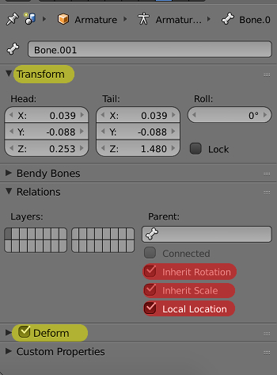

# Skeleton

## Rest Bone

Armature object in Blender is exported as a Skeleton node along with
rest position (transform in Godot) of bones.

Warning

The three check boxes `Inherit Rotation`, `Inherit Scale`,
`Local Location` (colored in red) must be ticked when building armature
in Blender, so that the exported bone transform be consistent between
Blender and Godot

It is important that the mesh is not deformed by bones when exporting in
Blender. Make sure that the skeleton is reset to its T-pose or default
rest pose.

## Bone Weights

Blender puts rigged mesh vertices which have no bone weights at their
original position, but these vertices would be placed at (0, 0, 0) in
Godot, making the mesh deformed. Therefore, the exporter will raise an
error for any vertex with no bone weights detected in a rigged mesh.

## Non-Deform Bone

Note that the non-deform bone can be configured as not exported by
enabling the `Exclude Control Bones`; the deform bone checkbox is shown
in the picture.

## Bone Attachment

A bone can be the parent of an object in Blender; this relation is
exported as a BoneAttachment node in the Godot scene.
