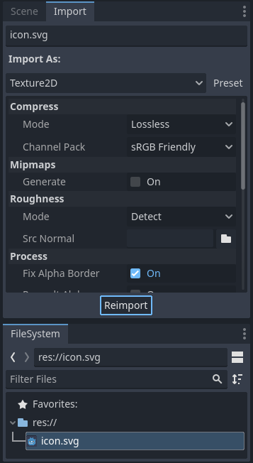
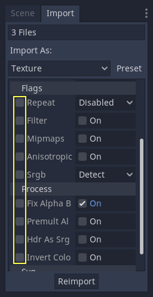
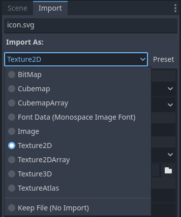
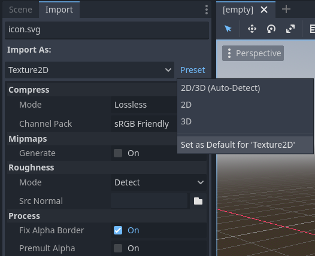

# Import process

## Importing assets in Godot

To import assets in Godot, place your assets (image files, scenes, audio
files, fonts, etc) directly in the project folder. There are 2 ways to
achieve this:

-   **For any file type:** Copy files manually with your operating
    system's file manager.
-   **For file types that can be imported by Godot:** Drag-and-drop
    files from the operating system's file manager to the editor's
    FileSystem dock. This only works with *resource* file types (i.e.
    file types that Godot can import).

Godot will automatically import these files internally and keep the
imported resources hidden in a `res://.godot/imported/` folder.

This means that when trying to access imported assets through code, you
need to use the `Resource Loader<class_ResourceLoader>` as it will
automatically take into account where the internal files are saved. If
you try and access an imported asset using the
`FileAccess <class_FileAccess>` class, it will work in the editor, but
**it will break in the exported project**.

However, the `Resource Loader<class_ResourceLoader>` cannot access
non-imported files. Only the `FileAccess <class_FileAccess>` class can.

## Changing import parameters

Note

Import parameters are only present in *non-native* Godot resource types.
This means Godot's own scene and resource file formats (`.tscn`, `.scn`,
`.tres`, `.res`) don't have import options you can select in the Import
dock.

To change the import parameters of an asset in Godot, select the
relevant resource in the FileSystem dock:

After adjusting the parameters, click **Reimport**. Be careful: if you
select another file in the FileSystem dock before clicking **Reimport**,
changes will be discarded. After clicking **Reimport**, the chosen
parameters will only be used for this asset and on future reimports.

Changing the import parameters of several assets at the same time is
also possible. Simply select all of them together in the resources dock
and the exposed parameters will apply to all of them when reimporting.

## Reimporting multiple assets

While working on a project you may find that several assets need to have
the same parameters changed, such as enabling mipmaps, but you only want
those specific parameters changed. To do this, select every asset you
want to reimport in the file system. In the import tab there will now be
a checkbox to the left of every import parameter.

Select the checkbox of the parameters you want to change on your
imported assets, then change the parameters normally. Finally, click the
reimport button and every selected asset will be reimported with only
those parameters changed.

## Automatic reimport

When the MD5 checksum of the source asset changes, Godot will perform an
automatic reimport of it, applying the preset configured for that
specific asset.

## Files generated

Importing will add an extra `<asset>.import` file next to the source
file, containing the import configuration.

**Make sure to commit these files to your version control system**, as
these files contain important metadata.

    ls
    example.png
    example.png.import
    project.godot

Additionally, extra assets will be present in the hidden
`res://.godot/imported/` folder:

    ls .godot/imported
    example.png-218a8f2b3041327d8a5756f3a245f83b.ctex
    example.png-218a8f2b3041327d8a5756f3a245f83b.md5

If any of the files present in this folder is erased (or the whole
folder), the asset or assets will be reimported automatically. As such,
committing the `.godot/` folder to the version control system is not
recommended. While committing this folder can shorten reimporting time
when checking out on another computer, it requires considerably more
space and bandwidth.

The default version control metadata that can be generated on project
creation will automatically ignore the `.godot/` folder.

## Changing import resource type

Some source assets can be imported as different types of resources. For
this, select the relevant type of resource desired then click
**Reimport**:

Select `Keep File (exported as is)` as resource type to skip file
import, files with this resource type will be preserved as is during
project export.

Select `Skip File (not exported)` as resource type to skip file import
and ignore file during project export.

## Changing default import parameters

Different types of projects might require different defaults. Changing
the import options to a predefined set of options can be achieved by
using the **Preset...** Menu. Besides some resource types offering
presets, the default settings can be saved and cleared too:

The default import parameters for a given resource type can be changed
project-wide using the **Import Defaults** tab of the Project Settings
dialog:

## Further reading

This workflow takes a little time to get used to, but it enforces a more
correct way to deal with resources.

There are many types of assets available for import. Continue reading to
understand how to work with all of them:

-   `doc_importing_images`
-   `doc_importing_audio_samples`
-   `doc_importing_3d_scenes`
-   `doc_importing_translations`
