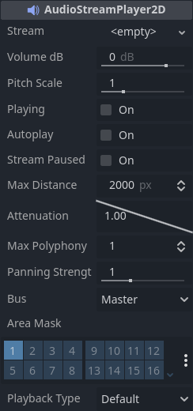
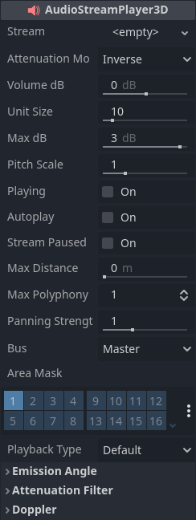
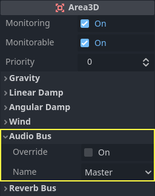
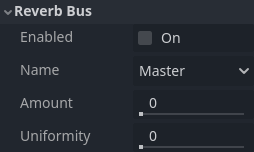
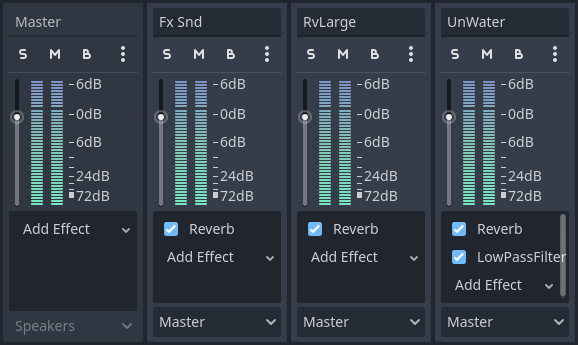
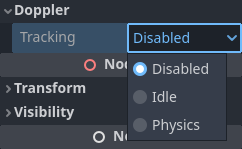

article\_outdated  
True

# Audio streams

## Introduction

As you might have already read in `doc_audio_buses`, sound is sent to
each bus via an AudioStreamPlayer node. There are different kinds of
AudioStreamPlayers. Each one loads an AudioStream and plays it back.

## AudioStream

An audio stream is an abstract object that emits sound. The sound can
come from many places, but is most commonly loaded from the filesystem.
Audio files can be loaded as AudioStreams and placed inside an
AudioStreamPlayer. You can find information on supported formats and
differences in `doc_importing_audio_samples`.

There are other types of AudioStreams, such as
`AudioStreamRandomizer<class_AudioStreamRandomizer>`. This one picks a
different audio stream from a list of streams each time it's played
back, and applies random pitch and volume shifting. This can be helpful
for adding variation to sounds that are played back often.

## AudioStreamPlayer

This is the standard, non-positional stream player. It can play to any
bus. In 5.1 sound setups, it can send audio to stereo mix or front
speakers.

Playback Type is an experimental setting, and could change in future
versions of Godot. It exists so Web exports use Web Audio-API based
samples instead of streaming all sounds to the browser, unlike most
platforms. This prevents the audio from being garbled in single-threaded
Web exports. By default, only the Web platform will use samples.
Changing this setting is not recommended, unless you have an explicit
reason to. You can change the default playback type for the web and
other platforms in the project settings under **Audio &gt; General**
(advanced settings must be turned on to see the setting).

## AudioStreamPlayer2D

This is a variant of AudioStreamPlayer, but emits sound in a 2D
positional environment. When close to the left of the screen, the
panning will go left. When close to the right side, it will go right.

Note

Area2Ds can be used to divert sound from any AudioStreamPlayer2Ds they
contain to specific buses. This makes it possible to create buses with
different reverb or sound qualities to handle action happening in a
particular parts of your game world.

## AudioStreamPlayer3D

This is a variant of AudioStreamPlayer, but emits sound in a 3D
positional environment. Depending on the location of the player relative
to the screen, it can position sound in stereo, 5.1 or 7.1 depending on
the chosen audio setup.

Similar to AudioStreamPlayer2D, an Area3D can divert the sound to an
audio bus.

Unlike for 2D, the 3D version of AudioStreamPlayer has a few more
advanced options:

### Reverb buses

Godot allows for 3D audio streams that enter a specific Area3D node to
send dry and wet audio to separate buses. This is useful when you have
several reverb configurations for different types of rooms. This is done
by enabling this type of reverb in the **Reverb Bus** section of the
Area3D's properties:

At the same time, a special bus layout is created where each Area3D
receives the reverb info from each Area3D. A Reverb effect needs to be
created and configured in each reverb bus to complete the setup for the
desired effect:

The Area3D's **Reverb Bus** section also has a parameter named
**Uniformity**. Some types of rooms bounce sounds more than others (like
a warehouse), so reverberation can be heard almost uniformly across the
room even though the source may be far away. Playing around with this
parameter can simulate that effect.

### Doppler

When the relative velocity between an emitter and listener changes, this
is perceived as an increase or decrease in the pitch of the emitted
sound. Godot can track velocity changes in the AudioStreamPlayer3D and
Camera nodes. Both nodes have this property, which must be enabled
manually:

Enable it by setting it depending on how objects will be moved: use
**Idle** for objects moved using `_process`, or **Physics** for objects
moved using `_physics_process`. The tracking will happen automatically.
