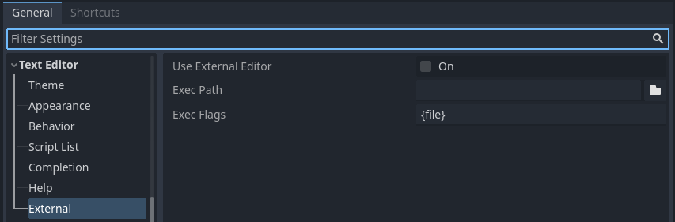

# Using an external text editor

This page explains how to code using an external text editor.

Note

To code C# in an external editor, see
`the C# guide to configure an external editor <doc_c_sharp_setup_external_editor>`.

Godot can be used with an external text editor, such as Sublime Text or
Visual Studio Code. Browse to the relevant editor settings: **Editor
&gt; Editor Settings &gt; Text Editor &gt; External**

<figure class="align-center">

<figcaption><strong>Text Editor &gt; External</strong> section of the
Editor Settings</figcaption>
</figure>

There are two text fields: the executable path and command-line flags.
The flags allow you to integrate the editor with Godot, passing it the
file path to open and other relevant arguments. Godot will replace the
following placeholders in the flags string:

<table>
<colgroup>
<col style="width: 28%" />
<col style="width: 71%" />
</colgroup>
<thead>
<tr>
<th>Field in Exec Flags</th>
<th>Is replaced with</th>
</tr>
</thead>
<tbody>
<tr>
<td><code>{project}</code></td>
<td>The absolute path to the project directory</td>
</tr>
<tr>
<td><code>{file}</code></td>
<td>The absolute path to the file</td>
</tr>
<tr>
<td><code>{col}</code></td>
<td>The column number of the error</td>
</tr>
<tr>
<td><code>{line}</code></td>
<td>The line number of the error</td>
</tr>
</tbody>
</table>

Some example **Exec Flags** for various editors include:

<table>
<colgroup>
<col style="width: 28%" />
<col style="width: 71%" />
</colgroup>
<thead>
<tr>
<th>Editor</th>
<th>Exec Flags</th>
</tr>
</thead>
<tbody>
<tr>
<td>Geany/Kate</td>
<td><code>{file} --line {line} --column {col}</code></td>
</tr>
<tr>
<td>Atom</td>
<td><code>{file}:{line}</code></td>
</tr>
<tr>
<td>JetBrains Rider</td>
<td><code>{project} --line {line} {file}</code></td>
</tr>
<tr>
<td>Visual Studio Code</td>
<td><code>{project} --goto {file}:{line}:{col}</code></td>
</tr>
<tr>
<td>Vim (gVim)</td>
<td><code>"+call cursor({line}, {col})" {file}</code></td>
</tr>
<tr>
<td>Emacs</td>
<td><code>emacs +{line}:{col} {file}</code></td>
</tr>
<tr>
<td>Sublime Text</td>
<td><code>{project} {file}:{line}:{column}</code></td>
</tr>
</tbody>
</table>

Note

For Visual Studio Code on Windows, you will have to point to the
`code.cmd` file.

For Emacs, you can call `emacsclient` instead of `emacs` if you use the
server mode.

## Using External Editor in Debugger

Using external editor in debugger is determined by a separate option in
settings. For details, see
`Script editor debug tools and options <doc_debugger_tools_and_options>`.

## Official editor plugins

We have official plugins for the following code editors:

-   [Visual Studio
    Code](https://github.com/godotengine/godot-vscode-plugin)
-   [Emacs](https://github.com/godotengine/emacs-gdscript-mode)

## LSP/DAP support

Godot supports the [Language Server
Protocol](https://microsoft.github.io/language-server-protocol/)
(**LSP**) for code completion and the [Debug Adapter
Protocol](https://microsoft.github.io/debug-adapter-protocol/) (**DAP**)
for debugging. You can check the [LSP client
list](https://microsoft.github.io/language-server-protocol/implementors/tools/)
and [DAP client
list](https://microsoft.github.io/debug-adapter-protocol/implementors/tools/)
to find if your editor supports them. If this is the case, you should be
able to take advantage of these features without the need of a custom
plugin.

To use these protocols, a Godot instance must be running on your current
project. You should then configure your editor to communicate to the
running adapter ports in Godot, which by default are `6005` for **LSP**,
and `6006` for **DAP**. You can change these ports and other settings in
the **Editor Settings**, under the **Network &gt; Language Server** and
**Network &gt; Debug Adapter** sections respectively.

Below are some configuration steps for specific editors:

### Visual Studio Code

You need to install the official [Visual Studio Code
plugin](https://github.com/godotengine/godot-vscode-plugin).

For **LSP**, follow [these
instructions](https://github.com/godotengine/godot-vscode-plugin#gdscript_lsp_server_port)
to change the default LSP port. The connection status can be checked on
the status bar:

For **DAP**, specify the `debugServer` property in your `launch.json`
file:

    {
        "version": "0.2.0",
        "configurations": [
            {
                "name": "GDScript Godot",
                "type": "godot",
                "request": "launch",
                "project": "${workspaceFolder}",
                "port": 6007,
                "debugServer": 6006,
            }
        ]
    }

### Emacs

Check the official instructions to configure
[LSP](https://github.com/godotengine/emacs-gdscript-mode#auto-completion-with-the-language-server-protocol-lsp),
and
[DAP](https://github.com/godotengine/emacs-gdscript-mode#using-the-debugger).
