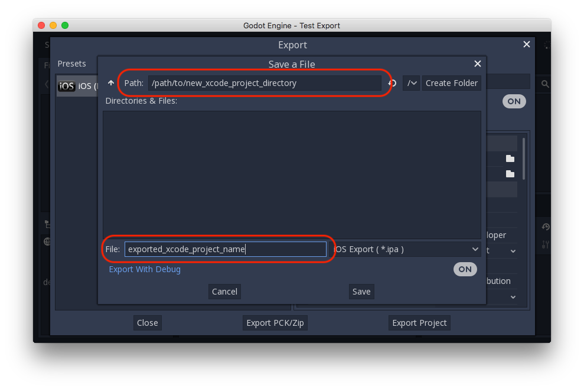
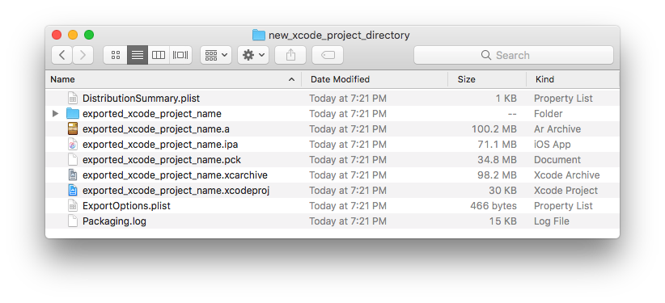
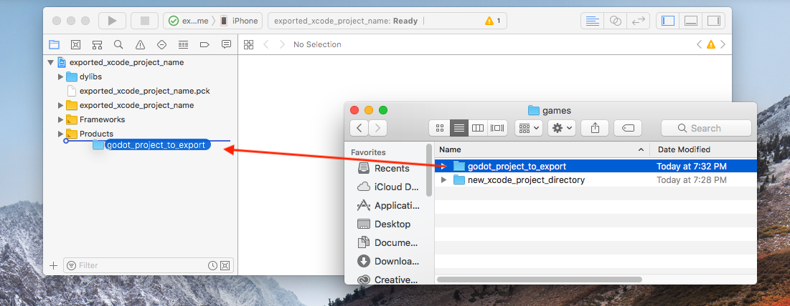
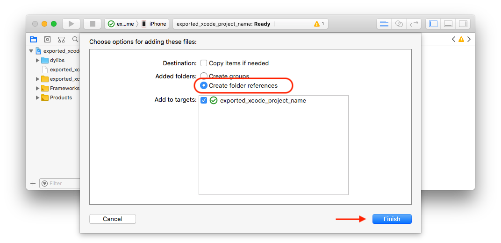
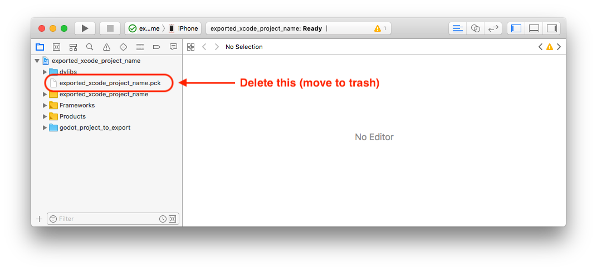

# Exporting for iOS

This page describes how to export a Godot project to iOS. If you're
looking to compile export template binaries from source instead, read
`doc_compiling_for_ios`.

These are the steps to load a Godot project in Xcode. This allows you to
build and deploy to an iOS device, build a release for the App Store,
and do everything else you can normally do with Xcode.

Attention

Projects written in C# can be exported to iOS as of Godot 4.2, but
support is experimental and
`some limitations apply <doc_c_sharp_platforms>`.

## Requirements

-   You must export for iOS from a computer running macOS with Xcode
    installed.
-   Download the Godot export templates. Use the Godot menu: Editor &gt;
    Manage Export Templates

## Export a Godot project to Xcode

In the Godot editor, open the **Export** window from the **Project**
menu. When the Export window opens, click **Add..** and select **iOS**.

The **App Store Team ID** and (Bundle) **Identifier** options in the
**Application** category are required. Leaving them blank will cause the
exporter to throw an error.

Note

If you encounter an error during export similar to  
`JSON text did not start with array or object and option to allow fragments not set`  
then it might be due to a malformated **App Store Team ID**!  
The exporter expects a (10 characters long) code like `ABCDE12XYZ` and
not, e.g., your name as Xcode likes to display in the *Signing &
Capabilities* tab.  
You can find the code over at
[developer.apple.com](https://developer.apple.com/account/resources/certificates/list)
next to your name in the top right corner.

After you click **Export Project**, there are still two important
options left:

> -   **Path** is an empty folder that will contain the exported Xcode
>     project files.
> -   **File** will be the name of the Xcode project and several project
>     specific files and directories.

Note

This tutorial uses **exported\_xcode\_project\_name**, but you will use
your project's name. When you see **exported\_xcode\_project\_name** in
the following steps, replace it with the name you used instead.

Note

Avoid using spaces when you choose your
**exported\_xcode\_project\_name** as this can lead to corruption in
your XCode project file.

When the export completes, the output folder should look like this:

Opening **exported\_xcode\_project\_name.xcodeproj** lets you build and
deploy like any other iOS app.

## Active development considerations

The above method creates an exported project that you can build for
release, but you have to re-export every time you make a change in
Godot.

While developing, you can speed this process up by linking your Godot
project files directly into your app.

In the following example:

> -   **exported\_xcode\_project\_name** is the name of the exported iOS
>     application (as above).
> -   **godot\_project\_to\_export** is the name of the Godot project.

Note

**godot\_project\_to\_export** must not be the same as
**exported\_xcode\_project\_name** to prevent signing issues in Xcode.

### Steps to link a Godot project folder to Xcode

1.  Start from an exported iOS project (follow the steps above).
2.  In Finder, drag the Godot project folder into the Xcode file
    browser.

3\. In the dialog, make sure **Create folder references** is selected.
This means you will be able to continue to edit your Godot project in
its current location.

1.  See the **godot\_project\_to\_export** folder in the Xcode file
    browser.
2.  Delete **exported\_xcode\_project\_name.pck** from the Xcode
    project.

6\. Open **exported\_xcode\_project\_name-Info.plist** and add a string
property named **godot\_path** (this is the real key name) with a value
**godot\_project\_to\_export** (this is the name of your project)

That's it! You can now edit your project in the Godot editor and build
it in Xcode when you want to run it on a device.

## Plugins for iOS

Special iOS plugins can be used in Godot. Check out the
`doc_plugins_for_ios` page.

## Environment variables

You can use the following environment variables to set export options
outside of the editor. During the export process, these override the
values that you set in the export menu.

<table>
<caption>iOS export environment variables</caption>
<thead>
<tr>
<th>Export option</th>
<th>Environment variable</th>
</tr>
</thead>
<tbody>
<tr>
<td>Encryption / Encryption Key</td>
<td><code>GODOT_SCRIPT_ENCRYPTION_KEY</code></td>
</tr>
<tr>
<td>Options / Application / Provisioning Profile UUID Debug</td>
<td><code>GODOT_IOS_PROVISIONING_PROFILE_UUID_DEBUG</code></td>
</tr>
<tr>
<td>Options / Application / Provisioning Profile UUID Release</td>
<td><code>GODOT_IOS_PROVISIONING_PROFILE_UUID_RELEASE</code></td>
</tr>
</tbody>
</table>

## Troubleshooting

### xcode-select points at wrong SDK location

xcode-select is a tool that comes with Xcode and among other things
points at iOS SDKs on your Mac. If you have Xcode installed, opened it,
agreed to the license agreement, and installed the command line tools,
xcode-select should point at the right location for the iPhone SDK. If
it somehow doesn't, Godot will fail exporting to iOS with an error that
may look like this:

    MSB3073: The command ""clang" <LOTS OF PATHS AND COMMAND LINE ARGUMENTS HERE>
    "/Library/Developer/CommandLineTools/Platforms/iPhoneOS.platform/Developer/SDKs/iPhoneOS.sdk"" exited with code 1.

In this case, Godot is trying to find the `Platforms` folder containing
the iPhone SDK inside the `/Library/Developer/CommandLineTools/` folder,
but the `Platforms` folder with the iPhone SDK is actually located under
`/Applications/Xcode.app/Contents/Developer`. To verify this, you can
open up Terminal and run the following command to see what xcode-select
points at:

    xcode-select -p

To fix xcode-select pointing at a wrong location, enter this command in
Terminal:

    sudo xcode-select -switch /Applications/Xcode.app

After running this command, Godot should be able to successfully export
to iOS.
