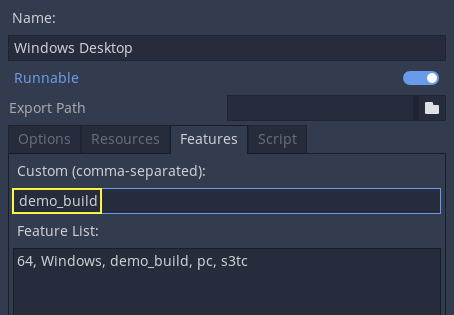
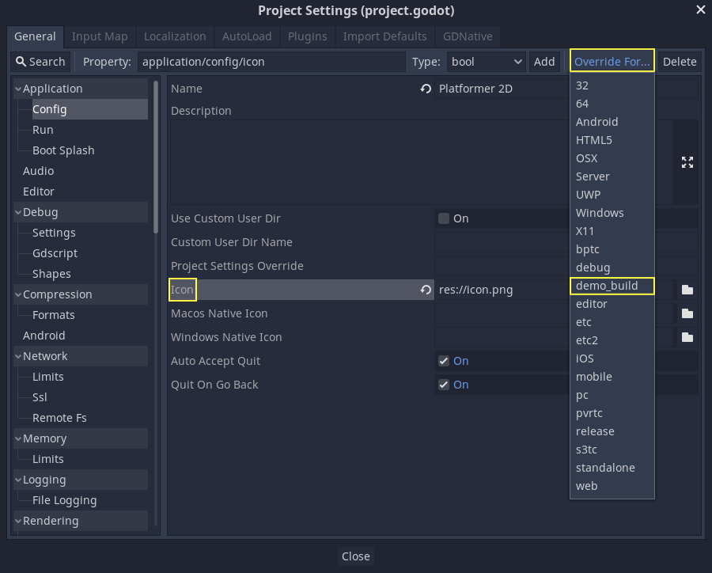

# Feature tags

## Introduction

Godot has a special system to tag availability of features. Each
*feature* is represented as a string, which can refer to many of the
following:

-   Platform name.
-   Platform architecture (64-bit or 32-bit, x86 or ARM).
-   Platform type (desktop, mobile, Web).
-   Supported texture compression algorithms on the platform.
-   Whether a build is `debug` or `release` (`debug` includes the
    editor).
-   Whether the project is running from the editor or a "standalone"
    binary.
-   Many more things.

Features can be queried at run-time from the singleton API by calling:

.. code-tab:: gdscript

OS.has\_feature(name)

csharp

OS.HasFeature(name);

OS feature tags are used by GDExtension to determine which libraries to
load. For example, a library for `linux.debug.editor.x86_64` will be
loaded only on a debug editor build for Linux x86\_64.

## Default features

Here is a list of most feature tags in Godot. Keep in mind they are
**case-sensitive**:

<table>
<colgroup>
<col style="width: 23%" />
<col style="width: 76%" />
</colgroup>
<thead>
<tr>
<th><strong>Feature tag</strong></th>
<th><strong>Description</strong></th>
</tr>
</thead>
<tbody>
<tr>
<td><strong>android</strong></td>
<td>Running on Android (but not within a Web browser)</td>
</tr>
<tr>
<td><strong>bsd</strong></td>
<td>Running on *BSD (but not within a Web browser)</td>
</tr>
<tr>
<td><strong>linux</strong></td>
<td>Running on Linux (but not within a Web browser)</td>
</tr>
<tr>
<td><strong>macos</strong></td>
<td>Running on macOS (but not within a Web browser)</td>
</tr>
<tr>
<td><strong>ios</strong></td>
<td>Running on iOS (but not within a Web browser)</td>
</tr>
<tr>
<td><strong>windows</strong></td>
<td>Running on Windows</td>
</tr>
<tr>
<td><strong>linuxbsd</strong></td>
<td>Running on Linux or *BSD</td>
</tr>
<tr>
<td><strong>debug</strong></td>
<td>Running on a debug build (including the editor)</td>
</tr>
<tr>
<td><strong>release</strong></td>
<td>Running on a release build</td>
</tr>
<tr>
<td><strong>editor</strong></td>
<td>Running on an editor build</td>
</tr>
<tr>
<td><strong>template</strong></td>
<td>Running on a non-editor (export template) build</td>
</tr>
<tr>
<td><strong>double</strong></td>
<td>Running on a double-precision build</td>
</tr>
<tr>
<td><strong>single</strong></td>
<td>Running on a single-precision build</td>
</tr>
<tr>
<td><strong>64</strong></td>
<td>Running on a 64-bit build (any architecture)</td>
</tr>
<tr>
<td><strong>32</strong></td>
<td>Running on a 32-bit build (any architecture)</td>
</tr>
<tr>
<td><strong>x86_64</strong></td>
<td>Running on a 64-bit x86 build</td>
</tr>
<tr>
<td><strong>x86_32</strong></td>
<td>Running on a 32-bit x86 build</td>
</tr>
<tr>
<td><strong>x86</strong></td>
<td>Running on an x86 build (any bitness)</td>
</tr>
<tr>
<td><strong>arm64</strong></td>
<td>Running on a 64-bit ARM build</td>
</tr>
<tr>
<td><strong>arm32</strong></td>
<td>Running on a 32-bit ARM build</td>
</tr>
<tr>
<td><strong>arm</strong></td>
<td>Running on an ARM build (any bitness)</td>
</tr>
<tr>
<td><strong>rv64</strong></td>
<td>Running on a 64-bit RISC-V build</td>
</tr>
<tr>
<td><strong>riscv</strong></td>
<td>Running on a RISC-V build (any bitness)</td>
</tr>
<tr>
<td><strong>ppc64</strong></td>
<td>Running on a 64-bit PowerPC build</td>
</tr>
<tr>
<td><strong>ppc32</strong></td>
<td>Running on a 32-bit PowerPC build</td>
</tr>
<tr>
<td><strong>ppc</strong></td>
<td>Running on a PowerPC build (any bitness)</td>
</tr>
<tr>
<td><strong>wasm64</strong></td>
<td>Running on a 64-bit WebAssembly build (not yet possible)</td>
</tr>
<tr>
<td><strong>wasm32</strong></td>
<td>Running on a 32-bit WebAssembly build</td>
</tr>
<tr>
<td><strong>wasm</strong></td>
<td>Running on a WebAssembly build (any bitness)</td>
</tr>
<tr>
<td><strong>mobile</strong></td>
<td>Host OS is a mobile platform</td>
</tr>
<tr>
<td><strong>pc</strong></td>
<td>Host OS is a PC platform (desktop/laptop)</td>
</tr>
<tr>
<td><strong>web</strong></td>
<td>Host OS is a Web browser</td>
</tr>
<tr>
<td><strong>web_android</strong></td>
<td>Host OS is a Web browser running on Android</td>
</tr>
<tr>
<td><strong>web_ios</strong></td>
<td>Host OS is a Web browser running on iOS</td>
</tr>
<tr>
<td><strong>web_linuxbsd</strong></td>
<td>Host OS is a Web browser running on Linux or *BSD</td>
</tr>
<tr>
<td><strong>web_macos</strong></td>
<td>Host OS is a Web browser running on macOS</td>
</tr>
<tr>
<td><strong>web_windows</strong></td>
<td>Host OS is a Web browser running on Windows</td>
</tr>
<tr>
<td><strong>etc</strong></td>
<td>Textures using ETC1 compression are supported</td>
</tr>
<tr>
<td><strong>etc2</strong></td>
<td>Textures using ETC2 compression are supported</td>
</tr>
<tr>
<td><strong>s3tc</strong></td>
<td>Textures using S3TC (DXT/BC) compression are supported</td>
</tr>
<tr>
<td><strong>movie</strong></td>
<td><code class="interpreted-text"
role="ref">Movie Maker mode &lt;doc_creating_movies&gt;</code> is
active</td>
</tr>
</tbody>
</table>

Warning

With the exception of texture compression, `web_<platform>` and `movie`
feature tags, default feature tags are **immutable**. This means that
they will *not* change depending on run-time conditions. For example,
`OS.has_feature("mobile")` will return `false` when running a project
exported to Web on a mobile device.

To check whether a project exported to Web is running on a mobile
device, use
`OS.has_feature("web_android") or OS.has_feature("web_ios")`.

## Custom features

It is possible to add custom features to a build; use the relevant field
in the *export preset* used to generate it:

Note

Custom feature tags are only used when running the exported project
(including with `doc_one-click_deploy`). They are **not used** when
running the project from the editor, even if the export preset marked as
**Runnable** for your current platform has custom feature tags defined.

## Overriding project settings

Features can be used to override specific configuration values in the
*Project Settings*. This allows you to better customize any
configuration when doing a build.

In the following example, a different icon is added for the demo build
of the game (which was customized in a special export preset, which, in
turn, includes only demo levels).

After overriding, a new field is added for this specific configuration:

Note

When using the
`project settings "override.cfg" functionality <class_ProjectSettings>`
(which is unrelated to feature tags), remember that feature tags still
apply. Therefore, make sure to *also* override the setting with the
desired feature tag(s) if you want them to override base project
settings on all platforms and configurations.

## Default overrides

There are already a lot of settings that come with overrides by default;
they can be found in many sections of the project settings.

## Customizing the build

Feature tags can be used to customize a build process too, by writing a
custom **ExportPlugin**. They are also used to specify which shared
library is loaded and exported in **GDExtension**.
