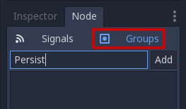

# Saving games

## Introduction

Save games can be complicated. For example, it may be desirable to store
information from multiple objects across multiple levels. Advanced save
game systems should allow for additional information about an arbitrary
number of objects. This will allow the save function to scale as the
game grows more complex.

Note

If you're looking to save user configuration, you can use the
`class_ConfigFile` class for this purpose.

You can see how saving and loading works in action using the [Saving and
Loading (Serialization) demo
project](https://github.com/godotengine/godot-demo-projects/blob/master/loading/serialization).

## Identify persistent objects

Firstly, we should identify what objects we want to keep between game
sessions and what information we want to keep from those objects. For
this tutorial, we will use groups to mark and handle objects to be
saved, but other methods are certainly possible.

We will start by adding objects we wish to save to the "Persist" group.
We can do this through either the GUI or script. Let's add the relevant
nodes using the GUI:

Once this is done, when we need to save the game, we can get all objects
to save them and then tell them all to save with this script:

.. code-tab:: gdscript GDScript

var save\_nodes = get\_tree().get\_nodes\_in\_group("Persist") for node
in save\_nodes: \# Now, we can call our save function on each node.

csharp

var saveNodes = GetTree().GetNodesInGroup("Persist"); foreach (Node
saveNode in saveNodes) { // Now, we can call our save function on each
node. }

## Serializing

The next step is to serialize the data. This makes it much easier to
read from and store to disk. In this case, we're assuming each member of
group Persist is an instanced node and thus has a path. GDScript has
helper class `JSON<class_json>` to convert between dictionary and
string, Our node needs to contain a save function that returns this
data. The save function will look like this:

.. code-tab:: gdscript GDScript

func save():  
var save\_dict = {  
"filename" : get\_scene\_file\_path(), "parent" :
get\_parent().get\_path(), "pos\_x" : position.x, \# Vector2 is not
supported by JSON "pos\_y" : position.y, "attack" : attack, "defense" :
defense, "current\_health" : current\_health, "max\_health" :
max\_health, "damage" : damage, "regen" : regen, "experience" :
experience, "tnl" : tnl, "level" : level, "attack\_growth" :
attack\_growth, "defense\_growth" : defense\_growth, "health\_growth" :
health\_growth, "is\_alive" : is\_alive, "last\_attack" : last\_attack

} return save\_dict

csharp

public Godot.Collections.Dictionary&lt;string, Variant&gt; Save() {
return new Godot.Collections.Dictionary&lt;string, Variant&gt;() { {
"Filename", SceneFilePath }, { "Parent", GetParent().GetPath() }, {
"PosX", Position.X }, // Vector2 is not supported by JSON { "PosY",
Position.Y }, { "Attack", Attack }, { "Defense", Defense }, {
"CurrentHealth", CurrentHealth }, { "MaxHealth", MaxHealth }, {
"Damage", Damage }, { "Regen", Regen }, { "Experience", Experience }, {
"Tnl", Tnl }, { "Level", Level }, { "AttackGrowth", AttackGrowth }, {
"DefenseGrowth", DefenseGrowth }, { "HealthGrowth", HealthGrowth }, {
"IsAlive", IsAlive }, { "LastAttack", LastAttack } }; }

This gives us a dictionary with the style
`{ "variable_name":value_of_variable }`, which will be useful when
loading.

## Saving and reading data

As covered in the `doc_filesystem` tutorial, we'll need to open a file
so we can write to it or read from it. Now that we have a way to call
our groups and get their relevant data, let's use the class
`JSON<class_json>` to convert it into an easily stored string and store
them in a file. Doing it this way ensures that each line is its own
object, so we have an easy way to pull the data out of the file as well.

.. code-tab:: gdscript GDScript

\# Note: This can be called from anywhere inside the tree. This function
is \# path independent. \# Go through everything in the persist category
and ask them to return a \# dict of relevant variables. func
save\_game(): var save\_file = FileAccess.open("user://savegame.save",
FileAccess.WRITE) var save\_nodes =
get\_tree().get\_nodes\_in\_group("Persist") for node in save\_nodes: \#
Check the node is an instanced scene so it can be instanced again during
load. if node.scene\_file\_path.is\_empty(): print("persistent node '%s'
is not an instanced scene, skipped" % node.name) continue

> \# Check the node has a save function. if !node.has\_method("save"):
> print("persistent node '%s' is missing a save() function, skipped" %
> node.name) continue
>
> \# Call the node's save function. var node\_data = node.call("save")
>
> \# JSON provides a static method to serialized JSON string. var
> json\_string = JSON.stringify(node\_data)
>
> \# Store the save dictionary as a new line in the save file.
> save\_file.store\_line(json\_string)

csharp

// Note: This can be called from anywhere inside the tree. This function
is // path independent. // Go through everything in the persist category
and ask them to return a // dict of relevant variables. public void
SaveGame() { using var saveFile =
FileAccess.Open("user://savegame.save", FileAccess.ModeFlags.Write);

> var saveNodes = GetTree().GetNodesInGroup("Persist"); foreach (Node
> saveNode in saveNodes) { // Check the node is an instanced scene so it
> can be instanced again during load. if
> (string.IsNullOrEmpty(saveNode.SceneFilePath)) { GD.Print($"persistent
> node '{saveNode.Name}' is not an instanced scene, skipped"); continue;
> }
>
> > // Check the node has a save function. if
> > (!saveNode.HasMethod("Save")) { GD.Print($"persistent node
> > '{saveNode.Name}' is missing a Save() function, skipped"); continue;
> > }
> >
> > // Call the node's save function. var nodeData =
> > saveNode.Call("Save");
> >
> > // Json provides a static method to serialized JSON string. var
> > jsonString = Json.Stringify(nodeData);
> >
> > // Store the save dictionary as a new line in the save file.
> > saveFile.StoreLine(jsonString);
>
> }

}

Game saved! Now, to load, we'll read each line. Use the
`parse<class_JSON_method_parse>` method to read the JSON string back to
a dictionary, and then iterate over the dict to read our values. But
we'll need to first create the object and we can use the filename and
parent values to achieve that. Here is our load function:

.. code-tab:: gdscript GDScript

\# Note: This can be called from anywhere inside the tree. This function
\# is path independent. func load\_game(): if not
FileAccess.file\_exists("user://savegame.save"): return \# Error! We
don't have a save to load.

> \# We need to revert the game state so we're not cloning objects \#
> during loading. This will vary wildly depending on the needs of a \#
> project, so take care with this step. \# For our example, we will
> accomplish this by deleting saveable objects. var save\_nodes =
> get\_tree().get\_nodes\_in\_group("Persist") for i in save\_nodes:
> i.queue\_free()
>
> \# Load the file line by line and process that dictionary to restore
> \# the object it represents. var save\_file =
> FileAccess.open("user://savegame.save", FileAccess.READ) while
> save\_file.get\_position() &lt; save\_file.get\_length(): var
> json\_string = save\_file.get\_line()
>
> > \# Creates the helper class to interact with JSON. var json =
> > JSON.new()
> >
> > \# Check if there is any error while parsing the JSON string, skip
> > in case of failure. var parse\_result = json.parse(json\_string) if
> > not parse\_result == OK: print("JSON Parse Error: ",
> > json.get\_error\_message(), " in ", json\_string, " at line ",
> > json.get\_error\_line()) continue
> >
> > \# Get the data from the JSON object. var node\_data = json.data
> >
> > \# Firstly, we need to create the object and add it to the tree and
> > set its position. var new\_object =
> > load(node\_data\["filename"\]).instantiate()
> > get\_node(node\_data\["parent"\]).add\_child(new\_object)
> > new\_object.position = Vector2(node\_data\["pos\_x"\],
> > node\_data\["pos\_y"\])
> >
> > \# Now we set the remaining variables. for i in node\_data.keys():
> > if i == "filename" or i == "parent" or i == "pos\_x" or i ==
> > "pos\_y": continue new\_object.set(i, node\_data\[i\])

csharp

// Note: This can be called from anywhere inside the tree. This function
is // path independent. public void LoadGame() { if
(!FileAccess.FileExists("user://savegame.save")) { return; // Error! We
don't have a save to load. }

> // We need to revert the game state so we're not cloning objects
> during loading. // This will vary wildly depending on the needs of a
> project, so take care with // this step. // For our example, we will
> accomplish this by deleting saveable objects. var saveNodes =
> GetTree().GetNodesInGroup("Persist"); foreach (Node saveNode in
> saveNodes) { saveNode.QueueFree(); }
>
> // Load the file line by line and process that dictionary to restore
> the object // it represents. using var saveFile =
> FileAccess.Open("user://savegame.save", FileAccess.ModeFlags.Read);
>
> while (saveFile.GetPosition() &lt; saveFile.GetLength()) { var
> jsonString = saveFile.GetLine();
>
> > // Creates the helper class to interact with JSON. var json = new
> > Json(); var parseResult = json.Parse(jsonString); if (parseResult !=
> > Error.Ok) { GD.Print($"JSON Parse Error: {json.GetErrorMessage()} in
> > {jsonString} at line {json.GetErrorLine()}"); continue; }
> >
> > // Get the data from the JSON object. var nodeData = new
> > Godot.Collections.Dictionary&lt;string,
> > Variant&gt;((Godot.Collections.Dictionary)json.Data);
> >
> > // Firstly, we need to create the object and add it to the tree and
> > set its position. var newObjectScene =
> > GD.Load&lt;PackedScene&gt;(nodeData\["Filename"\].ToString()); var
> > newObject = newObjectScene.Instantiate&lt;Node&gt;();
> > GetNode(nodeData\["Parent"\].ToString()).AddChild(newObject);
> > newObject.Set(Node2D.PropertyName.Position, new
> > Vector2((float)nodeData\["PosX"\], (float)nodeData\["PosY"\]));
> >
> > // Now we set the remaining variables. foreach (var (key, value) in
> > nodeData) { if (key == "Filename" || key == "Parent" || key ==
> > "PosX" || key == "PosY") { continue; } newObject.Set(key, value); }
>
> }

}

Now we can save and load an arbitrary number of objects laid out almost
anywhere across the scene tree! Each object can store different data
depending on what it needs to save.

## Some notes

We have glossed over setting up the game state for loading. It's
ultimately up to the project creator where much of this logic goes. This
is often complicated and will need to be heavily customized based on the
needs of the individual project.

Additionally, our implementation assumes no Persist objects are children
of other Persist objects. Otherwise, invalid paths would be created. To
accommodate nested Persist objects, consider saving objects in stages.
Load parent objects first so they are available for the `add_child()
<class_node_method_add_child>` call when child objects are loaded. You
will also need a way to link children to parents as the `NodePath
<class_nodepath>` will likely be invalid.

## JSON vs binary serialization

For simple game state, JSON may work and it generates human-readable
files that are easy to debug.

But JSON has many limitations. If you need to store more complex game
state or a lot of it,
`binary serialization<doc_binary_serialization_api>` may be a better
approach.

### JSON limitations

Here are some important gotchas to know about when using JSON.

-   **Filesize:** JSON stores data in text format, which is much larger
    than binary formats.
-   **Data types:** JSON only offers a limited set of data types. If you
    have data types that JSON doesn't have, you will need to translate
    your data to and from types that JSON can handle. For example, some
    important types that JSON can't parse are: `Vector2`, `Vector3`,
    `Color`, `Rect2`, and `Quaternion`.
-   **Custom logic needed for encoding/decoding:** If you have any
    custom classes that you want to store with JSON, you will need to
    write your own logic for encoding and decoding those classes.

### Binary serialization

`Binary serialization<doc_binary_serialization_api>` is an alternative
approach for storing game state, and you can use it with the functions
`get_var` and `store_var` of `class_FileAccess`.

-   Binary serialization should produce smaller files than JSON.
-   Binary serialization can handle most common data types.
-   Binary serialization requires less custom logic for encoding and
    decoding custom classes.

Note that not all properties are included. Only properties that are
configured with the
`PROPERTY_USAGE_STORAGE<class_@GlobalScope_constant_PROPERTY_USAGE_STORAGE>`
flag set will be serialized. You can add a new usage flag to a property
by overriding the
`_get_property_list<class_Object_private_method__get_property_list>`
method in your class. You can also check how property usage is
configured by calling `Object._get_property_list`. See
`PropertyUsageFlags<enum_@GlobalScope_PropertyUsageFlags>` for the
possible usage flags.
