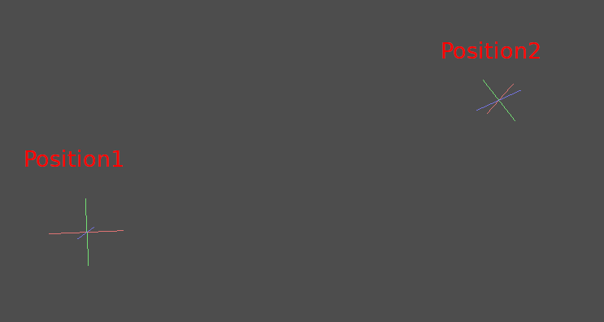
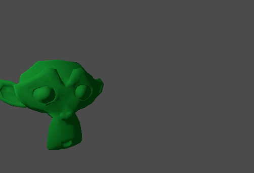

# Interpolation

Interpolation is a very basic operation in graphics programming. It's
good to become familiar with it in order to expand your horizons as a
graphics developer.

The basic idea is that you want to transition from A to B. A value `t`,
represents the states in-between.

For example, if `t` is 0, then the state is A. If `t` is 1, then the
state is B. Anything in-between is an *interpolation*.

Between two real (floating-point) numbers, an interpolation can be
described as:

    interpolation = A * (1 - t) + B * t

And often simplified to:

    interpolation = A + (B - A) * t

The name of this type of interpolation, which transforms a value into
another at *constant speed* is *"linear"*. So, when you hear about
*Linear Interpolation*, you know they are referring to this formula.

There are other types of interpolations, which will not be covered here.
A recommended read afterwards is the `Bezier <doc_beziers_and_curves>`
page.

## Vector interpolation

Vector types (`Vector2 <class_Vector2>` and `Vector3 <class_Vector3>`)
can also be interpolated, they come with handy functions to do it
`Vector2.lerp() <class_Vector2_method_lerp>` and
`Vector3.lerp() <class_Vector3_method_lerp>`.

For cubic interpolation, there are also
`Vector2.cubic_interpolate() <class_Vector2_method_cubic_interpolate>`
and
`Vector3.cubic_interpolate() <class_Vector3_method_cubic_interpolate>`,
which do a `Bezier <doc_beziers_and_curves>` style interpolation.

Here is example pseudo-code for going from point A to B using
interpolation:

.. code-tab:: gdscript GDScript

var t = 0.0

func \_physics\_process(delta):  
t += delta \* 0.4

$Sprite2D.position = $A.position.lerp($B.position, t)

csharp

private float \_t = 0.0f;

public override void \_PhysicsProcess(double delta) { \_t +=
(float)delta \* 0.4f;

> Marker2D a = GetNode&lt;Marker2D&gt;("A"); Marker2D b =
> GetNode&lt;Marker2D&gt;("B"); Sprite2D sprite =
> GetNode&lt;Sprite2D&gt;("Sprite2D");
>
> sprite.Position = a.Position.Lerp(b.Position, \_t);

}

It will produce the following motion:

## Transform interpolation

It is also possible to interpolate whole transforms (make sure they have
either uniform scale or, at least, the same non-uniform scale). For
this, the function
`Transform3D.interpolate_with() <class_Transform3D_method_interpolate_with>`
can be used.

Here is an example of transforming a monkey from Position1 to Position2:

Using the following pseudocode:

.. code-tab:: gdscript GDScript

var t = 0.0

func \_physics\_process(delta):  
t += delta

$Monkey.transform =
$Position1.transform.interpolate\_with($Position2.transform, t)

csharp

private float \_t = 0.0f;

public override void \_PhysicsProcess(double delta) { \_t +=
(float)delta;

> Marker3D p1 = GetNode&lt;Marker3D&gt;("Position1"); Marker3D p2 =
> GetNode&lt;Marker3D&gt;("Position2"); CSGMesh3D monkey =
> GetNode&lt;CSGMesh3D&gt;("Monkey");
>
> monkey.Transform = p1.Transform.InterpolateWith(p2.Transform, \_t);

}

And again, it will produce the following motion:

## Smoothing motion

Interpolation can be used to smooth movement, rotation, etc. Here is an
example of a circle following the mouse using smoothed motion:

.. code-tab:: gdscript GDScript

const FOLLOW\_SPEED = 4.0

func \_physics\_process(delta):  
var mouse\_pos = get\_local\_mouse\_position()

$Sprite2D.position = $Sprite2D.position.lerp(mouse\_pos, delta \*
FOLLOW\_SPEED)

csharp

private const float FollowSpeed = 4.0f;

public override void \_PhysicsProcess(double delta) { Vector2 mousePos =
GetLocalMousePosition();

> Sprite2D sprite = GetNode&lt;Sprite2D&gt;("Sprite2D");
>
> sprite.Position = sprite.Position.Lerp(mousePos, (float)delta \*
> FollowSpeed);

}

Here is how it looks:

This is useful for smoothing camera movement, allies following you
(ensuring they stay within a certain range), and many other common game
patterns.
