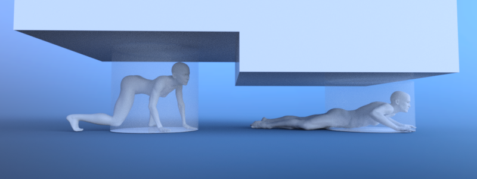

# Support different actor locomotion

To support different actor locomotion like crouching and crawling, a
similar map setup as supporting `doc_navigation_different_actor_types`
is required.

Bake different navigation meshes with an appropriate height for crouched
or crawling actors so they can find paths through those narrow sections
in your game world.

When an actor changes locomotion state, e.g. stands up, starts crouching
or crawling, query the appropriate map for a path.

If the avoidance behavior should also change with the locomotion e.g.
only avoid while standing or only avoid other agents in the same
locomotion state, switch the actor's avoidance agent to another
avoidance map with each locomotion change.

.. code-tab:: gdscript GDScript

func update\_path():

> if actor\_standing:  
> path =
> NavigationServer3D.map\_get\_path(standing\_navigation\_map\_rid,
> start\_position, target\_position, true)
>
> elif actor\_crouching:  
> path =
> NavigationServer3D.map\_get\_path(crouched\_navigation\_map\_rid,
> start\_position, target\_position, true)
>
> elif actor\_crawling:  
> path =
> NavigationServer3D.map\_get\_path(crawling\_navigation\_map\_rid,
> start\_position, target\_position, true)

func change\_agent\_avoidance\_state():

> if actor\_standing:  
> NavigationServer3D.agent\_set\_map(avoidance\_agent\_rid,
> standing\_navigation\_map\_rid)
>
> elif actor\_crouching:  
> NavigationServer3D.agent\_set\_map(avoidance\_agent\_rid,
> crouched\_navigation\_map\_rid)
>
> elif actor\_crawling:  
> NavigationServer3D.agent\_set\_map(avoidance\_agent\_rid,
> crawling\_navigation\_map\_rid)

csharp

private void UpdatePath() { if (\_actorStanding) { \_path =
NavigationServer3D.MapGetPath(\_standingNavigationMapRid,
\_startPosition, \_targetPosition, true); } else if (\_actorCrouching) {
\_path = NavigationServer3D.MapGetPath(\_crouchedNavigationMapRid,
\_startPosition, \_targetPosition, true); } else if (\_actorCrawling) {
\_path = NavigationServer3D.MapGetPath(\_crawlingNavigationMapRid,
\_startPosition, \_targetPosition, true); } }

private void ChangeAgentAvoidanceState() { if (\_actorStanding) {
NavigationServer3D.AgentSetMap(\_avoidanceAgentRid,
\_standingNavigationMapRid); } else if (\_actorCrouching) {
NavigationServer3D.AgentSetMap(\_avoidanceAgentRid,
\_crouchedNavigationMapRid); } else if (\_actorCrawling) {
NavigationServer3D.AgentSetMap(\_avoidanceAgentRid,
\_crawlingNavigationMapRid); } }

Note

While a path query can be execute immediately for multiple maps, the
avoidance agent map switch will only take effect after the next server
synchronization.
