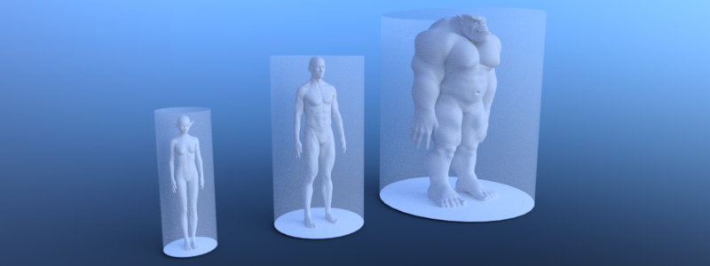

# Support different actor types

To support different actor types due to e.g. their sizes each type
requires its own navigation map and navigation mesh baked with an
appropriated agent radius and height. The same approach can be used to
distinguish between e.g. landwalking, swimming or flying agents.

Note

Agents are exclusively defined by a radius and height value for baking
navigation meshes, pathfinding and avoidance. More complex shapes are
not supported.

.. code-tab:: gdscript GDScript

\# Create a navigation mesh resource for each actor size. var
navigation\_mesh\_standard\_size: NavigationMesh = NavigationMesh.new()
var navigation\_mesh\_small\_size: NavigationMesh = NavigationMesh.new()
var navigation\_mesh\_huge\_size: NavigationMesh = NavigationMesh.new()

\# Set appropriated agent parameters.
navigation\_mesh\_standard\_size.agent\_radius = 0.5
navigation\_mesh\_standard\_size.agent\_height = 1.8
navigation\_mesh\_small\_size.agent\_radius = 0.25
navigation\_mesh\_small\_size.agent\_height = 0.7
navigation\_mesh\_huge\_size.agent\_radius = 1.5
navigation\_mesh\_huge\_size.agent\_height = 2.5

\# Get the root node to parse geometry for the baking. var root\_node:
Node3D = get\_node("NavigationMeshBakingRootNode")

\# Create the source geometry resource that will hold the parsed
geometry data. var source\_geometry\_data:
NavigationMeshSourceGeometryData3D =
NavigationMeshSourceGeometryData3D.new()

\# Parse the source geometry from the scene tree on the main thread. \#
The navigation mesh is only required for the parse settings so any of
the three will do.
NavigationServer3D.parse\_source\_geometry\_data(navigation\_mesh\_standard\_size,
source\_geometry\_data, root\_node)

\# Bake the navigation geometry for each agent size from the same source
geometry. \# If required for performance this baking step could also be
done on background threads.
NavigationServer3D.bake\_from\_source\_geometry\_data(navigation\_mesh\_standard\_size,
source\_geometry\_data)
NavigationServer3D.bake\_from\_source\_geometry\_data(navigation\_mesh\_small\_size,
source\_geometry\_data)
NavigationServer3D.bake\_from\_source\_geometry\_data(navigation\_mesh\_huge\_size,
source\_geometry\_data)

\# Create different navigation maps on the NavigationServer. var
navigation\_map\_standard: RID = NavigationServer3D.map\_create() var
navigation\_map\_small: RID = NavigationServer3D.map\_create() var
navigation\_map\_huge: RID = NavigationServer3D.map\_create()

\# Set the new navigation maps as active.
NavigationServer3D.map\_set\_active(navigation\_map\_standard, true)
NavigationServer3D.map\_set\_active(navigation\_map\_small, true)
NavigationServer3D.map\_set\_active(navigation\_map\_huge, true)

\# Create a region for each map. var navigation\_region\_standard: RID =
NavigationServer3D.region\_create() var navigation\_region\_small: RID =
NavigationServer3D.region\_create() var navigation\_region\_huge: RID =
NavigationServer3D.region\_create()

\# Add the regions to the maps.
NavigationServer3D.region\_set\_map(navigation\_region\_standard,
navigation\_map\_standard)
NavigationServer3D.region\_set\_map(navigation\_region\_small,
navigation\_map\_small)
NavigationServer3D.region\_set\_map(navigation\_region\_huge,
navigation\_map\_huge)

\# Set navigation mesh for each region.
NavigationServer3D.region\_set\_navigation\_mesh(navigation\_region\_standard,
navigation\_mesh\_standard\_size)
NavigationServer3D.region\_set\_navigation\_mesh(navigation\_region\_small,
navigation\_mesh\_small\_size)
NavigationServer3D.region\_set\_navigation\_mesh(navigation\_region\_huge,
navigation\_mesh\_huge\_size)

\# Create start and end position for the navigation path query. var
start\_pos: Vector3 = Vector3(0.0, 0.0, 0.0) var end\_pos: Vector3 =
Vector3(2.0, 0.0, 0.0) var use\_corridorfunnel: bool = true

\# Query paths for each agent size. var path\_standard\_agent =
NavigationServer3D.map\_get\_path(navigation\_map\_standard, start\_pos,
end\_pos, use\_corridorfunnel) var path\_small\_agent =
NavigationServer3D.map\_get\_path(navigation\_map\_small, start\_pos,
end\_pos, use\_corridorfunnel) var path\_huge\_agent =
NavigationServer3D.map\_get\_path(navigation\_map\_huge, start\_pos,
end\_pos, use\_corridorfunnel)

csharp

// Create a navigation mesh resource for each actor size. NavigationMesh
navigationMeshStandardSize = new NavigationMesh(); NavigationMesh
navigationMeshSmallSize = new NavigationMesh(); NavigationMesh
navigationMeshHugeSize = new NavigationMesh();

// Set appropriated agent parameters.
navigationMeshStandardSize.AgentRadius = 0.5f;
navigationMeshStandardSize.AgentHeight = 1.8f;
navigationMeshSmallSize.AgentRadius = 0.25f;
navigationMeshSmallSize.AgentHeight = 0.7f;
navigationMeshHugeSize.AgentRadius = 1.5f;
navigationMeshHugeSize.AgentHeight = 2.5f;

// Get the root node to parse geometry for the baking. Node3D rootNode =
GetNode&lt;Node3D&gt;("NavigationMeshBakingRootNode");

// Create the source geometry resource that will hold the parsed
geometry data. NavigationMeshSourceGeometryData3D sourceGeometryData =
new NavigationMeshSourceGeometryData3D();

// Parse the source geometry from the scene tree on the main thread. //
The navigation mesh is only required for the parse settings so any of
the three will do.
NavigationServer3D.ParseSourceGeometryData(navigationMeshStandardSize,
sourceGeometryData, rootNode);

// Bake the navigation geometry for each agent size from the same source
geometry. // If required for performance this baking step could also be
done on background threads.
NavigationServer3D.BakeFromSourceGeometryData(navigationMeshStandardSize,
sourceGeometryData);
NavigationServer3D.BakeFromSourceGeometryData(navigationMeshSmallSize,
sourceGeometryData);
NavigationServer3D.BakeFromSourceGeometryData(navigationMeshHugeSize,
sourceGeometryData);

// Create different navigation maps on the NavigationServer. Rid
navigationMapStandard = NavigationServer3D.MapCreate(); Rid
navigationMapSmall = NavigationServer3D.MapCreate(); Rid
navigationMapHuge = NavigationServer3D.MapCreate();

// Set the new navigation maps as active.
NavigationServer3D.MapSetActive(navigationMapStandard, true);
NavigationServer3D.MapSetActive(navigationMapSmall, true);
NavigationServer3D.MapSetActive(navigationMapHuge, true);

// Create a region for each map. Rid navigationRegionStandard =
NavigationServer3D.RegionCreate(); Rid navigationRegionSmall =
NavigationServer3D.RegionCreate(); Rid navigationRegionHuge =
NavigationServer3D.RegionCreate();

// Add the regions to the maps.
NavigationServer3D.RegionSetMap(navigationRegionStandard,
navigationMapStandard);
NavigationServer3D.RegionSetMap(navigationRegionSmall,
navigationMapSmall);
NavigationServer3D.RegionSetMap(navigationRegionHuge,
navigationMapHuge);

// Set navigation mesh for each region.
NavigationServer3D.RegionSetNavigationMesh(navigationRegionStandard,
navigationMeshStandardSize);
NavigationServer3D.RegionSetNavigationMesh(navigationRegionSmall,
navigationMeshSmallSize);
NavigationServer3D.RegionSetNavigationMesh(navigationRegionHuge,
navigationMeshHugeSize);

// Create start and end position for the navigation path query. Vector3
startPos = new Vector3(0.0f, 0.0f, 0.0f); Vector3 endPos = new
Vector3(2.0f, 0.0f, 0.0f); bool useCorridorFunnel = true;

// Query paths for each agent size. var pathStandardAgent =
NavigationServer3D.MapGetPath(navigationMapStandard, startPos, endPos,
useCorridorFunnel); var pathSmallAgent =
NavigationServer3D.MapGetPath(navigationMapSmall, startPos, endPos,
useCorridorFunnel); var pathHugeAgent =
NavigationServer3D.MapGetPath(navigationMapHuge, startPos, endPos,
useCorridorFunnel);
