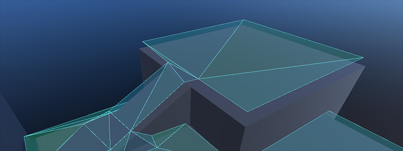
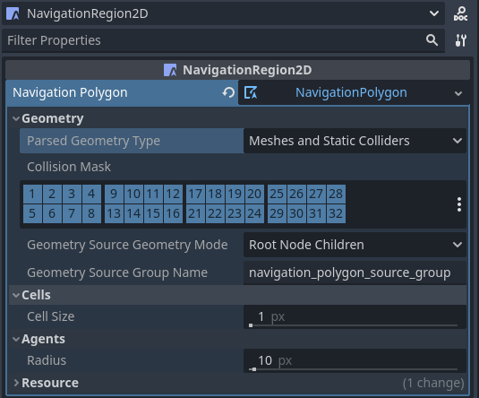
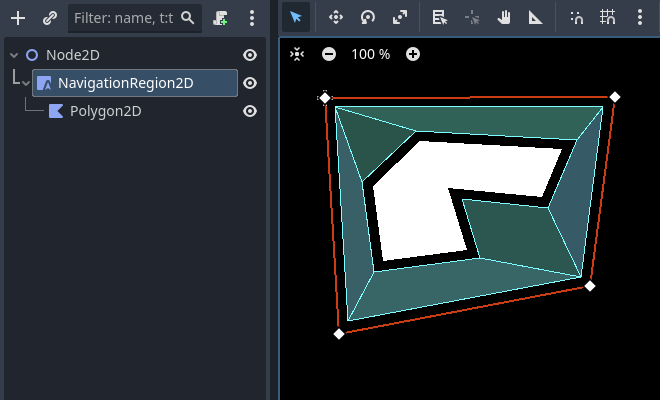
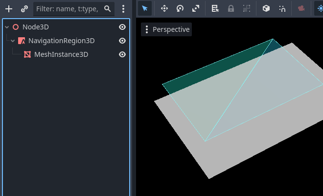

# Using navigation meshes

2D and 3D versions of the navigation mesh are available as
`NavigationPolygon<class_NavigationPolygon>` and
`NavigationMesh<class_NavigationMesh>` respectively.

Note

A navigation mesh only describes a traversable area for an agent's
center position. Any radius values an agent may have are ignored. If you
want pathfinding to account for an agent's (collision) size you need to
shrink the navigation mesh accordingly.

Navigation works independently from other engine parts like rendering or
physics. Navigation meshes are the only things considered when doing
pathfinding, e.g. visuals and collision shapes for example are
completely ignored by the navigation system. If you need to take other
data (like visuals for example) into account when doing pathfinding, you
need to adapt your navigation meshes accordingly. The process of
factoring in navigation restrictions in navigation meshes is commonly
referred to as navigation mesh baking.

<figure class="align-center">

<figcaption>A navigation mesh describes a surface that an agent can
stand on safely with its center compared to physics shapes that describe
outer collision bounds.</figcaption>
</figure>

If you experience clipping or collision problems while following
navigation paths, always remember that you need to tell the navigation
system what your intentions are through an appropriate navigation mesh.
By itself the navigation system will never know "this is a tree / rock /
wall collision shape or visual mesh" because it only knows that "here I
was told I can path safely because it is on a navigation mesh".

Navigation mesh baking can be done either by using a
`NavigationRegion2D<class_NavigationRegion2D>` or
`NavigationRegion3D<class_NavigationRegion3D>`, or by using the
`NavigationServer2D<class_NavigationServer2D>` and
`NavigationServer3D<class_NavigationServer3D>` API directly.

## Baking a navigation mesh with a NavigationRegion

<figure class="align-center">

<figcaption>Baking a navigation mesh with agent radius offset from
geometry.</figcaption>
</figure>

The navigation mesh baking is made more accessible with the
NavigationRegion node. When baking with a NavigationRegion node, the
individual parsing, baking, and region update steps are all combined
into one function.

The nodes are available in 2D and 3D as
`NavigationRegion2D<class_NavigationRegion2D>` and
`NavigationRegion3D<class_NavigationRegion3D>` respectively.

Tip

The navigation mesh `source_geometry_mode` can be switched to parse
specific node group names so nodes that should be baked can be placed
anywhere in the scene.

Baking with a NavigationRegion2D

When a NavigationRegion2D node is selected in the Editor, bake options
as well as polygon draw tools appear in the top bar of the Editor.

In order for the region to work a
`NavigationPolygon<class_NavigationPolygon>` resource needs to be added.

The properties to parse and bake a navigation mesh are then part of the
used resource and can be found in the resource Inspector.

The result of the source geometry parsing can be influenced with the
following properties.

-   The `parsed_geometry_type` that filters if visual objects or physics
    objects or both should be parsed from the
    `SceneTree<class_SceneTree>`. For more details on what objects are
    parsed and how, see the section about parsing source geometry below.
-   The `collision_mask` filters which physics collision objects are
    included when the `parsed_geometry_type` includes static colliders.
-   The `source_geometry_mode` that defines on which node(s) to start
    the parsing, and how to traverse the `SceneTree<class_SceneTree>`.
-   The `source_geometry_group_name` is used when only a certain node
    group should be parsed. Depends on the selected
    `source_geometry_mode`.

With the source geometry added, the result of the baking can be
controlled with the following properties.

-   The `cell_size` sets the rasterization grid size and should match
    the navigation map size.
-   The `agent_radius` shrinks the baked navigation mesh to have enough
    margin for the agent (collision) size.

The NavigationRegion2D baking can also be used at runtime with scripts.

.. code-tab:: gdscript GDScript

var on\_thread: bool = true bake\_navigation\_polygon(on\_thread)

csharp

bool onThread = true; BakeNavigationPolygon(onThread);

To quickly test the 2D baking with default settings:

-   Add a `NavigationRegion2D<class_NavigationRegion2D>`.
-   Add a `NavigationPolygon<class_NavigationPolygon>` resource to the
    NavigationRegion2D.
-   Add a `Polygon2D<class_Polygon2D>` below the NavigationRegion2D.
-   Draw 1 NavigationPolygon outline with the selected
    NavigationRegion2D draw tool.
-   Draw 1 Polygon2D outline inside the NavigationPolygon outline with
    the selected Polygon2D draw tool.
-   Hit the Editor bake button and a navigation mesh should appear.

Baking with a NavigationRegion3D

When a NavigationRegion3D node is selected in the Editor, bake options
appear in the top bar of the Editor.

In order for the region to work a `NavigationMesh<class_NavigationMesh>`
resource needs to be added.

The properties to parse and bake a navigation mesh are then part of the
used resource and can be found in the resource Inspector.

The result of the source geometry parsing can be influenced with the
following properties.

-   The `parsed_geometry_type` that filters if visual objects or physics
    objects or both should be parsed from the
    `SceneTree<class_SceneTree>`. For more details on what objects are
    parsed and how, see the section about parsing source geometry below.
-   The `collision_mask` filters which physics collision objects are
    included when the `parsed_geometry_type` includes static colliders.
-   The `source_geometry_mode` that defines on which node(s) to start
    the parsing, and how to traverse the `SceneTree<class_SceneTree>`.
-   The `source_geometry_group_name` is used when only a certain node
    group should be parsed. Depends on the selected
    `source_geometry_mode`.

With the source geometry added, the result of the baking can be
controlled with the following properties.

-   The `cell_size` and `cell_height` sets the rasterization voxel grid
    size and should match the navigation map size.
-   The `agent_radius` shrinks the baked navigation mesh to have enough
    margin for the agent (collision) size.
-   The `agent_height` excludes areas from the navigation mesh where the
    agent is too tall to fit in.
-   The `agent_max_climb` and `agent_max_slope` removes areas where the
    height difference between neighboring voxels is too large, or where
    their surface is too steep.

Warning

A too small `cell_size` or `cell_height` can create so many voxels that
it has the potential to freeze the game or even crash.

The NavigationRegion3D baking can also be used at runtime with scripts.

.. code-tab:: gdscript GDScript

var on\_thread: bool = true bake\_navigation\_mesh(on\_thread)

csharp

bool onThread = true; BakeNavigationMesh(onThread);

To quickly test the 3D baking with default settings:

-   Add a `NavigationRegion3D<class_NavigationRegion3D>`.
-   Add a `NavigationMesh<class_NavigationMesh>` resource to the
    NavigationRegion3D.
-   Add a `MeshInstance3D<class_MeshInstance3D>` below the
    NavigationRegion3D.
-   Add a `PlaneMesh<class_PlaneMesh>` to the MeshInstance3D.
-   Hit the Editor bake button and a navigation mesh should appear.

## Baking a navigation mesh with the NavigationServer

The `NavigationServer2D<class_NavigationServer2D>` and
`NavigationServer3D<class_NavigationServer3D>` have API functions to
call each step of the navigation mesh baking process individually.

-   `parse_source_geometry_data()` can be used to parse source geometry
    to a reusable and serializable resource.
-   `bake_from_source_geometry_data()` can be used to bake a navigation
    mesh from already parsed data e.g. to avoid runtime performance
    issues with (redundant) parsing.
-   `bake_from_source_geometry_data_async()` is the same but bakes the
    navigation mesh deferred with threads, not blocking the main thread.

Compared to a NavigationRegion, the NavigationServer offers finer
control over the navigation mesh baking process. In turn it is more
complex to use but also provides more advanced options.

Some other advantages of the NavigationServer over a NavigationRegion
are:

-   The server can parse source geometry without baking, e.g. to cache
    it for later use.
-   The server allows selecting the root node at which to start the
    source geometry parsing manually.
-   The server can accept and bake from procedurally generated source
    geometry data.
-   The server can bake multiple navigation meshes in sequence while
    (re)using the same source geometry data.

To bake navigation meshes with the NavigationServer, source geometry is
required. Source geometry is geometry data that should be considered in
a navigation mesh baking process. Both navigation meshes for 2D and 3D
are created by baking them from source geometry.

2D and 3D versions of the source geometry resources are available as
`NavigationMeshSourceGeometryData2D<class_NavigationMeshSourceGeometryData2D>`
and
`NavigationMeshSourceGeometryData3D<class_NavigationMeshSourceGeometryData3D>`
respectively.

Source geometry can be geometry parsed from visual meshes, from physics
collision, or procedural created arrays of data, like outlines (2D) and
triangle faces (3D). For convenience, source geometry is commonly parsed
directly from node setups in the SceneTree. For runtime navigation mesh
(re)bakes, be aware that the geometry parsing always happens on the main
thread.

Note

The SceneTree is not thread-safe. Parsing source geometry from the
SceneTree can only be done on the main thread.

Warning

The data from visual meshes and polygons needs to be received from the
GPU, stalling the RenderingServer in the process. For runtime (re)baking
prefer using physics shapes as parsed source geometry.

Source geometry is stored inside resources so the created geometry can
be reused for multiple bakes. E.g. baking multiple navigation meshes for
different agent sizes from the same source geometry. This also allows to
save source geometry to disk so it can be loaded later, e.g. to avoid
the overhead of parsing it again at runtime.

The geometry data should be in general kept very simple. As many edges
as are required but as few as possible. Especially in 2D duplicated and
nested geometry should be avoided as it forces polygon hole calculation
that can result in flipped polygons. An example for nested geometry
would be a smaller StaticBody2D shape placed completely inside the
bounds of another StaticBody2D shape.

## Baking navigation mesh chunks for large worlds

<figure class="align-center">

<figcaption>Building and updating individual navigation mesh chunks at
runtime.</figcaption>
</figure>

You can see the navigation mesh chunk baking in action in the
[Navigation Mesh Chunks
2D](https://github.com/godotengine/godot-demo-projects/tree/master/2d/navigation_mesh_chunks)
and [Navigation Mesh Chunks
3D](https://github.com/godotengine/godot-demo-projects/tree/master/3d/navigation_mesh_chunks)
demo projects.

To avoid misaligned edges between different region chunks the navigation
meshes have two important properties for the navigation mesh baking
process. The baking bound and the border size. Together they can be used
to ensure perfectly aligned edges between region chunks.

<figure class="align-center">

<figcaption>Navigation mesh chunk baked with bake bound or baked with
additional border size.</figcaption>
</figure>

The baking bound, which is an axis-aligned `Rect2<class_Rect2>` for 2D
and `AABB<class_AABB>` for 3D, limits the used source geometry by
discarding all the geometry that is outside of the bounds.

The `NavigationPolygon<class_NavigationPolygon>` properties
`baking_rect` and `baking_rect_offset` can be used to create and place
the 2D baking bound.

The `NavigationMesh<class_NavigationMesh>` properties
`filter_baking_aabb` and `filter_baking_aabb_offset` can be used to
create and place the 3D baking bound.

With only the baking bound set another problem still exists. The
resulting navigation mesh will inevitably be affected by necessary
offsets like the `agent_radius` which makes the edges not align
properly.

<figure class="align-center">

<figcaption>Navigation mesh chunks with noticeable gaps due to baked
agent radius offset.</figcaption>
</figure>

This is where the `border_size` property for navigation mesh comes in.
The border size is an inward margin from the baking bound. The important
characteristic of the border size is that it is unaffected by most
offsets and postprocessing like the `agent_radius`.

Instead of discarding source geometry, the border size discards parts of
the final surface of the baked navigation mesh. If the baking bound is
large enough the border size can remove the problematic surface parts so
that only the intended chunk size is left.

<figure class="align-center">

<figcaption>Navigation mesh chunks with aligned edges and without
gaps.</figcaption>
</figure>

Note

The baking bounds need to be large enough to include a reasonable amount
of source geometry from all the neighboring chunks.

Warning

In 3D the functionality of the border size is limited to the xz-axis.

## Navigation mesh baking common problems

There are some common user problems and important caveats to consider
when creating or baking navigation meshes.

-   Navigation mesh baking creates frame rate problems at runtime  
    The navigation mesh baking is by default done on a background
    thread, so as long as the platform supports threads, the actual
    baking is rarely the source of any performance issues (assuming a
    reasonably sized and complex geometry for runtime rebakes).

    The common source for performance issues at runtime is the parsing
    step for source geometry that involves nodes and the SceneTree. The
    SceneTree is not thread-safe so all the nodes need to be parsed on
    the main thread. Some nodes with a lot of data can be very heavy and
    slow to parse at runtime, e.g. a TileMap has one or more polygons
    for every single used cell and TileMapLayer to parse. Nodes that
    hold meshes need to request the data from the RenderingServer
    stalling the rendering in the process.

    To improve performance, use more optimized shapes, e.g. collision
    shapes over detailed visual meshes, and merge and simplify as much
    geometry as possible upfront. If nothing helps, don't parse the
    SceneTree and add the source geometry procedural with scripts. If
    only pure data arrays are used as source geometry, the entire baking
    process can be done on a background thread.

-   Navigation mesh creates unintended holes in 2D.  
    The navigation mesh baking in 2D is done by doing polygon clipping
    operations based on outline paths. Polygons with "holes" are a
    necessary evil to create more complex 2D polygons but can become
    unpredictable for users with many complex shapes involved.

    To avoid any unexpected problems with polygon hole calculations,
    avoid nesting any outlines inside other outlines of the same type
    (traversable / obstruction). This includes the parsed shapes from
    nodes. E.g. placing a smaller StaticBody2D shape inside a larger
    StaticBody2D shape can result in the resulting polygon being
    flipped.

-   Navigation mesh appears inside geometry in 3D.  
    The navigation mesh baking in 3D has no concept of "inside". The
    voxel cells used to rasterize the geometry are either occupied or
    not. Remove the geometry that is on the ground inside the other
    geometry. If that is not possible, add smaller "dummy" geometry
    inside with as few triangles as possible so the cells are occupied
    with something.

    A `NavigationObstacle3D<class_NavigationObstacle3D>` shape set to
    bake with navigation mesh can be used to discard geometry as well.

<figure class="align-center">

<figcaption>A NavigationObstacle3D shape can be used to discard unwanted
navigation mesh parts.</figcaption>
</figure>

## Navigation mesh script templates

The following script uses the NavigationServer to parse source geometry
from the scene tree, bakes a navigation mesh, and updates a navigation
region with the updated navigation mesh.

.. code-tab:: gdscript 2D GDScript

extends Node2D

var navigation\_mesh: NavigationPolygon var source\_geometry :
NavigationMeshSourceGeometryData2D var callback\_parsing : Callable var
callback\_baking : Callable var region\_rid: RID

func \_ready() -&gt; void:  
navigation\_mesh = NavigationPolygon.new()
navigation\_mesh.agent\_radius = 10.0 source\_geometry =
NavigationMeshSourceGeometryData2D.new() callback\_parsing =
on\_parsing\_done callback\_baking = on\_baking\_done region\_rid =
NavigationServer2D.region\_create()

\# Enable the region and set it to the default navigation map.
NavigationServer2D.region\_set\_enabled(region\_rid, true)
NavigationServer2D.region\_set\_map(region\_rid,
get\_world\_2d().get\_navigation\_map())

\# Some mega-nodes like TileMap are often not ready on the first frame.
\# Also the parsing needs to happen on the main-thread. \# So do a
deferred call to avoid common parsing issues.
parse\_source\_geometry.call\_deferred()

func parse\_source\_geometry() -&gt; void:  
source\_geometry.clear() var root\_node: Node2D = self

\# Parse the obstruction outlines from all child nodes of the root node
by default. NavigationServer2D.parse\_source\_geometry\_data(
navigation\_mesh, source\_geometry, root\_node, callback\_parsing )

func on\_parsing\_done() -&gt; void:  
\# If we did not parse a TileMap with navigation mesh cells we may now
only \# have obstruction outlines so add at least one traversable
outline \# so the obstructions outlines have something to "cut" into.
source\_geometry.add\_traversable\_outline(PackedVector2Array(\[
Vector2(0.0, 0.0), Vector2(500.0, 0.0), Vector2(500.0, 500.0),
Vector2(0.0, 500.0) \]))

\# Bake the navigation mesh on a thread with the source geometry data.
NavigationServer2D.bake\_from\_source\_geometry\_data\_async(
navigation\_mesh, source\_geometry, callback\_baking )

func on\_baking\_done() -&gt; void:  
\# Update the region with the updated navigation mesh.
NavigationServer2D.region\_set\_navigation\_polygon(region\_rid,
navigation\_mesh)

csharp 2D C#

using Godot;

public partial class MyNode2D : Node2D { private NavigationPolygon
\_navigationMesh; private NavigationMeshSourceGeometryData2D
\_sourceGeometry; private Callable \_callbackParsing; private Callable
\_callbackBaking; private Rid \_regionRid;

> public override void \_Ready() { \_navigationMesh = new
> NavigationPolygon(); \_navigationMesh.AgentRadius = 10.0f;
> \_sourceGeometry = new NavigationMeshSourceGeometryData2D();
> \_callbackParsing = Callable.From(OnParsingDone); \_callbackBaking =
> Callable.From(OnBakingDone); \_regionRid =
> NavigationServer2D.RegionCreate();
>
> > // Enable the region and set it to the default navigation map.
> > NavigationServer2D.RegionSetEnabled(\_regionRid, true);
> > NavigationServer2D.RegionSetMap(\_regionRid,
> > GetWorld2D().NavigationMap);
> >
> > // Some mega-nodes like TileMap are often not ready on the first
> > frame. // Also the parsing needs to happen on the main-thread. // So
> > do a deferred call to avoid common parsing issues.
> > CallDeferred(MethodName.ParseSourceGeometry);
>
> }
>
> private void ParseSourceGeometry() { \_sourceGeometry.Clear(); Node2D
> rootNode = this;
>
> > // Parse the obstruction outlines from all child nodes of the root
> > node by default. NavigationServer2D.ParseSourceGeometryData(
> > \_navigationMesh, \_sourceGeometry, rootNode, \_callbackParsing );
>
> }
>
> private void OnParsingDone() { // If we did not parse a TileMap with
> navigation mesh cells we may now only // have obstruction outlines so
> add at least one traversable outline // so the obstructions outlines
> have something to "cut" into.
> \_sourceGeometry.AddTraversableOutline(new Vector2\[\] { new
> Vector2(0.0f, 0.0f), new Vector2(500.0f, 0.0f), new Vector2(500.0f,
> 500.0f), new Vector2(0.0f, 500.0f), });
>
> > // Bake the navigation mesh on a thread with the source geometry
> > data.
> > NavigationServer2D.BakeFromSourceGeometryDataAsync(\_navigationMesh,
> > \_sourceGeometry, \_callbackBaking);
>
> }
>
> private void OnBakingDone() { // Update the region with the updated
> navigation mesh.
> NavigationServer2D.RegionSetNavigationPolygon(\_regionRid,
> \_navigationMesh); }

}

gdscript 3D GDScript

extends Node3D

var navigation\_mesh: NavigationMesh var source\_geometry :
NavigationMeshSourceGeometryData3D var callback\_parsing : Callable var
callback\_baking : Callable var region\_rid: RID

func \_ready() -&gt; void:  
navigation\_mesh = NavigationMesh.new() navigation\_mesh.agent\_radius =
0.5 source\_geometry = NavigationMeshSourceGeometryData3D.new()
callback\_parsing = on\_parsing\_done callback\_baking =
on\_baking\_done region\_rid = NavigationServer3D.region\_create()

\# Enable the region and set it to the default navigation map.
NavigationServer3D.region\_set\_enabled(region\_rid, true)
NavigationServer3D.region\_set\_map(region\_rid,
get\_world\_3d().get\_navigation\_map())

\# Some mega-nodes like GridMap are often not ready on the first frame.
\# Also the parsing needs to happen on the main-thread. \# So do a
deferred call to avoid common parsing issues.
parse\_source\_geometry.call\_deferred()

func parse\_source\_geometry() -&gt; void:  
source\_geometry.clear() var root\_node: Node3D = self

\# Parse the geometry from all mesh child nodes of the root node by
default. NavigationServer3D.parse\_source\_geometry\_data(
navigation\_mesh, source\_geometry, root\_node, callback\_parsing )

func on\_parsing\_done() -&gt; void:  
\# Bake the navigation mesh on a thread with the source geometry data.
NavigationServer3D.bake\_from\_source\_geometry\_data\_async(
navigation\_mesh, source\_geometry, callback\_baking )

func on\_baking\_done() -&gt; void:  
\# Update the region with the updated navigation mesh.
NavigationServer3D.region\_set\_navigation\_mesh(region\_rid,
navigation\_mesh)

csharp 3D C#

using Godot;

public partial class MyNode3D : Node3D { private NavigationMesh
\_navigationMesh; private NavigationMeshSourceGeometryData3D
\_sourceGeometry; private Callable \_callbackParsing; private Callable
\_callbackBaking; private Rid \_regionRid;

> public override void \_Ready() { \_navigationMesh = new
> NavigationMesh(); \_navigationMesh.AgentRadius = 0.5f;
> \_sourceGeometry = new NavigationMeshSourceGeometryData3D();
> \_callbackParsing = Callable.From(OnParsingDone); \_callbackBaking =
> Callable.From(OnBakingDone); \_regionRid =
> NavigationServer3D.RegionCreate();
>
> > // Enable the region and set it to the default navigation map.
> > NavigationServer3D.RegionSetEnabled(\_regionRid, true);
> > NavigationServer3D.RegionSetMap(\_regionRid,
> > GetWorld3D().NavigationMap);
> >
> > // Some mega-nodes like GridMap are often not ready on the first
> > frame. // Also the parsing needs to happen on the main-thread. // So
> > do a deferred call to avoid common parsing issues.
> > CallDeferred(MethodName.ParseSourceGeometry);
>
> }
>
> private void ParseSourceGeometry () { \_sourceGeometry.Clear(); Node3D
> rootNode = this;
>
> > // Parse the geometry from all mesh child nodes of the root node by
> > default. NavigationServer3D.ParseSourceGeometryData(
> > \_navigationMesh, \_sourceGeometry, rootNode, \_callbackParsing );
>
> }
>
> private void OnParsingDone() { // Bake the navigation mesh on a thread
> with the source geometry data.
> NavigationServer3D.BakeFromSourceGeometryDataAsync(\_navigationMesh,
> \_sourceGeometry, \_callbackBaking); }
>
> private void OnBakingDone() { // Update the region with the updated
> navigation mesh.
> NavigationServer3D.RegionSetNavigationMesh(\_regionRid,
> \_navigationMesh); }

}

The following script uses the NavigationServer to update a navigation
region with procedurally generated navigation mesh data.

.. code-tab:: gdscript 2D GDScript

extends Node2D

var navigation\_mesh: NavigationPolygon var region\_rid: RID

func \_ready() -&gt; void:  
navigation\_mesh = NavigationPolygon.new() region\_rid =
NavigationServer2D.region\_create()

\# Enable the region and set it to the default navigation map.
NavigationServer2D.region\_set\_enabled(region\_rid, true)
NavigationServer2D.region\_set\_map(region\_rid,
get\_world\_2d().get\_navigation\_map())

\# Add vertices for a convex polygon. navigation\_mesh.vertices =
PackedVector2Array(\[ Vector2(0.0, 0.0), Vector2(100.0, 0.0),
Vector2(100.0, 100.0), Vector2(0.0, 100.0), \])

\# Add indices for the polygon. navigation\_mesh.add\_polygon(
PackedInt32Array(\[0, 1, 2, 3\]) )

NavigationServer2D.region\_set\_navigation\_polygon(region\_rid,
navigation\_mesh)

csharp 2D C#

using Godot;

public partial class MyNode2D : Node2D { private NavigationPolygon
\_navigationMesh; private Rid \_regionRid;

> public override void \_Ready() { \_navigationMesh = new
> NavigationPolygon(); \_regionRid = NavigationServer2D.RegionCreate();
>
> > // Enable the region and set it to the default navigation map.
> > NavigationServer2D.RegionSetEnabled(\_regionRid, true);
> > NavigationServer2D.RegionSetMap(\_regionRid,
> > GetWorld2D().NavigationMap);
> >
> > // Add vertices for a convex polygon. \_navigationMesh.Vertices =
> > new Vector2\[\] { new Vector2(0, 0), new Vector2(100.0f, 0), new
> > Vector2(100.0f, 100.0f), new Vector2(0, 100.0f), };
> >
> > // Add indices for the polygon. \_navigationMesh.AddPolygon(new
> > int\[\] { 0, 1, 2, 3 });
> >
> > NavigationServer2D.RegionSetNavigationPolygon(\_regionRid,
> > \_navigationMesh);
>
> }

}

gdscript 3D GDScript

extends Node3D

var navigation\_mesh: NavigationMesh var region\_rid: RID

func \_ready() -&gt; void:  
navigation\_mesh = NavigationMesh.new() region\_rid =
NavigationServer3D.region\_create()

\# Enable the region and set it to the default navigation map.
NavigationServer3D.region\_set\_enabled(region\_rid, true)
NavigationServer3D.region\_set\_map(region\_rid,
get\_world\_3d().get\_navigation\_map())

\# Add vertices for a convex polygon. navigation\_mesh.vertices =
PackedVector3Array(\[ Vector3(-1.0, 0.0, 1.0), Vector3(1.0, 0.0, 1.0),
Vector3(1.0, 0.0, -1.0), Vector3(-1.0, 0.0, -1.0), \])

\# Add indices for the polygon. navigation\_mesh.add\_polygon(
PackedInt32Array(\[0, 1, 2, 3\]) )

NavigationServer3D.region\_set\_navigation\_mesh(region\_rid,
navigation\_mesh)

csharp 3D C#

using Godot;

public partial class MyNode3D : Node3D { private NavigationMesh
\_navigationMesh; private Rid \_regionRid;

> public override void \_Ready() { \_navigationMesh = new
> NavigationMesh(); \_regionRid = NavigationServer3D.RegionCreate();
>
> > // Enable the region and set it to the default navigation map.
> > NavigationServer3D.RegionSetEnabled(\_regionRid, true);
> > NavigationServer3D.RegionSetMap(\_regionRid,
> > GetWorld3D().NavigationMap);
> >
> > // Add vertices for a convex polygon. \_navigationMesh.Vertices =
> > new Vector3\[\] { new Vector3(-1.0f, 0.0f, 1.0f), new Vector3(1.0f,
> > 0.0f, 1.0f), new Vector3(1.0f, 0.0f, -1.0f), new Vector3(-1.0f,
> > 0.0f, -1.0f), };
> >
> > // Add indices for the polygon. \_navigationMesh.AddPolygon(new
> > int\[\] { 0, 1, 2, 3 });
> >
> > NavigationServer3D.RegionSetNavigationMesh(\_regionRid,
> > \_navigationMesh);
>
> }

}
