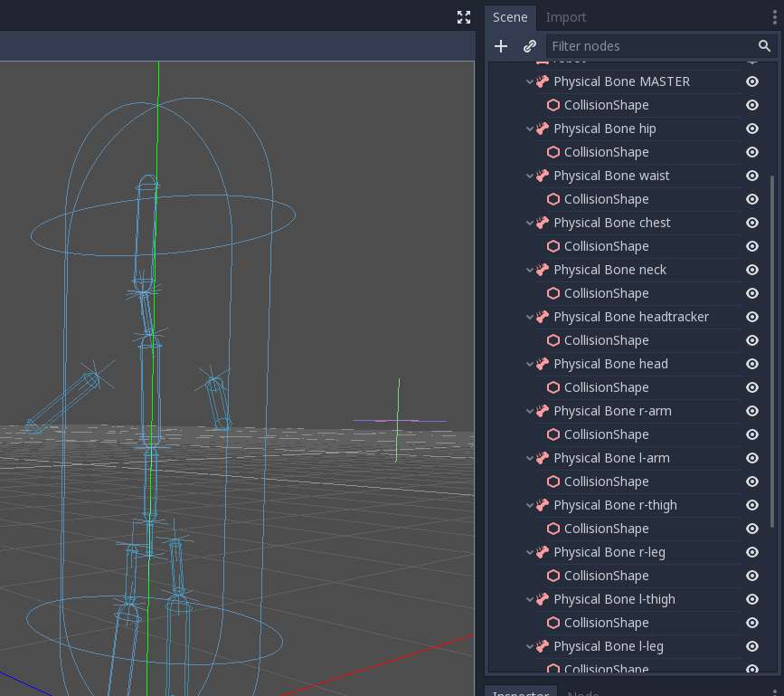
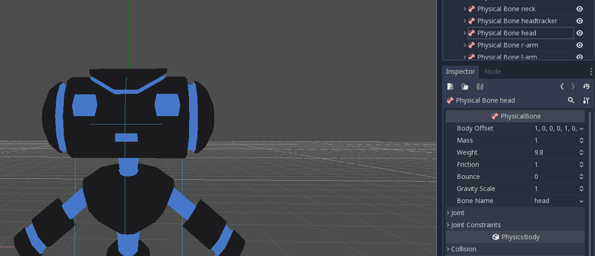
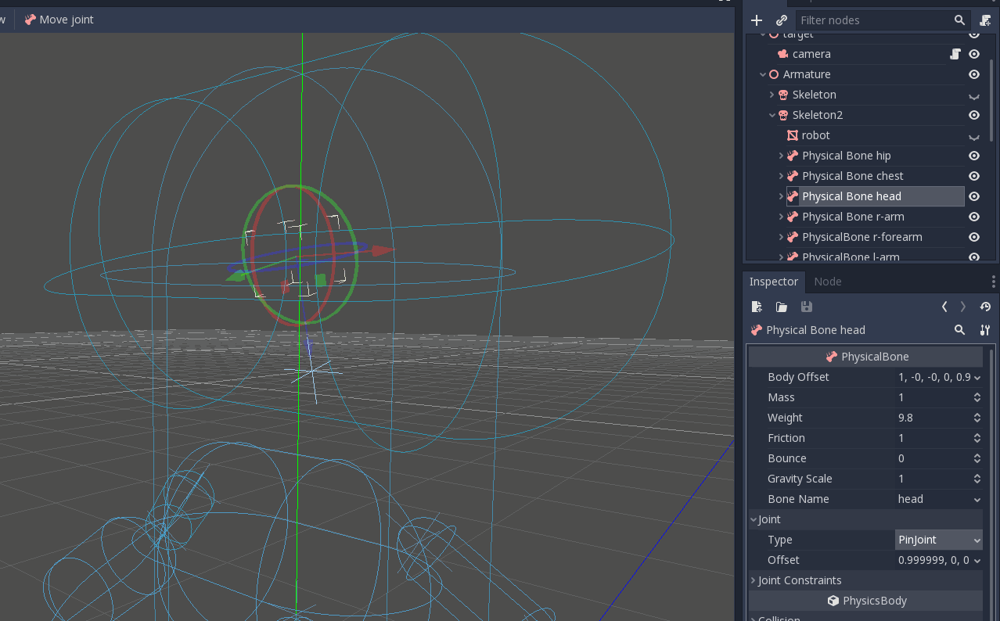
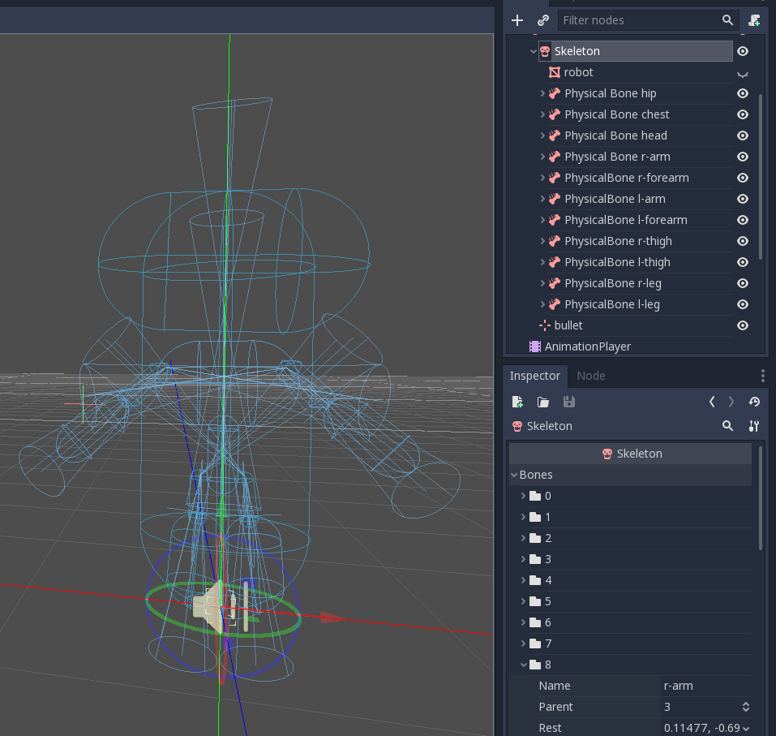
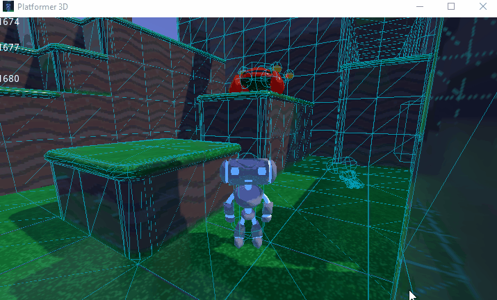

# Ragdoll system

## Introduction

Since version 3.1, Godot supports ragdoll physics. Ragdolls rely on
physics simulation to create realistic procedural animation. They are
used for death animations in many games.

In this tutorial, we will be using the Platformer3D demo to set up a
ragdoll.

Note

You can download the Platformer3D demo on
[GitHub](https://github.com/godotengine/godot-demo-projects/tree/master/3d/platformer)
or using the [Asset
Library](https://godotengine.org/asset-library/asset/2748).

## Setting up the ragdoll

### Creating physical bones

Like many other features in the engine, there is a node to set up a
ragdoll: the `PhysicalBone3D <class_PhysicalBone3D>` node. To simplify
the setup, you can generate `PhysicalBone` nodes with the "Create
physical skeleton" feature in the skeleton node.

Open the platformer demo in Godot, and then the Robi scene. Select the
`Skeleton` node. A skeleton button appears on the top bar menu:

Click it and select the `Create physical skeleton` option. Godot will
generate `PhysicalBone` nodes and collision shapes for each bone in the
skeleton and pin joints to connect them together:

Some of the generated bones aren't necessary: the `MASTER` bone for
example. So we're going to clean up the skeleton by removing them.

### Cleaning up the skeleton

Each `PhysicalBone` the engine needs to simulate has a performance cost,
so you want to remove every bone that is too small to make a difference
in the simulation, as well as all utility bones.

For example, if we take a humanoid, you do not want to have physical
bones for each finger. You can use a single bone for the entire hand
instead, or one for the palm, one for the thumb, and a last one for the
other four fingers.

Remove these physical bones: `MASTER`, `waist`, `neck`, `headtracker`.
This gives us an optimized skeleton and makes it easier to control the
ragdoll.

### Collision shape adjustment

The next task is adjusting the collision shape and the size of physical
bones to match the part of the body that each bone should simulate.

### Joints adjustment

Once you adjusted the collision shapes, your ragdoll is almost ready.
You just want to adjust the pin joints to get a better simulation.
`PhysicalBone` nodes have an unconstrained pin joint assigned to them by
default. To change the pin joint, select the `PhysicalBone` and change
the constraint type in the `Joint` section. There, you can change the
constraint's orientation and its limits.

This is the final result:

## Simulating the ragdoll

The ragdoll is now ready to use. To start the simulation and play the
ragdoll animation, you need to call the
`physical_bones_start_simulation` method. Attach a script to the
skeleton node and call the method in the `_ready` method:

.. code-tab:: gdscript GDScript

func \_ready():  
physical\_bones\_start\_simulation()

csharp

public override void \_Ready() { PhysicalBonesStartSimulation(); }

To stop the simulation, call the `physical_bones_stop_simulation()`
method.

You can also limit the simulation to only a few bones. To do so, pass
the bone names as a parameter. Here's an example of partial ragdoll
simulation:

### Collision layer and mask

Make sure to set up your collision layers and masks properly so the
`CharacterBody3D`'s capsule doesn't get in the way of the physics
simulation:

For more information, read
`doc_physics_introduction_collision_layers_and_masks`.
