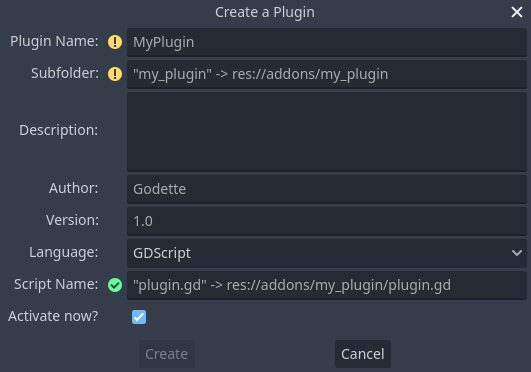
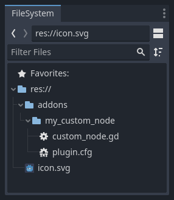
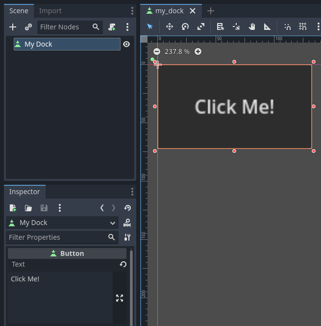

# Making plugins

## About plugins

A plugin is a great way to extend the editor with useful tools. It can
be made entirely with GDScript and standard scenes, without even
reloading the editor. Unlike modules, you don't need to create C++ code
nor recompile the engine. While this makes plugins less powerful, there
are still many things you can do with them. Note that a plugin is
similar to any scene you can already make, except it is created using a
script to add editor functionality.

This tutorial will guide you through the creation of two plugins so you
can understand how they work and be able to develop your own. The first
is a custom node that you can add to any scene in the project, and the
other is a custom dock added to the editor.

## Creating a plugin

Before starting, create a new empty project wherever you want. This will
serve as a base to develop and test the plugins.

The first thing you need for the editor to identify a new plugin is to
create two files: a `plugin.cfg` for configuration and a tool script
with the functionality. Plugins have a standard path like
`addons/plugin_name` inside the project folder. Godot provides a dialog
for generating those files and placing them where they need to be.

In the main toolbar, click the `Project` dropdown. Then click
`Project Settings...`. Go to the `Plugins` tab and then click on the
`Create New Plugin` button in the top-right.

You will see the dialog appear, like so:

The placeholder text in each field describes how it affects the plugin's
creation of the files and the config file's values.

To continue with the example, use the following values:

.. code-tab:: ini GDScript

Plugin Name: My Custom Node Subfolder: my\_custom\_node Description: A
custom node made to extend the Godot Engine. Author: Your Name Here
Version: 1.0.0 Language: GDScript Script Name: custom\_node.gd Activate
now: No

ini C#

Plugin Name: My Custom Node Subfolder: MyCustomNode Description: A
custom node made to extend the Godot Engine. Author: Your Name Here
Version: 1.0.0 Language: C# Script Name: CustomNode.cs Activate now: No

Warning

Unchecking the `Activate now?` option in C# is always required because,
like every other C# script, the EditorPlugin script needs to be compiled
which requires building the project. After building the project the
plugin can be enabled in the `Plugins` tab of `Project Settings`.

You should end up with a directory structure like this:

`plugin.cfg` is an INI file with metadata about your plugin. The name
and description help people understand what it does. Your name helps you
get properly credited for your work. The version number helps others
know if they have an outdated version; if you are unsure on how to come
up with the version number, check out [Semantic
Versioning](https://semver.org/). The main script file will instruct
Godot what your plugin does in the editor once it is active.

### The script file

Upon creation of the plugin, the dialog will automatically open the
EditorPlugin script for you. The script has two requirements that you
cannot change: it must be a `@tool` script, or else it will not load
properly in the editor, and it must inherit from `class_EditorPlugin`.

Warning

In addition to the EditorPlugin script, any other GDScript that your
plugin uses must *also* be a tool. Any GDScript without `@tool` used by
the editor will act like an empty file!

It's important to deal with initialization and clean-up of resources. A
good practice is to use the virtual function
`_enter_tree() <class_Node_private_method__enter_tree>` to initialize
your plugin and `_exit_tree() <class_Node_private_method__exit_tree>` to
clean it up. Thankfully, the dialog generates these callbacks for you.
Your script should look something like this:

> @tool extends EditorPlugin
>
> func \_enter\_tree():  
> \# Initialization of the plugin goes here. pass
>
> func \_exit\_tree():  
> \# Clean-up of the plugin goes here. pass
>
> csharp
>
> \#if TOOLS using Godot;
>
> \[Tool\] public partial class CustomNode : EditorPlugin { public
> override void \_EnterTree() { // Initialization of the plugin goes
> here. }
>
> > public override void \_ExitTree() { // Clean-up of the plugin goes
> > here. }
>
> } \#endif

This is a good template to use when creating new plugins.

## A custom node

Sometimes you want a certain behavior in many nodes, such as a custom
scene or control that can be reused. Instancing is helpful in a lot of
cases, but sometimes it can be cumbersome, especially if you're using it
in many projects. A good solution to this is to make a plugin that adds
a node with a custom behavior.

Warning

Nodes added via an EditorPlugin are "CustomType" nodes. While they work
with any scripting language, they have fewer features than
`the Script Class system <doc_gdscript_basics_class_name>`. If you are
writing GDScript or NativeScript, we recommend using Script Classes
instead.

To create a new node type, you can use the function
`add_custom_type() <class_EditorPlugin_method_add_custom_type>` from the
`class_EditorPlugin` class. This function can add new types to the
editor (nodes or resources). However, before you can create the type,
you need a script that will act as the logic for the type. While that
script doesn't have to use the `@tool` annotation, it can be added so
the script runs in the editor.

For this tutorial, we'll create a button that prints a message when
clicked. For that, we'll need a script that extends from `class_Button`.
It could also extend `class_BaseButton` if you prefer:

.. code-tab:: gdscript GDScript

@tool extends Button

func \_enter\_tree():  
pressed.connect(clicked)

func clicked():  
print("You clicked me!")

csharp

using Godot;

\[Tool\] public partial class MyButton : Button { public override void
\_EnterTree() { Pressed += Clicked; }

> public void Clicked() { GD.Print("You clicked me!"); }

}

That's it for our basic button. You can save this as `my_button.gd`
inside the plugin folder. You'll also need a 16×16 icon to show in the
scene tree. If you don't have one, you can grab the default one from the
engine and save it in your
addons/my\_custom\_node folder as
icon.png, or use the default Godot logo
(preload("res://icon.svg")).

Tip

SVG images that are used as custom node icons should have the **Editor
&gt; Scale With Editor Scale** and **Editor &gt; Convert Colors With
Editor Theme**
`import options <doc_importing_images_editor_import_options>` enabled.
This allows icons to follow the editor's scale and theming settings if
the icons are designed with the same color palette as Godot's own icons.

Now, we need to add it as a custom type so it shows on the **Create New
Node** dialog. For that, change the `custom_node.gd` script to the
following:

.. code-tab:: gdscript GDScript

@tool extends EditorPlugin

func \_enter\_tree():  
\# Initialization of the plugin goes here. \# Add the new type with a
name, a parent type, a script and an icon. add\_custom\_type("MyButton",
"Button", preload("my\_button.gd"), preload("icon.png"))

func \_exit\_tree():  
\# Clean-up of the plugin goes here. \# Always remember to remove it
from the engine when deactivated. remove\_custom\_type("MyButton")

csharp

\#if TOOLS using Godot;

\[Tool\] public partial class CustomNode : EditorPlugin { public
override void \_EnterTree() { // Initialization of the plugin goes here.
// Add the new type with a name, a parent type, a script and an icon.
var script =
GD.Load&lt;Script&gt;("<res://addons/MyCustomNode/MyButton.cs>"); var
texture =
GD.Load&lt;Texture2D&gt;("<res://addons/MyCustomNode/Icon.png>");
AddCustomType("MyButton", "Button", script, texture); }

> public override void \_ExitTree() { // Clean-up of the plugin goes
> here. // Always remember to remove it from the engine when
> deactivated. RemoveCustomType("MyButton"); }

} \#endif

With that done, the plugin should already be available in the plugin
list in the **Project Settings**, so activate it as explained in
[Checking the results](#checking-the-results).

Then try it out by adding your new node:

When you add the node, you can see that it already has the script you
created attached to it. Set a text to the button, save and run the
scene. When you click the button, you can see some text in the console:

### A custom dock

Sometimes, you need to extend the editor and add tools that are always
available. An easy way to do it is to add a new dock with a plugin.
Docks are just scenes based on Control, so they are created in a way
similar to usual GUI scenes.

Creating a custom dock is done just like a custom node. Create a new
`plugin.cfg` file in the `addons/my_custom_dock` folder, then add the
following content to it:

.. code-tab:: gdscript GDScript

\[plugin\]

name="My Custom Dock" description="A custom dock made so I can learn how
to make plugins." author="Your Name Here" version="1.0"
script="custom\_dock.gd"

csharp

\[plugin\]

name="My Custom Dock" description="A custom dock made so I can learn how
to make plugins." author="Your Name Here" version="1.0"
script="CustomDock.cs"

Then create the script `custom_dock.gd` in the same folder. Fill it with
the `template we've seen before <doc_making_plugins_template_code>` to
get a good start.

Since we're trying to add a new custom dock, we need to create the
contents of the dock. This is nothing more than a standard Godot scene:
just create a new scene in the editor then edit it.

For an editor dock, the root node **must** be a
`Control <class_Control>` or one of its child classes. For this
tutorial, you can create a single button. The name of the root node will
also be the name that appears on the dock tab, so be sure to give it a
short and descriptive name. Also, don't forget to add some text to your
button.

Save this scene as `my_dock.tscn`. Now, we need to grab the scene we
created then add it as a dock in the editor. For this, you can rely on
the function
`add_control_to_dock() <class_EditorPlugin_method_add_control_to_dock>`
from the `EditorPlugin <class_EditorPlugin>` class.

You need to select a dock position and define the control to add (which
is the scene you just created). Don't forget to **remove the dock** when
the plugin is deactivated. The script could look like this:

.. code-tab:: gdscript GDScript

@tool extends EditorPlugin

\# A class member to hold the dock during the plugin life cycle. var
dock

func \_enter\_tree():  
\# Initialization of the plugin goes here. \# Load the dock scene and
instantiate it. dock =
preload("<res://addons/my_custom_dock/my_dock.tscn>").instantiate()

\# Add the loaded scene to the docks.
add\_control\_to\_dock(DOCK\_SLOT\_LEFT\_UL, dock) \# Note that LEFT\_UL
means the left of the editor, upper-left dock.

func \_exit\_tree():  
\# Clean-up of the plugin goes here. \# Remove the dock.
remove\_control\_from\_docks(dock) \# Erase the control from the memory.
dock.free()

csharp

\#if TOOLS using Godot;

\[Tool\] public partial class CustomDock : EditorPlugin { private
Control \_dock;

> public override void \_EnterTree() { \_dock =
> GD.Load&lt;PackedScene&gt;("<res://addons/MyCustomDock/MyDock.tscn>").Instantiate&lt;Control&gt;();
> AddControlToDock(DockSlot.LeftUl, \_dock); }
>
> public override void \_ExitTree() { // Clean-up of the plugin goes
> here. // Remove the dock. RemoveControlFromDocks(\_dock); // Erase the
> control from the memory. \_dock.Free(); }

} \#endif

Note that, while the dock will initially appear at its specified
position, the user can freely change its position and save the resulting
layout.

### Checking the results

It's now time to check the results of your work. Open the **Project
Settings** and click on the **Plugins** tab. Your plugin should be the
only one on the list.

You can see the plugin is not enabled. Click the **Enable** checkbox to
activate the plugin. The dock should become visible before you even
close the settings window. You should now have a custom dock:

## Going beyond

Now that you've learned how to make basic plugins, you can extend the
editor in several ways. Lots of functionality can be added to the editor
with GDScript; it is a powerful way to create specialized editors
without having to delve into C++ modules.

You can make your own plugins to help yourself and share them in the
[Asset Library](https://godotengine.org/asset-library/) so that people
can benefit from your work.

## Registering autoloads/singletons in plugins

It is possible for editor plugins to automatically register
`autoloads <doc_singletons_autoload>` when the plugin is enabled. This
also includes unregistering the autoload when the plugin is disabled.

This makes setting up plugins faster for users, as they no longer have
to manually add autoloads to their project settings if your editor
plugin requires the use of an autoload.

Use the following code to register a singleton from an editor plugin:

.. code-tab:: gdscript GDScript

@tool extends EditorPlugin

\# Replace this value with a PascalCase autoload name, as per the
GDScript style guide. const AUTOLOAD\_NAME = "SomeAutoload"

func \_enable\_plugin():  
\# The autoload can be a scene or script file.
add\_autoload\_singleton(AUTOLOAD\_NAME,
"<res://addons/my_addon/some_autoload.tscn>")

func \_disable\_plugin():  
remove\_autoload\_singleton(AUTOLOAD\_NAME)

csharp

\#if TOOLS using Godot;

\[Tool\] public partial class MyEditorPlugin : EditorPlugin { // Replace
this value with a PascalCase autoload name. private const string
AutoloadName = "SomeAutoload";

> public override void \_EnablePlugin() { // The autoload can be a scene
> or script file. AddAutoloadSingleton(AutoloadName,
> "<res://addons/MyAddon/SomeAutoload.tscn>"); }
>
> public override void \_DisablePlugin() {
> RemoveAutoloadSingleton(AutoloadName); }

} \#endif
