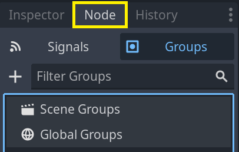
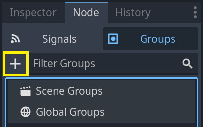
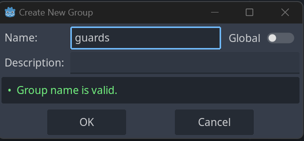
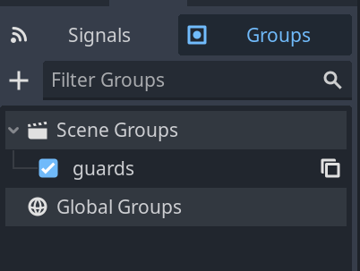
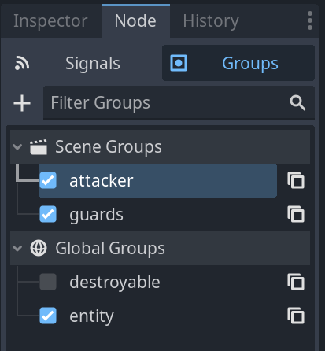

# Groups

Groups in Godot work like tags in other software. You can add a node to
as many groups as you want. Then, in code, you can use the SceneTree to:

-   Get a list of nodes in a group.
-   Call a method on all nodes in a group.
-   Send a notification to all nodes in a group.

This is a useful feature to organize large scenes and decouple code.

## Managing groups

Groups are created by adding a node to a new group name, and likewise
they are removed by removing all nodes from a given group.

There are two ways to add/remove nodes to groups:

-   During design, by using the Node dock in the editor, or the Global
    Groups in project settings.
-   During execution, by calling
    `Node.add_to_group() <class_Node_method_add_to_group>` or
    `Node.remove_from_group() <class_Node_method_remove_from_group>`.

### Using the Node dock

You can create new groups using the Groups tab in the Node dock.

Select one or more nodes in the Scene dock then click the add button
with the + symbol.

You should now see the Create New Group modal appear. Write the group
name in the field.

You can optionally mark the option "Global", which will make the group
visible project-wide, and able to be reused in any project scene. This
will also allow you to give it a description.

When done, press Ok to create it.

You should see the new groups appear in the Groups tab under Scene
Groups if the Global option was unmarked, or under Global Groups if that
option was marked.

Selected Node(s) from the Scene dock can be added into groups by marking
the checkbox on the left side of the groups in the Groups dock. The
node(s) you had selected when creating a new group will be automatically
checked.

All groups present in the project that were marked as Global, created
from any scene, will be visible under Global Groups.

Any other group derived from nodes in the current scene will appear
under Scene Groups.

Warning

The same underlying logic is used for both Global and Scene groups.
Groups with the same name are considered one and the same. This feature
is purely organizational.

You can manage Global Groups in the Global Groups dock, inside Project
Settings. There, you will be able to add new global groups, or change
existing groups' names and descriptions.

### Using code

You can also manage groups from scripts. The following code adds the
node to which you attach the script to the `guards` group as soon as it
enters the scene tree.

.. code-tab:: gdscript GDScript

func \_ready():  
add\_to\_group("guards")

csharp

public override void \_Ready() { base.\_Ready();

> AddToGroup("guards");

}

Imagine you're creating an infiltration game. When an enemy spots the
player, you want all guards and robots to be on alert.

In the fictional example below, we use `SceneTree.call_group()` to alert
all enemies that the player was spotted.

.. code-tab:: gdscript GDScript

func \_on\_player\_spotted():  
get\_tree().call\_group("guards", "enter\_alert\_mode")

csharp

public void \_OnPlayerDiscovered() { GetTree().CallGroup("guards",
"enter\_alert\_mode"); }

The above code calls the function `enter_alert_mode` on every member of
the group `guards`.

To get the full list of nodes in the `guards` group as an array, you can
call `SceneTree.get_nodes_in_group()
<class_SceneTree_method_get_nodes_in_group>`:

.. code-tab:: gdscript GDScript

var guards = get\_tree().get\_nodes\_in\_group("guards")

csharp

var guards = GetTree().GetNodesInGroup("guards");

The `SceneTree <class_SceneTree>` class provides many more useful
methods to interact with scenes, their node hierarchy, and groups. It
allows you to switch scenes easily or reload them, quit the game or
pause and unpause it. It also provides useful signals.
