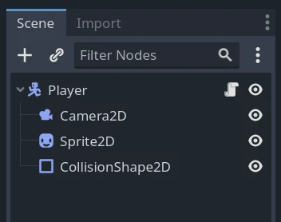
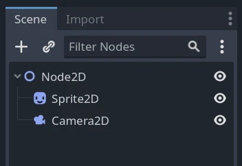
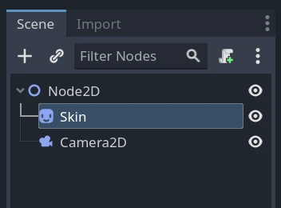
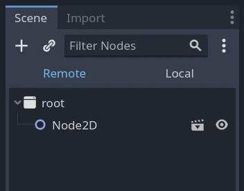

# Nodes and scene instances

This guide explains how to get nodes, create nodes, add them as a child,
and instantiate scenes from code.

## Getting nodes

You can get a reference to a node by calling the `Node.get_node()
<class_Node_method_get_node>` method. For this to work, the child node
must be present in the scene tree. Getting it in the parent node's
`_ready()` function guarantees that.

If, for example, you have a scene tree like this, and you want to get a
reference to the Sprite2D and Camera2D nodes to access them in your
script.

To do so, you can use the following code.

.. code-tab:: gdscript GDScript

var sprite2d var camera2d

func \_ready():  
sprite2d = get\_node("Sprite2D") camera2d = get\_node("Camera2D")

csharp

private Sprite2D \_sprite2D; private Camera2D \_camera2D;

public override void \_Ready() { base.\_Ready();

> \_sprite2D = GetNode&lt;Sprite2D&gt;("Sprite2D"); \_camera2D =
> GetNode&lt;Camera2D&gt;("Camera2D");

}

Note that you get nodes using their name, not their type. Above,
"Sprite2D" and "Camera2D" are the nodes' names in the scene.

If you rename the Sprite2D node as Skin in the Scene dock, you have to
change the line that gets the node to `get_node("Skin")` in the script.

## Node paths

When getting a reference to a node, you're not limited to getting a
direct child. The `get_node()` function supports paths, a bit like when
working with a file browser. Add a slash to separate nodes.

Take the following example scene, with the script attached to the
UserInterface node.

To get the AnimationPlayer node, you would use the following code.

.. code-tab:: gdscript GDScript

var animation\_player

func \_ready():  
animation\_player = get\_node("ShieldBar/AnimationPlayer")

csharp

private AnimationPlayer \_animationPlayer;

public override void \_Ready() { base.\_Ready();

> \_animationPlayer =
> GetNode&lt;AnimationPlayer&gt;("ShieldBar/AnimationPlayer");

}

Note

As with file paths, you can use ".." to get a parent node. The best
practice is to avoid doing that though not to break encapsulation. You
can also start the path with a forward slash to make it absolute, in
which case your topmost node would be "/root", the application's
predefined root viewport.

### Syntactic sugar

You can use two shorthands to shorten your code in GDScript. Firstly,
putting the `@onready` annotation before a member variable makes it
initialize right before the `_ready()` callback.

    @onready var sprite2d = get_node("Sprite2D")

There is also a short notation for `get_node()`: the dollar sign, "$".
You place it before the name or path of the node you want to get.

    @onready var sprite2d = $Sprite2D
    @onready var animation_player = $ShieldBar/AnimationPlayer

## Creating nodes

To create a node from code, call its `new()` method like for any other
class-based datatype.

You can store the newly created node's reference in a variable and call
`add_child()` to add it as a child of the node to which you attached the
script.

.. code-tab:: gdscript GDScript

var sprite2d

func \_ready():  
var sprite2d = Sprite2D.new() \# Create a new Sprite2D.
add\_child(sprite2d) \# Add it as a child of this node.

csharp

private Sprite2D \_sprite2D;

public override void \_Ready() { base.\_Ready();

> \_sprite2D = new Sprite2D(); // Create a new Sprite2D.
> AddChild(\_sprite2D); // Add it as a child of this node.

}

To delete a node and free it from memory, you can call its
`queue_free()` method. Doing so queues the node for deletion at the end
of the current frame after it has finished processing. At that point,
the engine removes the node from the scene and frees the object in
memory.

.. code-tab:: gdscript GDScript

sprite2d.queue\_free()

csharp

\_sprite2D.QueueFree();

Before calling `sprite2d.queue_free()`, the remote scene tree looks like
this.

After the engine freed the node, the remote scene tree doesn't display
the sprite anymore.

You can alternatively call `free()` to immediately destroy the node. You
should do this with care as any reference to it will instantly become
`null`. We recommend using `queue_free()` unless you know what you're
doing.

When you free a node, it also frees all its children. Thanks to this, to
delete an entire branch of the scene tree, you only have to free the
topmost parent node.

## Instancing scenes

Scenes are templates from which you can create as many reproductions as
you'd like. This operation is called instancing, and doing it from code
happens in two steps:

1.  Loading the scene from the local drive.
2.  Creating an instance of the loaded `PackedScene <class_PackedScene>`
    resource.

.. code-tab:: gdscript GDScript

var scene = load("<res://my_scene.tscn>")

csharp

var scene = GD.Load&lt;PackedScene&gt;("<res://MyScene.tscn>");

Preloading the scene can improve the user's experience as the load
operation happens when the compiler reads the script and not at runtime.
This feature is only available with GDScript.

.. code-tab:: gdscript GDScript

var scene = preload("<res://my_scene.tscn>")

At that point, `scene` is a packed scene resource, not a node. To create
the actual node, you need to call `PackedScene.instantiate()
<class_PackedScene_method_instantiate>`. It returns a tree of nodes that
you can use as a child of your current node.

.. code-tab:: gdscript GDScript

var instance = scene.instantiate() add\_child(instance)

csharp

var instance = scene.Instantiate(); AddChild(instance);

The advantage of this two-step process is you can keep a packed scene
loaded and create new instances on the fly. For example, to quickly
instance several enemies or bullets.
