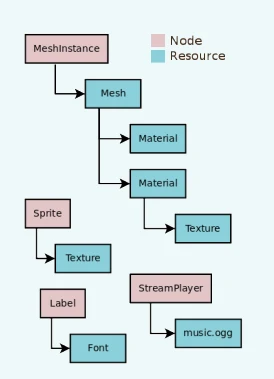
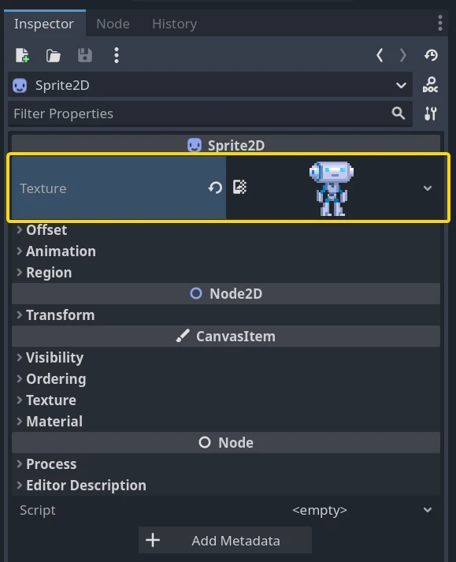
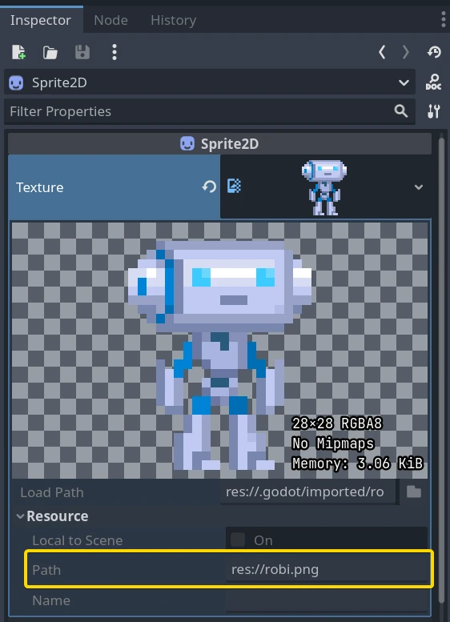

# Resources

## Nodes and resources

Up to this tutorial, we focused on the `Node <class_Node>` class in
Godot as that's the one you use to code behavior and most of the
engine's features rely on it. There is another datatype that is just as
important: `Resource <class_Resource>`.

*Nodes* give you functionality: they draw sprites, 3D models, simulate
physics, arrange user interfaces, etc. **Resources** are **data
containers**. They don't do anything on their own: instead, nodes use
the data contained in resources.

Anything Godot saves or loads from disk is a resource. Be it a scene (a
`.tscn` or an `.scn` file), an image, a script... Here are some
`Resource <class_Resource>` examples:

-   `Texture <class_Texture>`
-   `Script <class_Script>`
-   `Mesh <class_Mesh>`
-   `Animation <class_Animation>`
-   `AudioStream <class_AudioStream>`
-   `Font <class_Font>`
-   `Translation <class_Translation>`

When the engine loads a resource from disk, **it only loads it once**.
If a copy of that resource is already in memory, trying to load the
resource again will return the same copy every time. As resources only
contain data, there is no need to duplicate them.

Every object, be it a Node or a Resource, can export properties. There
are many types of Properties, like String, integer, Vector2, etc., and
any of these types can become a resource. This means that both nodes and
resources can contain resources as properties:

## External vs built-in

There are two ways to save resources. They can be:

1.  **External** to a scene, saved on the disk as individual files.
2.  **Built-in**, saved inside the `.tscn` or the `.scn` file they're
    attached to.

To be more specific, here's a `Texture2D <class_Texture2D>` in a
`Sprite2D <class_Sprite2D>` node:

Clicking the resource preview allows us to view the resource's
properties.

The path property tells us where the resource comes from. In this case,
it comes from a PNG image called `robi.png`. When the resource comes
from a file like this, it is an external resource. If you erase the path
or this path is empty, it becomes a built-in resource.

The switch between built-in and external resources happens when you save
the scene. In the example above, if you erase the path
`"res://robi.png"` and save, Godot will save the image inside the
`.tscn` scene file.

Note

Even if you save a built-in resource, when you instance a scene multiple
times, the engine will only load one copy of it.

## Loading resources from code

There are two ways to load resources from code. First, you can use the
`load()` function anytime:

.. code-tab:: gdscript GDScript

func \_ready():  
\# Godot loads the Resource when it reads this very line. var
imported\_resource = load("<res://robi.png>") $sprite.texture =
imported\_resource

csharp

public override void \_Ready() { // Godot loads the Resource when it
executes this line. var texture =
GD.Load&lt;Texture&gt;("<res://Robi.png>"); var sprite =
GetNode&lt;Sprite2D&gt;("sprite"); sprite.Texture = texture; }

You can also `preload` resources. Unlike `load`, this function will read
the file from disk and load it at compile-time. As a result, you cannot
call `preload` with a variable path: you need to use a constant string.

.. code-tab:: gdscript GDScript

func \_ready():  
\# Godot loads the resource at compile-time var imported\_resource =
preload("<res://robi.png>") get\_node("sprite").texture =
imported\_resource

csharp

// 'preload()' is unavailable in C Sharp.

## Loading scenes

Scenes are also resources, but there is a catch. Scenes saved to disk
are resources of type `PackedScene <class_PackedScene>`. The scene is
packed inside a `Resource <class_Resource>`.

To get an instance of the scene, you have to use the
`PackedScene.instantiate() <class_PackedScene_method_instantiate>`
method.

.. code-tab:: gdscript GDScript

func \_on\_shoot():  
var bullet = preload("<res://bullet.tscn>").instantiate()
add\_child(bullet)

csharp

private PackedScene \_bulletScene =
GD.Load&lt;PackedScene&gt;("<res://Bullet.tscn>");

private void OnShoot() { Node bullet = \_bulletScene.Instantiate();
AddChild(bullet); }

This method creates the nodes in the scene's hierarchy, configures them,
and returns the root node of the scene. You can then add it as a child
of any other node.

The approach has several advantages. As the `PackedScene.instantiate()
<class_PackedScene_method_instantiate>` function is fast, you can create
new enemies, bullets, effects, etc. without having to load them again
from disk each time. Remember that, as always, images, meshes, etc. are
all shared between the scene instances.

## Freeing resources

When a `Resource <class_Resource>` is no longer in use, it will
automatically free itself. Since, in most cases, Resources are contained
in Nodes, when you free a node, the engine frees all the resources it
owns as well if no other node uses them.

## Creating your own resources

Like any Object in Godot, users can also script Resources. Resource
scripts inherit the ability to freely translate between object
properties and serialized text or binary data (\*.tres, \*.res). They
also inherit the reference-counting memory management from the
RefCounted type.

This comes with many distinct advantages over alternative data
structures, such as JSON, CSV, or custom TXT files. Users can only
import these assets as a `Dictionary <class_Dictionary>` (JSON) or as a
`FileAccess <class_FileAccess>` to parse. What sets Resources apart is
their inheritance of `Object <class_Object>`,
`RefCounted <class_RefCounted>`, and `Resource <class_Resource>`
features:

-   They can define constants, so constants from other data fields or
    objects are not needed.
-   They can define methods, including setter/getter methods for
    properties. This allows for abstraction and encapsulation of the
    underlying data. If the Resource script's structure needs to change,
    the game using the Resource need not also change.
-   They can define signals, so Resources can trigger responses to
    changes in the data they manage.
-   They have defined properties, so users know 100% that their data
    will exist.
-   Resource auto-serialization and deserialization is a built-in Godot
    Engine feature. Users do not need to implement custom logic to
    import/export a resource file's data.
-   Resources can even serialize sub-Resources recursively, meaning
    users can design even more sophisticated data structures.
-   Users can save Resources as version-control-friendly text files
    (\*.tres). Upon exporting a game, Godot serializes resource files as
    binary files (\*.res) for increased speed and compression.
-   Godot Engine's Inspector renders and edits Resource files
    out-of-the-box. As such, users often do not need to implement custom
    logic to visualize or edit their data. To do so, double-click the
    resource file in the FileSystem dock or click the folder icon in the
    Inspector and open the file in the dialog.
-   They can extend **other** resource types besides just the base
    Resource.

Godot makes it easy to create custom Resources in the Inspector.

1.  Create a plain Resource object in the Inspector. This can even be a
    type that derives Resource, so long as your script is extending that
    type.
2.  Set the `script` property in the Inspector to be your script.

The Inspector will now display your Resource script's custom properties.
If one edits those values and saves the resource, the Inspector
serializes the custom properties too! To save a resource from the
Inspector, click the Inspector's tools menu (top right), and select
"Save" or "Save As...".

If the script's language supports
`script classes <doc_gdscript_basics_class_name>`, then it streamlines
the process. Defining a name for your script alone will add it to the
Inspector's creation dialog. This will auto-add your script to the
Resource object you create.

Let's see some examples. Create a `Resource <class_Resource>` and name
it `bot_stats`. It should appear in your file tab with the full name
`bot_stats.tres`. Without a script, it's useless, so let's add some data
and logic! Attach a script to it named `bot_stats.gd` (or just create a
new script, and then drag it to it).

Note

If you're using C#, you need to annotate your Resource class with the
`[GlobalClass]` attribute for it to show up in the create resource GUI.

.. code-tab:: gdscript GDScript

extends Resource

@export var health: int @export var sub\_resource: Resource @export var
strings: PackedStringArray

\# Make sure that every parameter has a default value. \# Otherwise,
there will be problems with creating and editing \# your resource via
the inspector. func \_init(p\_health = 0, p\_sub\_resource = null,
p\_strings = \[\]): health = p\_health sub\_resource = p\_sub\_resource
strings = p\_strings

csharp

// BotStats.cs using Godot;

namespace ExampleProject { \[GlobalClass\] public partial class BotStats
: Resource { \[Export\] public int Health { get; set; }

> \[Export\] public Resource SubResource { get; set; }
>
> \[Export\] public string\[\] Strings { get; set; }
>
> // Make sure you provide a parameterless constructor. // In C#, a
> parameterless constructor is different from a // constructor with all
> default values. // Without a parameterless constructor, Godot will
> have problems // creating and editing your resource via the inspector.
> public BotStats() : this(0, null, null) {}
>
> public BotStats(int health, Resource subResource, string\[\] strings)
> { Health = health; SubResource = subResource; Strings = strings ??
> System.Array.Empty&lt;string&gt;(); } }

}

Now, create a `CharacterBody3D <class_CharacterBody3D>`, name it `Bot`,
and add the following script to it:

.. code-tab:: gdscript GDScript

extends CharacterBody3D

@export var stats: Resource

func \_ready():  
\# Uses an implicit, duck-typed interface for any 'health'-compatible
resources. if stats: stats.health = 10 print(stats.health) \# Prints
"10"

csharp

// Bot.cs using Godot;

namespace ExampleProject { public partial class Bot : CharacterBody3D {
\[Export\] public Resource Stats;

> public override void \_Ready() { if (Stats is BotStats botStats) {
> GD.Print(botStats.Health); // Prints '10'. } } }

}

Now, select the `CharacterBody3D <class_CharacterBody3D>` node which we
named `bot`, and drag&drop the `bot_stats.tres` resource onto the
Inspector. It should print 10! Obviously, this setup can be used for
more advanced features than this, but as long you really understand
*how* it all worked, you should figure out everything else related to
Resources.

Note

Resource scripts are similar to Unity's ScriptableObjects. The Inspector
provides built-in support for custom resources. If desired though, users
can even design their own Control-based tool scripts and combine them
with an `EditorPlugin <class_EditorPlugin>` to create custom
visualizations and editors for their data.

Unreal Engine's DataTables and CurveTables are also easy to recreate
with Resource scripts. DataTables are a String mapped to a custom
struct, similar to a Dictionary mapping a String to a secondary custom
Resource script.

.. code-tab:: gdscript GDScript

\# bot\_stats\_table.gd extends Resource

const BotStats = preload("bot\_stats.gd")

var data = {  
"GodotBot": BotStats.new(10), \# Creates instance with 10 health.
"DifferentBot": BotStats.new(20) \# A different one with 20 health.

}

func \_init():  
print(data)

csharp

using Godot;

\[GlobalClass\] public partial class BotStatsTable : Resource { private
Godot.Collections.Dictionary&lt;string, BotStats&gt; \_stats = new
Godot.Collections.Dictionary&lt;string, BotStats&gt;();

> public BotStatsTable() { \_stats\["GodotBot"\] = new BotStats(10); //
> Creates instance with 10 health. \_stats\["DifferentBot"\] = new
> BotStats(20); // A different one with 20 health. GD.Print(\_stats); }

}

Instead of inlining the Dictionary values, one could also,
alternatively:

1.  Import a table of values from a spreadsheet and generate these
    key-value pairs.
2.  Design a visualization within the editor and create a plugin that
    adds it to the Inspector when you open these types of Resources.

CurveTables are the same thing, except mapped to an Array of float
values or a `Curve <class_Curve>`/`Curve2D <class_Curve2D>` resource
object.

Warning

Beware that resource files (\*.tres/\*.res) will store the path of the
script they use in the file. When loaded, they will fetch and load this
script as an extension of their type. This means that trying to assign a
subclass, i.e. an inner class of a script (such as using the `class`
keyword in GDScript) won't work. Godot will not serialize the custom
properties on the script subclass properly.

In the example below, Godot would load the `Node` script, see that it
doesn't extend `Resource`, and then determine that the script failed to
load for the Resource object since the types are incompatible.

.. code-tab:: gdscript GDScript

extends Node

class MyResource:  
extends Resource @export var value = 5

func \_ready():  
var my\_res = MyResource.new()

\# This will NOT serialize the 'value' property.
ResourceSaver.save(my\_res, "<res://my_res.tres>")

csharp

using Godot;

public partial class MyNode : Node { \[GlobalClass\] public partial
class MyResource : Resource { \[Export\] public int Value { get; set; }
= 5; }

> public override void \_Ready() { var res = new MyResource();
>
> > // This will NOT serialize the 'Value' property.
> > ResourceSaver.Save(res, "<res://MyRes.tres>");
>
> }

}
