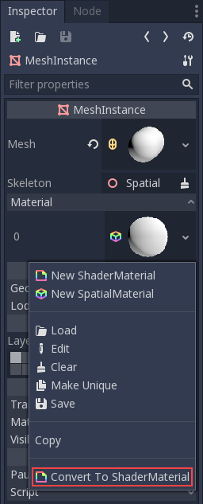

# Shader materials

## Introduction

For the most common cases, Godot provides ready to use materials for
most types of shaders, such as
`StandardMaterial3D <class_StandardMaterial3D>`,
`CanvasItemMaterial <class_CanvasItemMaterial>` and
`ParticleProcessMaterial <class_ParticleProcessMaterial>`. They are
flexible implementations that cover most use cases.

Shader materials allow writing a custom shader directly, for maximum
flexibility. Examples of this are:

-   Create procedural textures.
-   Create complex texture blending effects.
-   Create animated materials, or materials that change over time.
-   Create refractive effects or other advanced effects.
-   Create special lighting shaders for more exotic materials.
-   Animate vertices, like tree leaves or grass.
-   Create custom particle code.
-   And much more!

Godot provides built in functionality to make frequent operations
easier. Additionally, Godot's shader editor will detect errors as you
type, so you can see your edited shaders in real-time. It is also
possible to edit shaders using a visual, node-based graph editor.

## Creating a ShaderMaterial

Create a new ShaderMaterial in some object of your choice. Go to the
"Material" property and create a ShaderMaterial.

Next, click on the shader material to see its properties. From here you
can create a shader or visual shader. Regular shaders use code to set
their properties while a visual shader uses a node based workflow.

If you need to you can convert a visual shader to a text shader. However
you can't convert a text shader to a visual shader.

Choose one of them and you can start editing your shader.

If you create a regular shader click on it and the shader editor will
open.

If you create a visual shader the visual shader editor will open
automatically.

In the visual shader editor you can click a button and see what your
visual shader looks like as shader code. This can be useful if you're
trying to replicate a text shader as nodes, or it can be used as a
preview for converting your visual shader to a text shader.

Note

To learn more about visual shaders, read `doc_visual_shaders`.

## Converting to ShaderMaterial

It is possible to convert from StandardMaterial3D, CanvasItemMaterial
and ParticleProcessMaterial to ShaderMaterial. To do so, go to the
material properties and select the convert option.

Note

Using the convert option will turn the StandardMaterial3D into a
ShaderMaterial with a text shader, not a visual shader.
