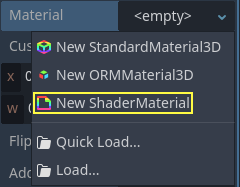
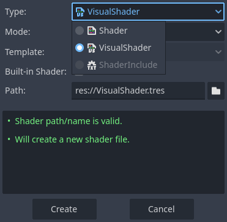
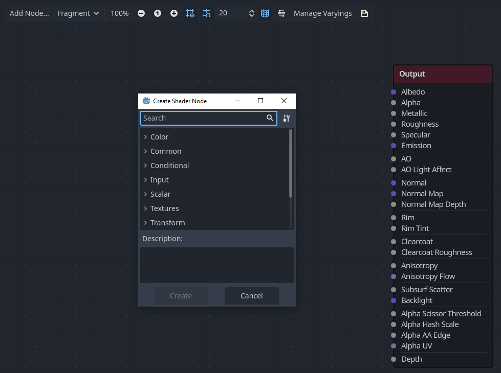
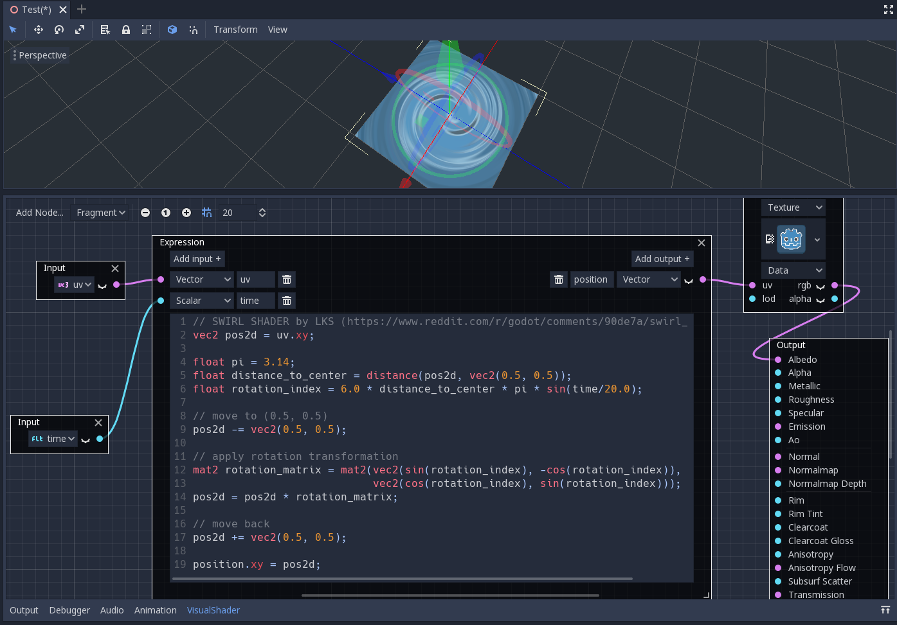
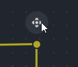
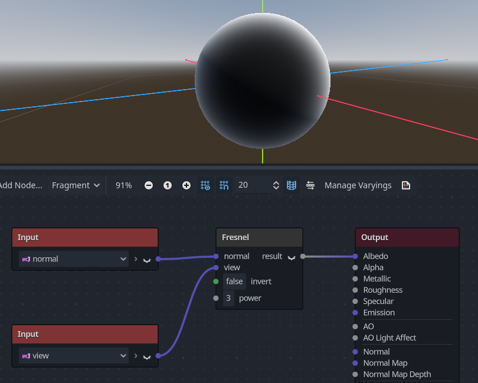
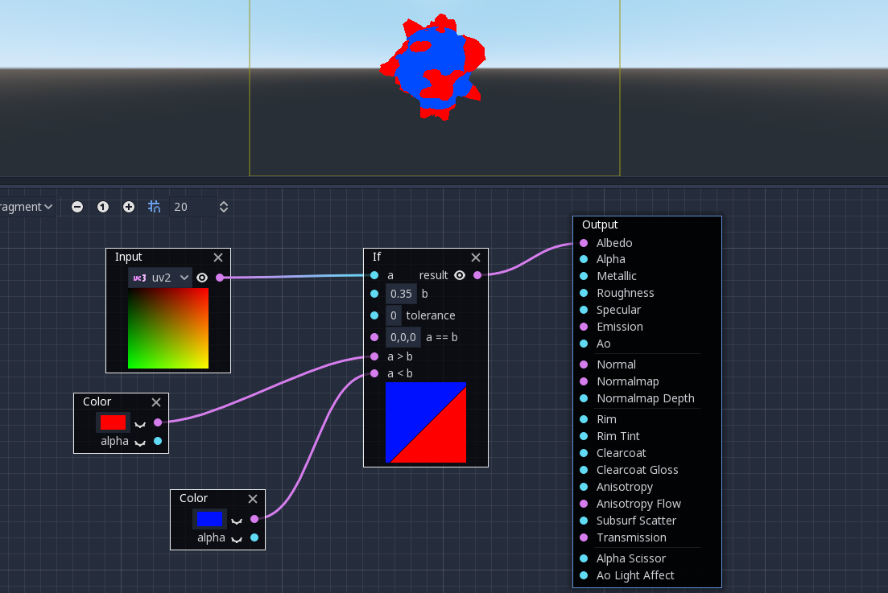
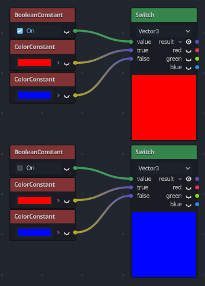

# Using VisualShaders

VisualShaders are the visual alternative for creating shaders.

As shaders are inherently linked to visuals, the graph-based approach
with previews of textures, materials, etc. offers a lot of additional
convenience compared to purely script-based shaders. On the other hand,
VisualShaders do not expose all features of the shader script and using
both in parallel might be necessary for specific effects.

Note

If you are not familiar with shaders, start by reading
`doc_introduction_to_shaders`.

## Creating a VisualShader

VisualShaders can be created in any `class_ShaderMaterial`. To begin
using VisualShaders, create a new `ShaderMaterial` in an object of your
choice.

Then assign a `class_Shader` resource to the `Shader` property.

Click on the new `Shader` resource and the Create Shader dialog will
open automatically. Change the Type option to `class_VisualShader` in
the dropdown, then give it a name.

Click on the visual shader you just created to open the Shader Editor.
The layout of the Shader Editor comprises two parts: the upper toolbar
and the graph itself.

From left to right in the toolbar:

-   The `Add Node` button displays a popup menu to let you add nodes to
    the shader graph.
-   The drop-down menu is the shader type: Vertex, Fragment and Light.
    Like for script shaders, it defines what built-in nodes will be
    available.
-   The following buttons and number input control the zooming level,
    grid snapping and distance between grid lines (in pixels).
-   The toggle controls if the graph minimap in the bottom right of the
    editor is visible or not.
-   The automatically arrange selected nodes button will try to organize
    any nodes you have selected as efficiently and cleanly as possible.
-   The Manage Varyings button opens a dropdown that lets you add or
    remove a varying.
-   The last icon shows the generated shader code corresponding to your
    graph.

Note

Although VisualShaders do not require coding, they share the same logic
with script shaders. It is advised to learn the basics of both to have a
good understanding of the shading pipeline.

The visual shader graph is converted to a script shader behind the
scene, and you can see this code by pressing the last button in the
toolbar. This can be convenient to understand what a given node does and
how to reproduce it in scripts.

## Using the Visual Shader Editor

By default, every new `VisualShader` will have an output node. Every
node connection ends at one of the output node's sockets. A node is the
basic unit to create your shader. To add a new node, click on the
`Add Node` button on the upper left corner or right click on any empty
location in the graph, and a menu will pop up.

This popup has the following properties:

-   If you right-click on the graph, this menu will be called at the
    cursor position and the created node, in that case, will also be
    placed under that position; otherwise, it will be created at the
    graph's center.
-   It can be resized horizontally and vertically allowing more content
    to be shown. Size transform and tree content position are saved
    between the calls, so if you suddenly closed the popup you can
    easily restore its previous state.
-   The `Expand All` and `Collapse All` options in the drop-down option
    menu can be used to easily list the available nodes.
-   You can also drag and drop nodes from the popup onto the graph.

While the popup has nodes sorted in categories, it can seem overwhelming
at first. Try to add some of the nodes, plug them in the output socket
and observe what happens.

When connecting any `scalar` output to a `vector` input, all components
of the vector will take the value of the scalar.

When connecting any `vector` output to a `scalar` input, the value of
the scalar will be the average of the vector's components.

## Visual Shader node interface

Visual shader nodes have input and output ports. The input ports are
located on the left side of the node, and output ports are located on
the right side of the node.

<figure>

</figure>

These ports are colored to differentiate type of port:

<table>
<caption>Port types</caption>
<thead>
<tr>
<th>Type</th>
<th>Color</th>
<th>Description</th>
<th>Example</th>
</tr>
</thead>
<tbody>
<tr>
<td>Scalar</td>
<td>Gray</td>
<td>Scalar is a single value.</td>
<td></td>
</tr>
<tr>
<td>Vector</td>
<td>Purple</td>
<td>Vector is a set of values.</td>
<td></td>
</tr>
<tr>
<td>Boolean</td>
<td>Green</td>
<td>On or off, true or false.</td>
<td></td>
</tr>
<tr>
<td>Transform</td>
<td>Pink</td>
<td>A matrix, usually used to transform vertices.</td>
<td></td>
</tr>
<tr>
<td>Sampler</td>
<td>Orange</td>
<td>A texture sampler. It can be used to sample textures.</td>
<td></td>
</tr>
</tbody>
</table>

All of the types are used in the calculations of vertices, fragments,
and lights in the shader. For example: matrix multiplication, vector
addition, or scalar division.

There are other types but these are the main ones.

## Visual Shader nodes

Below are some special nodes that are worth knowing about. The list is
not exhaustive and might be expanded with more nodes and examples.

### Expression node

The `Expression` node allows you to write Godot Shading Language
(GLSL-like) expressions inside your visual shaders. The node has buttons
to add any amount of required input and output ports and can be resized.
You can also set up the name and type of each port. The expression you
have entered will apply immediately to the material (once the focus
leaves the expression text box). Any parsing or compilation errors will
be printed to the Output tab. The outputs are initialized to their zero
value by default. The node is located under the Special tab and can be
used in all shader modes.

The possibilities of this node are almost limitless – you can write
complex procedures, and use all the power of text-based shaders, such as
loops, the `discard` keyword, extended types, etc. For example:

### Reroute node

The `Reroute` node is used purely for organizational purposes. In a
complicated shader with many nodes you may find that the paths between
nodes can make things hard to read. Reroute, as its name suggests,
allows you to adjust the path between nodes to make things easier to
read. You can even have multiple reroute nodes for a single path, which
can be used to make right angles.

To move a reroute node move your mouse cursor above it, and grab the
handle that appears.

### Fresnel node

The `Fresnel` node is designed to accept normal and view vectors and
produces a scalar which is the saturated dot product between them.
Additionally, you can setup the inversion and the power of equation. The
`Fresnel` node is great for adding a rim-like lighting effect to
objects.

### Boolean node

The `Boolean` node can be converted to `Scalar` or `Vector` to represent
`0` or `1` and `(0, 0, 0)` or `(1, 1, 1)` respectively. This property
can be used to enable or disable some effect parts with one click.

### If node

The `If` node allows you to setup a vector which will be returned the
result of the comparison between `a` and `b`. There are three vectors
which can be returned: `a == b` (in that case the tolerance parameter is
provided as a comparison threshold – by default it is equal to the
minimal value, i.e. `0.00001`), `a > b` and `a < b`.

### Switch node

The `Switch` node returns a vector if the boolean condition is `true` or
`false`. `Boolean` was introduced above. If you convert a vector to a
true boolean, all components of the vector should be above zero.

