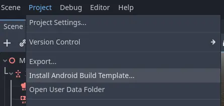
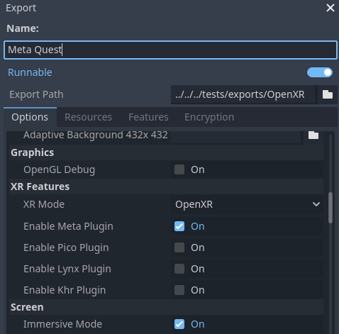
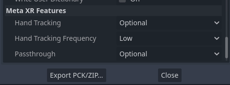

# Deploying to Android

## Setup

Most standalone headsets run on Android and OpenXR support is making its
way to these platforms.

Before following the OpenXR-specific instructions here, you'll need to
first setup your system to export to Android in general, including:

-   Installing OpenJDK 17
-   Installing Android Studio
-   Creating a debug.keystore
-   Configuring the location of the Android SDK and debug.keystore in
    Godot

See `doc_exporting_for_android` for the full details, and return here
when you've finished these steps.

## Gradle Android build

Note

Official support for the Android platform wasn't added to the OpenXR
specification initially resulting in various vendors creating custom
loaders to make OpenXR available on their headsets. While the long term
expectation is that all vendors will adopt the official OpenXR loader,
for now these loaders need to be added to your project.

In order to include the vendor-specific OpenXR loader into your project,
you will need to setup a gradle Android build.

Select **Install Android Build Template...** from the **Project** menu:

This will create a folder called **android** inside of your project that
contains all the runtime files needed on Android. You can now customize
this installation. Godot won't show this in the editor but you can find
it with a file browser.

You can read more about gradle builds here: `doc_android_gradle_build`.

## Installing the vendors plugin

Warning

The Android plugin structure has been restructured in Godot 4.2, and the
loader plugin was renamed to vendors plugin as it now includes more than
just loaders. If you've previously installed the loader plugin you need
to delete it from the android/plugins
folder.

The vendors plugin can be downloaded from the asset library, search for
"OpenXR vendors" and install the plugin:

You will find the installed files inside the **addons** folder.

Alternatively you can manually install the vendors plugin by downloading
the v2.x version of the plugin [from the release page
here](https://github.com/GodotVR/godot_openxr_vendors/releases).

You will need to copy the
assets/addons/godotopenxrvendors folder
from the zip file into your projects
addons folder.

You can find the main repository of the vendors plugin
[here](https://github.com/GodotVR/godot_openxr_vendors).

## Enabling the vendors plugin

The vendors plugin needs to be enabled before the export settings become
accessible. Open **Project** and select **Project Settings...**. Go to
the **Plugins** tab. Enable the **GodotOpenXRVendors** plugin.

Note

This is no longer required from vendors plugin 2.0.3 onwards as it now
uses GDExtension. The plugin will not be shown in this list. You can
verify it is installed correctly by checking if the export presets
contain the entries described below.

## Creating the export presets

You will need to setup a separate export preset for each device, as each
device will need its own loader included.

Open **Project** and select **Export..**. Click on **Add..** and select
**Android**. Next change the name of the export preset for the device
you're setting this up for, say **Meta Quest**. And enable **Use Gradle
Build**. If you want to use one-click deploy (described below), ensure
that **Runnable** is enabled.

If the vendors plugins were installed correctly you should find entries
for the different headsets, select the entry for meta:

Also change the **XR Mode** to **OpenXR**.

Scroll to the bottom of the list and you'll find additional XR feature
sections, currently only **Meta XR Features** is available. The hand
tracking and passthrough settings here currently only work for the Meta
Quest and you will need to select the appropriate settings if you wish
to use these features.

Now you can repeat the same process for the other devices.

Note

There are separate loaders for the Meta Quest, Pico and Lynx R1
headsets.

The fourth option is the official Khronos loader, in due time all
headsets should work with this loader. At the moment this loader has
been tested with the Magic Leap 2 and standalone HTC headsets.

Warning

While the Mobile Vulkan renderer has many optimizations targeted at
mobile devices, we're still working out the kinks. It is highly
advisable to use the compatibility renderer (OpenGL) for the time being
when targeting Android based XR devices.

## Running on your device from the Godot editor

If you've setup your export settings as described above, and your
headset is connected to your computer and correctly recognized, you can
launch it directly from the Godot editor using `doc_one-click_deploy`:

For some devices on some platforms, you may need to perform some extra
steps in order for your device to be recognized correctly, so be sure to
check the developer documentation from your headset vendor.

For example, with the Meta Quest 2, you need to enable developer mode on
the headset, and if you're on Windows, you'll need to install special
ADB drivers. See the [official Meta Quest developer
documentation](https://developer.oculus.com/documentation/native/android/mobile-device-setup/)
for more details.

If you're having any issues with one-click deploy, check the
`Troubleshooting section <doc_one-click_deploy_troubleshooting>`.
