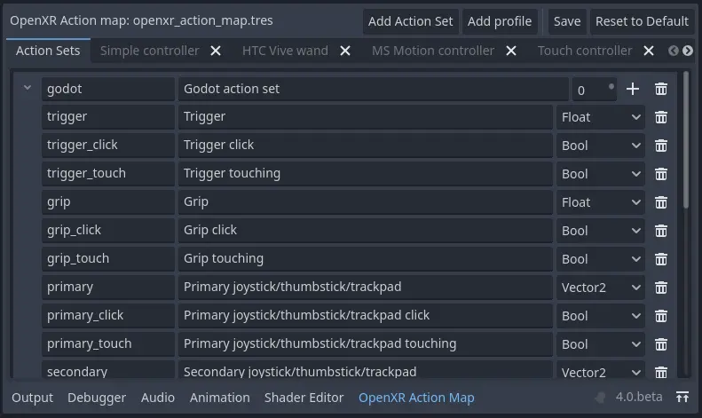
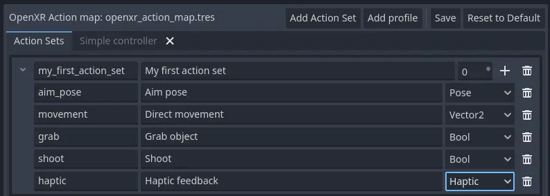
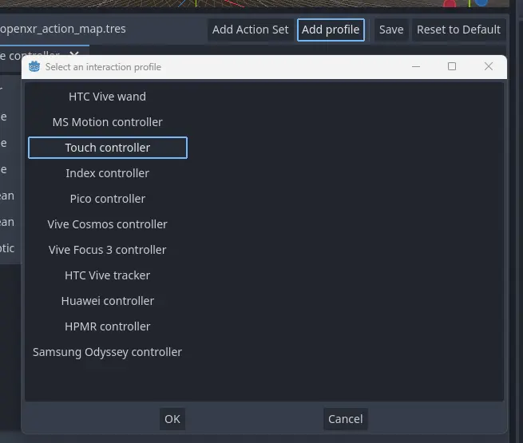
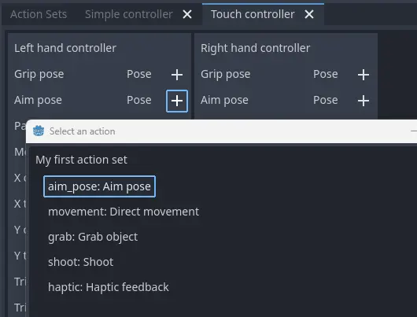
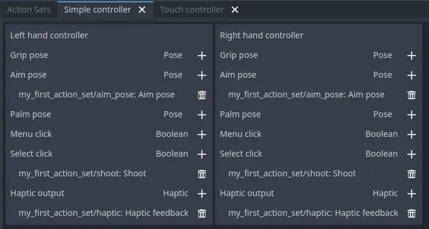

# The XR action map

Godot has an action map feature as part of the XR system. At this point
in time this system is part of the OpenXR module. There are plans to
encompass WebXR into this in the near future hence we call it the XR
action map system in this document. It implements the built-in action
map system of OpenXR mostly exactly as it is offered.

The XR action map system exposes input, positional data and output for
XR controllers to your game/application. It does this by exposing named
actions that can be tailored to your game/application and binding these
to the actual inputs and outputs on your XR devices.

As the XR action map is currently part of the OpenXR module, OpenXR
needs to be enabled in your project settings to expose it:

You will then find the XR Action Map interface in the bottom of the
screen:

Note

Godot's built-in input system has many things in common with the XR
action map system. In fact our original idea was to add functionality to
the existing input system and expose the data to the OpenXR action map
system. We may revisit that idea at some point but as it turns out there
were just too many problems to overcome. To name a few:

-   Godot's input system mainly centers around button inputs, XR adds
    triggers, axis, poses and haptics (output) into the mix. This would
    greatly complicate the input system with features that won't work
    for normal controllers or contrast with the current approach. It was
    felt this would lead to confusion for the majority of Godot users.
-   Godot's input system works with raw input data that is parsed and
    triggers emitting actions. This input data is made available to the
    end user. OpenXR completely hides raw data and does all the parsing
    for us, we only get access to already parsed action data. This
    inconsistency is likely to lead to bugs when an unsuspecting user
    tries to use an XR device as a normal input device.
-   Godot's input system allows changes to what inputs are bound to
    actions in runtime, OpenXR does not.
-   Godot's input system is based on device ids which are meaningless in
    OpenXR.

This does mean that a game/application that mixes traditional inputs
with XR controllers will have a separation. For most applications either
one or the other is used and this is not seen as a problem. In the end,
it's a limitation of the system.

## The default action map

Godot will automatically create a default action map if no action map
file is found.

Warning

This default map was designed to help developers port their XR
games/applications from Godot 3 to Godot 4. As a result this map
essentially binds all known inputs on all controllers supported by
default, to actions one on one. This is not a good example of setting up
an action map. It does allow a new developer to have a starting point
when they want to become familiar with Godot XR. It prevents having to
design a proper action map for their game/application first.

For this walkthrough we're going to start with a blank action map. You
can simply delete the "Godot action set" entry at the top by pressing
the trash can icon. This will clear out all actions. You might also want
to remove the controllers that you do not wish to setup, more on this
later.

## Action sets

Note

Before we dive in, you will see the term XR runtime used throughout this
document. With XR runtime we mean the software that is controlling and
interacting with the AR or VR headset. The XR runtime then exposes this
to us through an API such as OpenXR. So:

-   for Steam this is SteamVR,
-   for Meta on desktop this is the Oculus Client (including when using
    Quest link),
-   for Meta on Quest this is the Quest's native OpenXR client,
-   on Linux this could be Monado, etc.

The action map allows us to organize our actions in sets. Each set can
be enabled or disabled on its own.

The concept here is that you could have different sets that provide
bindings in different scenarios. You could have:

> -   a `Character control` set for when you're walking around,
> -   a `Vehicle control` set for when you're operating a vehicle,
> -   a `Menu` set for when a menu is open.

Only the action set applicable to the current state of your
game/application can then be enabled.

This is especially important if you wish to bind the same input on a
controller to a different action. For instance:

> -   in your `Character control` set you may have an action `Jump`,
> -   in your `Vehicle control` set you may have an action `Accelerate`,
> -   in your `Menu` set you may have an action `Select`.

All are bound to the trigger on your controller.

OpenXR will only bind an input or output to a single action. If the same
input or output is bound to multiple actions the one in the active
action set with the highest priority will be the one updated/used. So in
our above example it will thus be important that only one action set is
active.

For your first XR game/application we highly recommend starting with
just a single action set and to not over-engineer things.

For our walkthrough in this document we will thus create a single action
set called `my_first_action_set`. We do this by pressing the
`Add action set` button:

The columns in our table are as follows:

<table>
<colgroup>
<col style="width: 7%" />
<col style="width: 23%" />
<col style="width: 70%" />
</colgroup>
<thead>
<tr>
<th>Col</th>
<th>Value</th>
<th>Description</th>
</tr>
</thead>
<tbody>
<tr>
<td>1</td>
<td>my_first_action_set</td>
<td>This is the internal name of the action set. OpenXR doesn't specify
specific restrictions on this name other then size, however some XR
runtimes will not like spaces or special characters.</td>
</tr>
<tr>
<td>2</td>
<td>My first action set</td>
<td>This is a human-readable name for the action set. Some XR runtimes
will display this name to the end user, for example in configuration
dialogs.</td>
</tr>
<tr>
<td>3</td>
<td>0</td>
<td>This is the priority of the action set. If multiple active action
sets have actions bound to the same controllers inputs or outputs, the
action set with the highest priority value will determine the action
that is updated.</td>
</tr>
</tbody>
</table>

## Actions

In the XR action map, actions are the entities that your
game/application will interact with. For instance, we can define an
action `Shoot` and the input bound to that action will trigger the
`button_pressed` signal on the relevant
`XRController3D <class_xrcontroller3d>` node in your scene with `Shoot`
as the `name` parameter of the signal.

You can also poll the current state of an action.
`XRController3D <class_xrcontroller3d>` for instance has an
`is_button_pressed` method.

Actions can be used for both input and output and each action has a type
that defines its behavior.

-   The `Bool` type is used for discrete input like buttons.
-   The `Float` type is used for analogue input like triggers.

These two are special as they are the only ones that are
interchangeable. OpenXR will handle conversions between `Bool` and
`Float` inputs and actions. You can get the value of a `Float` type
action by calling the method `get_float` on your
`XRController3D <class_xrcontroller3d>` node. It emits the
`input_float_changed` signal when changed.

Note

Where analogue inputs are queried as buttons a threshold is applied.
This threshold is currently managed exclusively by the XR runtime. There
are plans to extend Godot to provide some level of control over these
thresholds in the future.

The `Vector2` type defines the input as an axis input. Touchpads,
thumbsticks and similar inputs are exposed as vectors. You can get the
value of a `Vector2` type action by calling the method `get_vector2` on
your `XRController3D <class_xrcontroller3d>` node. It emits the
`input_vector2_changed` signal when changed.

The `Pose` type defines a spatially tracked input. Multiple "pose"
inputs are available in OpenXR: `aim`, `grip` and `palm`. Your
`XRController3D <class_xrcontroller3d>` node is automatically positioned
based on the pose action assigned to `pose` property of this node. More
about poses later.

Note

The OpenXR implementation in Godot also exposes a special pose called
`Skeleton`. This is part of the hand tracking implementation. This pose
is exposed through the `skeleton` action that is supported outside of
the action map system. It is thus always present if hand tracking is
supported. You don't need to bind actions to this pose to use it.

Finally, the only output type is `Haptic` and it allows us to set the
intensity of haptic feedback, such as controller vibration. Controllers
can have multiple haptic outputs and support for haptic vests is coming
to OpenXR.

So lets add an action for our aim pose, we do this by clicking on the
`+` button for our action set:

The columns in our table are as follows:

<table>
<colgroup>
<col style="width: 7%" />
<col style="width: 23%" />
<col style="width: 70%" />
</colgroup>
<thead>
<tr>
<th>Col</th>
<th>Value</th>
<th>Description</th>
</tr>
</thead>
<tbody>
<tr>
<td>1</td>
<td>aim_pose</td>
<td>This is the internal name of the action. OpenXR doesn't specify
specific restrictions on this name other then size, however some XR
runtimes will not like spaces or special characters.</td>
</tr>
<tr>
<td>2</td>
<td>Aim pose</td>
<td>This is a human-readable name for the action. Some XR runtimes will
display this name to the end user, for example in configuration
dialogs.</td>
</tr>
<tr>
<td>3</td>
<td>Pose</td>
<td>The type of this action.</td>
</tr>
</tbody>
</table>

OpenXR defines a number of bindable input poses that are commonly
available for controllers. There are no rules for which poses are
supported for different controllers. The poses OpenXR currently defines
are:

> -   The aim pose on most controllers is positioned slightly in front
>     of the controller and aims forward. This is a great pose to use
>     for laser pointers or to align the muzzle of a weapon with.
> -   The grip pose on most controllers is positioned where the grip
>     button is placed on the controller. The orientation of this pose
>     differs between controllers and can differ for the same controller
>     on different XR runtimes.
> -   The palm pose on most controllers is positioned in the center of
>     the palm of the hand holding the controller. This is a new pose
>     that is not available on all XR runtimes.
>
> Note
>
> If hand tracking is used, there are currently big differences in
> implementations between the different XR runtimes. As a result the
> action map is currently not suitable for hand tracking. Work is being
> done on this so stay tuned.

Let's complete our list of actions for a very simple shooting
game/application:

The actions we have added are:

> -   movement, which allows the user to move around outside of normal
>     room scale tracking.
> -   grab, which detects that the user wants to hold something.
> -   shoot, which detects that the user wants to fire the weapon they
>     are holding.
> -   haptic, which allows us to output haptic feedback.

Now note that we don't distinguish between the left and right hand. This
is something that is determined at the next stage. We've implemented the
action system in such a way that you can bind the same action to both
hands. The appropriate `XRController3D <class_xrcontroller3d>` node will
emit the signal.

Warning

For both grab and shoot we've used the `Bool` type. As mentioned before,
OpenXR does automatic conversions from an analogue controls however not
all XR Runtimes currently apply sensible thresholds.

We recommend as a workaround to use the `Float` type when interacting
with triggers and grip buttons and apply your own threshold.

For buttons like A/B/X/Y and similar where there is no analogue option,
the `Bool` type works fine.

Note

You can bind the same action to multiple inputs for the same controller
on the same profile. In this case the XR runtime will attempt to combine
the inputs.

-   For `Bool` inputs, this will perform an `OR` operation between the
    buttons.
-   For `Float` inputs, this will take the highest value of the bound
    inputs.
-   The behavior for `Pose` inputs is undefined, but the first bound
    input is likely to be used.

You shouldn't bind multiple actions of the same action set to the same
controller input. If you do this, or if actions are bound from multiple
action sets but they have overlapping priorities, the behavior is
undefined. The XR runtime may simply not accept your action map, or it
may take this on a first come first serve basis.

We are still investigating the restrictions around binding multiple
actions to the same output as this scenario makes sense. The OpenXR
specification seems to not allow this.

Now that we have our basic actions defined, it's time to hook them up.

## Profiles

In OpenXR controller bindings are captured in so-called "Interaction
Profiles". We've simply shortened it to "Profiles" because it takes up
less space.

This generic name is chosen because controllers don't cover the entire
system. Currently there are also profiles for trackers, remotes and
tracked pens. There are also provisions for devices such as treadmills,
haptic vests and such even though those are not part of the
specification yet.

Warning

It is important to know that OpenXR has strict checking on supported
devices. The core specification identifies a number of controllers and
similar devices with their supported inputs and outputs. Every XR
runtime must accept these interaction profiles even if they aren't
applicable.

New devices are added through extensions and XR runtimes must specify
which ones they support. XR runtimes that do not support a device added
through extensions will not accept these profiles. XR runtimes that do
not support added input or output types will often crash if supplied.

As such Godot keeps meta data of all available devices, their inputs and
outputs and which extension adds support for them. You can create
interaction profiles for all devices you wish to support. Godot will
filter out those not supported by the XR runtime the user is using.

This does mean that in order to support new devices, you might need to
update to a more recent version of Godot.

It is however also important to note that the action map has been
designed with this in mind. When new devices enter the market, or when
your users use devices that you do not have access to, the action map
system relies on the XR runtime. It is the XR runtime's job to choose
the best fitting interaction profile that has been specified and adapt
it for the controller the user is using.

How the XR runtime does this is left to the implementation of the
runtime and there are thus vast differences between the runtimes. Some
runtimes might even permit users to edit the bindings themselves.

A common approach for a runtime is to look for a matching interaction
profile first. If this is not found it will check the most common
profiles such as that of the "Touch controller" and do a conversion. If
all else fails, it will check the generic
`"Simple controller" <doc_xr_action_map_simple>`.

Note

There is an important conclusion to be made here: When a controller is
found, and the action map is applied to it, the XR runtime is not
limited to the exact configurations you set up in Godot's action map
editor. While the runtime will generally choose a suitable mapping based
on one of the bindings you set up in the action map, it can deviate from
it.

For example, when the Touch controller profile is used any of the
following scenarios could be true:

> -   we could be using a Quest 1 controller,
> -   we could be using a Quest 2 controller,
> -   we could be using a Quest Pro controller but no Quest Pro profile
>     was given or the XR runtime being used does not support the Quest
>     Pro controller,
> -   it could be a completely different controller for which no profile
>     was given but the XR runtime is using the touch bindings as a
>     base.

Ergo, there currently is no way to know with certainty, which controller
the user is actually using.

Warning

Finally, and this trips up a lot of people, the bindings aren't set in
stone. It is fully allowed, and even expected, that an XR runtime allows
a user to customise the bindings.

At the moment none of the XR runtimes offer this functionality though
SteamVR has an existing UI from OpenVRs action map system that is still
accessible. This is actively being worked on however.

## Our first controller binding

Let's set up our first controller binding, using the Touch controller as
an example.

Press "Add profile", find the Touch controller, and add it. If it is not
in the list, then it may already have been added.

Our UI now shows panels for both the left and right controllers. The
panels contain all of the possible inputs and outputs for each
controller. We can use the `+` next to each entry to bind it to an
action:

Let's finish our configuration:

Each action is bound the given input or output for both controllers to
indicate that we support the action on either controller. The exception
is the movement action which is bound only to the right hand controller.
It is likely that we would want to use the left hand thumbstick for a
different purpose, say a teleport function.

In developing your game/application you have to account for the
possibility that the user changes the binding and binds the movement to
the left hand thumbstick.

Also note that our shoot and grab boolean actions are linked to inputs
of type `Float`. As mentioned before OpenXR will do conversions between
the two, but do read the warning given on that subject earlier in this
document.

Note

Some of the inputs seem to appear in our list multiple times.

For instance we can find the `X` button twice, once as `X click` and
then as `X touch`. This is due to the Touch controller having a
capacitive sensor.

-   `X touch` will be true if the user is merely touching the X button.
-   `X click` will be true when the user is actually pressing down on
    the button.

Similarly for the thumbstick we have:

-   `Thumbstick touch` which will be true if the user is touching the
    thumbstick.
-   `Thumbstick` which gives a value for the direction the thumbstick is
    pushed to.
-   `Thumbstick click` which is true when the user is pressing down on
    the thumbstick.

It is important to note that only a select number of XR controllers
support touch sensors or have click features on thumbsticks. Keep that
in mind when designing your game/application. Make sure these are used
for optional features of your game/application.

## The simple controller

The "Simple controller" is a generic controller that OpenXR offers as a
fallback. We'll apply our mapping:

As becomes painfully clear, the simple controller is often far too
simple and falls short for anything but the simplest of VR
games/applications.

This is why many XR runtimes only use it as a last resort and will
attempt to use bindings from one of the more popular systems as a
fallback first.

Note

Due to the simple controller likely not covering the needs of your game,
it is tempting to provide bindings for every controller supported by
OpenXR. The default action map seems to suggest this as a valid course
of action. As mentioned before, the default action map was designed for
ease of migration from Godot 3.

It is the recommendation from the OpenXR Working Group that only
bindings for controllers actually tested by the developer are setup. The
XR runtimes are designed with this in mind. They can perform a better
job of rebinding a provided binding than a developer can make educated
guesses. Especially as the developer can't test if this leads to a
comfortable experience for the end user.

This is our advice as well: limit your action map to the interaction
profiles for devices you have actually tested your game with. The Oculus
Touch controller is widely used as a fallback controller by many
runtimes. If you are able to test your game using a Meta Rift or Quest
and add this profile there is a high probability your game will work
with other headsets.
